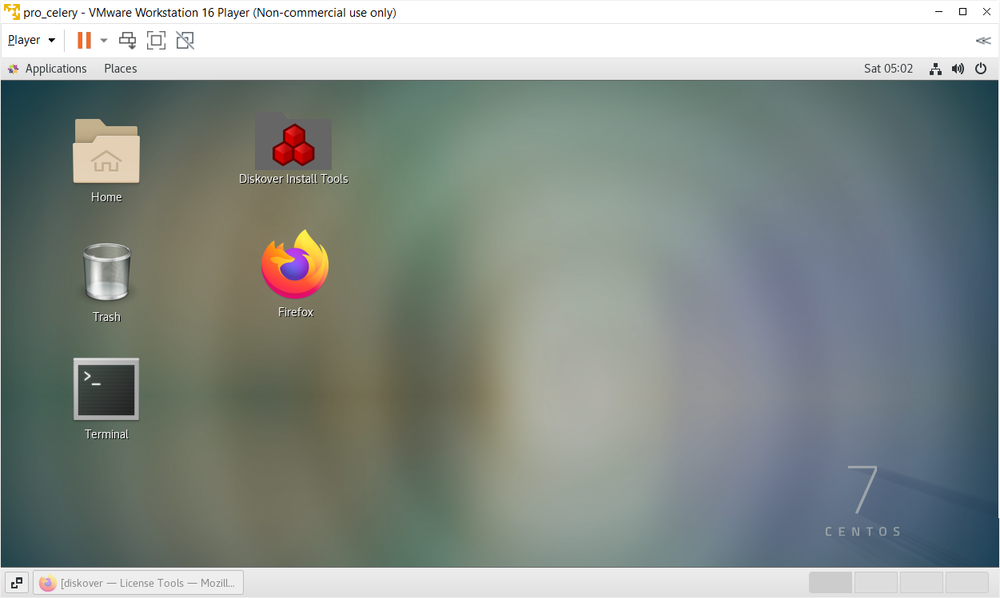
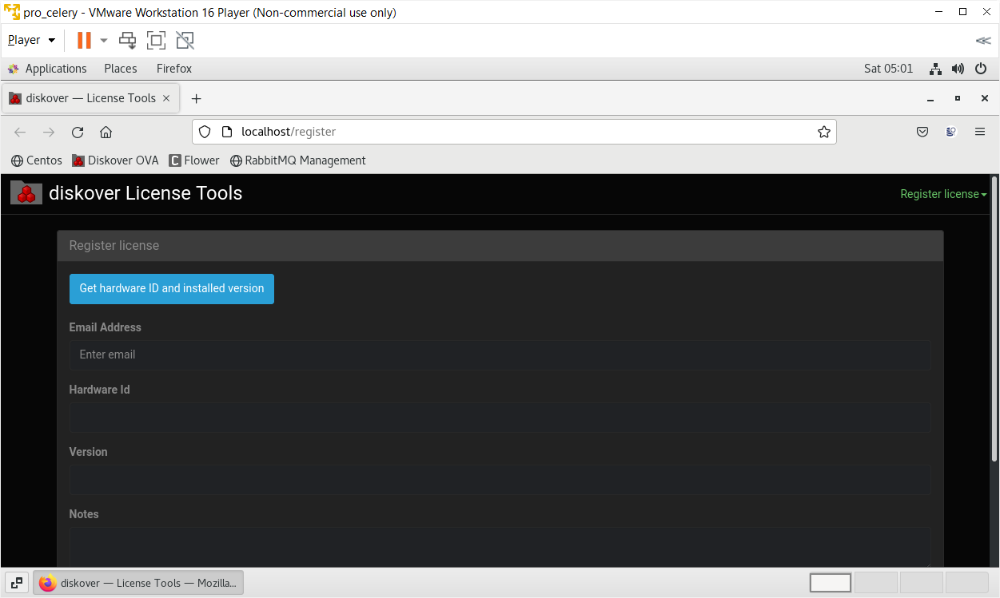

## OVA Installation

This section contains instructions to quickly get up and running with Diskover using an OVA (Open Virtual Appliance) on **VMWare Workstation** and **VirtualBox**. These OVAs can easily be imported into either of these hypervisors and booted up to run Diskover. This guide provides light instructions on how to import the OVA properly and get it booted up.

### Features
- Diskover and built-in dependencies (Elasticsearch, Python, etc.).
- Diskover is configured to start at boot.
- Hostname set to `diskover`
- DHCP enabled
- CentOS 9.x

### Understand the Network

Understand the networking architecture of the site you will be deploying into. If the site has DHCP already configured,
the virtual machine will acquire an IP address from the offered range. Ensure the offered IP address will route to the
clients using the service. The file systems to be scanned must also be reachable from the offered DHCP range.

For clients to access the service, they will need to route to the hostname provided in the license file. The hostname
in the license file must match the hostname on the Linux host. It is recommended that DNS be used to resolve the
service.

### Performance Limitations

🟨 There are performance limitations when running Diskover using an OVA, as it will start to get sluggish at around **200 million files**.

### VirtualBox Import and VM Settings

🔴 Import the OVA by choosing **File -> Import Appliance**

🔴 Choose **Source -> Local File System**

🔴 Then **File : -> Browse for the OVA on your local machine and import it here**

🔴 Once imported, choose **Next**

🔴 By default, the OVA sets the **CPU=2** and **RAM=2GB**. You need to adjust these settings according to your host machine. The recommended specs for OVA usage for POC: 

- **CPU=12**
- **RAM=64GB**

🔴 Once you've adjusted the settings choose **Start**

### VMWare Workstation Import and VM Settings

🔴 To import the OVA by choosing **File -> Open**

🔴 Give the VM a unique name, ex:**diskover-2.3.0**

🔴 Once you've given the VM a name, choose **Import**

🔴 By default, the OVA sets the **CPU=2** and **RAM=2GB**. You need to adjust these settings according to your host machine. The recommended specs for OVA usage for POC: 

- **CPU=12**
- **RAM=64GB**

🔴 Once you've adjusted the settings choose **Power on this virtual machine**

### Diskover Configuration

With the OVA now imported into your hypervisor, there are a few configuration steps needed to get the system up and running and ready to scan. These instructions apply to any hypervisor used for the import.

#### OVA Login

🔴 You will see two user accounts, **Vagrant** and **Diskover**, choose to user/login as **Diskover**.<br>
🔴 Password by default is **darkdata**.

#### Open Activities

🔴 Click on **Activities** in the top left.<br>
🔴 Open the terminal app.<br>
🔴 Additionally, open Google Chrome or Firefox.

#### Diskover Configuration Wizard)

Diskover v2.3 has an easy configuration wizard that we will walk you through.

🔴 In the browser window, go to [**http://localhost:8000/diskover_admin/config/**](http://localhost:8000/diskover_admin/config/)

#### Diskover Configuration Wizard | ElasticSearch

🔴 In the initial section, you will see **hosts-0** and within the box you will see **Elasticsearch**, replace this with **localhost**.<br>
🔴 Choose **Test** in the bottom right. This should show your Elasticsearch cluster health with a status of **green** at the top of the window.<br>
🔴 Choose **Save & Continue**.<br>
🔴 Choose **Yes**.<br>
🔴 Choose **Test** in the bottom right. This should show your ES cluster health with a status of **green** at the top of the window.<br>
🔴 Choose **Save & Continue**.

#### Diskover Configuration Wizard | License

🔴 Choose **Skip** in the bottom right for now, we will do this at the end.

  
#### Diskover Configuration Wizard | Time Settings

🔴 Select your proper timezone.<br>
🔴 Choose **Save & Continue**.<br>
🔴 Check the box for **Show Times in Local Timezone**.<br>
🔴 Choose **Save & Continue**.

  
#### Diskover Configuration Wizard | RabbitMQ

🔴 Choose **Test** in the bottom right, this should show **Connection Successful*(* at the top of the screen.

#### License Request and Installation

Whether you are doing a POC or are a customer, the process is the same.

🔴 [Generate your **hardware ID**](#hd_id)
🔴 Send your [hardware ID](#hd_id) along with basic information so we can easily identify you to [licenses@diskoverdata.com](mailto:licenses@diskoverdata.com) for all editions and add [diskover-licensing@aja.com](mailto:diskover-licensing@aja.com) for the media edition.
🔴 Once you have your licenses back from the Diskover team, you can input them here [http://localhost:8000/diskover_admin/config/License](http://localhost:8000/diskover_admin/config/License) by simply copying the contents from the **diskover.lic** and **diskover-web.lic** files into their respective boxe.

### Diskover Configuration Enhancements

Now that our Diskover system is mostly configured and online, we want to make a couple of quality-of-life changes. Note that most of these commands are issued via the terminal with the exception of the **enable logging**.

🔴 Diskover-Web Ownership:
```
chown -R nginx.nginx /var/www/diskover-*
```

🔴 Sart DiskoverD service)
```
systemctl start diskoverd
```

🔴 Enable logging by going to [http://localhost:8000/diskover_admin/config/Diskover.Configurations.Default](http://localhost:8000/diskover_admin/config/Diskover.Configurations.Default)
🔴 Click **Enable Log File** checkbox and hit **Save** in the bottom right.
🔴 Go to [http://localhost:8000/diskover_admin/config/DiskoverD.Default](http://localhost:8000/diskover_admin/config/DiskoverD.Default)
🔴 Click **Enable Log File** checkbox.
🔴 Under **Python Command** section put in **/bin/python3.11** instead of just **python3** and hit **Save** at the bottom right.
🔴 In the left-hand pane, expand the **DiskoverD** section, and you should see another **Default** option here that matches the hostname
of your machine. This might just be **worker-localhost_localdomain**.
🔴 Click the **Enable Log File** checkbox.
🔴 Under **Python Command** section put in **/bin/python3.11** instead of just **python3** and hit **Save** at the bottom right.
🔴 Restart services:
```
systemctl restart diskoverd diskover-admin
```


### Size the Instance

Before you begin, ensure there are sufficient memory and disk resources for the OVA:

- Memory 32GB RAM
- Disk:
    - Media & Entertainment workflows: 256GB fast disk/SSD
    - Life Science, EDA, etc. workflows: 512GB fast disk/SSD
<br>
🔴 To Expand the root partition and filesystem:

```
sudo -s
yum install cloud-utils-growpart-0.27-10.el7.x86_64
```

🔴 To grow the sda3 partition:

```
growpart /dev/sda 3
```

🔴 To grow the root filesystem:

```
xfs_growfs -d /
```

### OVA Installation Instructions

🔴  To obtain the Diskover OVA software:

1. If you are new to the **Diskover Download Portal**, you will fist need to [create an account](https://download.diskoverdata.com/register.php).
2. Once your account is approved, you'll receive a confirmation email.
3. You can then login at [https://download.diskoverdata.com/](https://download.diskoverdata.com/) and download the latest OVA file.

🔴  Linux Login:

User: **diskover**

Password: **darkdata**

🔴  You can elevate yourself via:
```
sudo -s
```

🔴  Diskover Login:

User: **admin**

Password: **darkdata**

🔴 Request a license by sending us your **hardware ID** as described below, so we can generate a license. 

- First, you can click on the **Diskover Install Tools** icon on the desktop to open the **Diskover License Tools** application.



- Select **Register license** in the drop-down list located at the upper right corner, and then click on **Get hardware ID and installed version** to get your hardware ID number. This will trigger an automated [email to Diskover](mailto:licenses@diskoverdata.com) with your license request.



🔴  Install your license files as explained in the [software activation chapter](https://docs.diskoverdata.com/diskover_installation_guide_ova/#software_activation).

🔴  You will need to mount the file system(s) of interest to the virtual machine and then start indexing. You can create a [scheduled index task by following these instructions](https://docs.diskoverdata.com/diskover_configuration_and_administration_guide/#managing-diskover-tasks-via-the-task-panel).

🔴  Or you can manually initiate an index:

- To run the Diskover indexing process from a shell prompt:
```
cd /opt/diskover
```
- Start your first crawl:
```
python3 diskover.py -i diskover-<indexname> <storage_top_dir>
```
