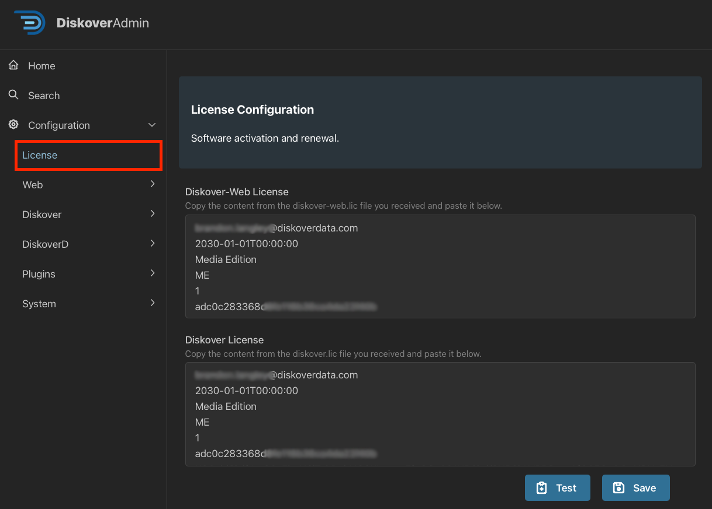

## OVA Overview

### Understand the Network

Understand the networking architecture of the site you will be deploying into. If the site has DHCP already configured,
the virtual machine will acquire an IP address from the offered range. Ensure the offered IP address will route to the
clients using the service. The file systems to be scanned must also be reachable from the offered DHCP range.

For clients to access the service, they will need to route to the hostname provided in the license file. The hostname
in the license file must match the hostname on the Linux host. It is recommended that DNS be used to resolve the
service.

### Performance Limitations

🟨 There are performance limitations when running Diskover using an OVA, as it will start to get sluggish at around **200 million files**.

## OVA Installation

This section contains instructions to quickly get up and running with Diskover using an OVA (Open Virtual Appliance) on **VMWare Workstation** and **VirtualBox**. These OVAs can easily be imported into either of these hypervisors and booted up to run Diskover. This guide provides light instructions on how to import the OVA properly and get it booted up.

### VirtualBox Import and VM Settings

🔴 Import the OVA by choosing File -> **Import Appliance**<br>
🔴 Choose Source → **Local File System**<br>
🔴 File → Browse for the OVA on your local machine and **import it here**<br>
🔴 Once imported, choose **Next**<br>
🔴 By default, the OVA sets the **CPU=2** and **RAM=2GB**. You need to adjust these settings according to your host machine. The recommended specs for OVA usage for POC: 

- **CPU=12**
- **RAM=64GB**
- **DISK=500GB**

🔴 Once you've adjusted the settings choose **Start**

### VMWare Workstation Import and VM Settings

🔴 Import the OVA by choosing File -> **Open**<br>
🔴 Give the VM a unique name, ex:**diskover-2.4.0**<br>
🔴 Once you've given the VM a name, choose **Import**<br>
🔴 By default, the OVA sets the **CPU=2** and **RAM=2GB**. You need to adjust these settings according to your host machine. The recommended specs for OVA usage for POC: 

- **CPU=12**
- **RAM=64GB**
- **DISK=500GB**

🔴 Once you've adjusted the settings choose **Power on this virtual machine**.

## Diskover Configuration

With the OVA now imported into your hypervisor, there are a few configuration steps needed to get the system up and running and ready to scan. These instructions apply to any hypervisor used for the import.

### OVA Login

🔴 You will see two user accounts, **Vagrant** and **Diskover**, choose to user/login as **Diskover**.<br>
🔴 Password by default is **darkdata**.

### Open Activities

🔴 Click on **Activities** in the top left.<br>
🔴 Open the terminal app.<br>
🔴 Additionally, open Google Chrome or Firefox.

### Diskover Configuration Wizard

Diskover v2.4 has an easy configuration wizard that we will walk you through.

🔴 In the browser window, go to [**http://localhost:8000/diskover_admin/config/**](http://localhost:8000/diskover_admin/config/)

#### Elasticsearch

🔴 In the initial section, you will see **hosts-0** and within the box you will see **Elasticsearch**, replace this with **localhost**.<br>
🔴 Choose **Test** in the bottom right. This should show your Elasticsearch cluster health with a status of **green** at the top of the window.<br>
🔴 Choose **Save & Continue**.<br>
🔴 Choose **Yes**.<br>
🔴 Choose **Test** in the bottom right. This should show your ES cluster health with a status of **green** at the top of the window.<br>
🔴 Choose **Save & Continue**.

#### License

🔴 Choose **Skip** in the bottom right for now, we will do this at the end.

  
#### Time Settings

🔴 Select your proper timezone.<br>
🔴 Choose **Save & Continue**.<br>
🔴 Check the box for **Show Times in Local Timezone**.<br>
🔴 Choose **Save & Continue**.

  
#### RabbitMQ

🔴 Choose **Test** in the bottom right, this should show **Connection Successful*(* at the top of the screen.

### License Request and Installation

Whether you are doing a POC or are a customer, the process is the same.

🔴 [Generate your **hardware ID**](#hd_id)<br>
🔴 Send your [hardware ID](#hd_id) along with basic information so we can easily identify you to [licenses@diskoverdata.com](mailto:licenses@diskoverdata.com)<br>
🔴 Once you have your licenses back from the Diskover team, you can input them here [http://localhost:8000/diskover_admin/config/License](http://localhost:8000/diskover_admin/config/License) by simply copying the contents from the **diskover.lic** and **diskover-web.lic** files into their respective boxes.



## Diskover Configuration Enhancements

Now that your Diskover system is mostly configured and online, we want to make a couple of quality-of-life changes. Note that most of these commands are issued via the terminal with the exception of the **enable logging**.

🔴 Diskover-Web Ownership:
```
chown -R nginx.nginx /var/www/diskover-*
```

🔴 Sart DiskoverD service)
```
systemctl start diskoverd
```

🔴 Enable logging by going to [http://localhost:8000/diskover_admin/config/Diskover.Configurations.Default](http://localhost:8000/diskover_admin/config/Diskover.Configurations.Default).<br>
🔴 Click **Enable Log File** checkbox and hit **Save** in the bottom right.

 

🔴 Go to [http://localhost:8000/diskover_admin/config/DiskoverD.Default](http://localhost:8000/diskover_admin/config/DiskoverD.Default)<br>
🔴 Click **Enable Log File** checkbox.<br>
🔴 Under **Python Command** section put in **/bin/python3.11** instead of just **python3** and hit **Save** at the bottom right.

 

🔴 In the left-hand pane, expand the **DiskoverD** section, and you should see another **Default** option here that matches the hostname
of your machine. This might just be **worker-localhost_localdomain**.<br>
🔴 Click the **Enable Log File** checkbox.<br>
🔴 Under **Python Command** section put in **/bin/python3.11** instead of just **python3** and hit **Save** at the bottom right.<br>
🔴 Restart services:
```
systemctl restart diskoverd diskover-admin
```

## Schedule and Run Sample Storage Scan

### Scan Schedule

This section will be a real quick test scan of the local OVA filesystem. To properly scan your own storage, you will need to set up and configure SMB/NFS shares to be mounted to the OVA. Once these shares are mounted, you can follow a similar process as outlined below to scan those storage repositories.

🔴 Login to Diskover by going to [http://localhost:8000](http://localhost:8000) and login as the **admin** user. Once you input this password you will be prompted to reset the password and log back in with your own password:

- Username : **admin**
- Password : **darkdata**

🔴 From the main user interface, go to the upper right corner **⛭ → Task Panel**<br>
🔴 Select **Task List** at the top left.<br>
🔴 Select **New Index Task**.<br>
🔴 Select the **filesystem** template from the template list at the top.


🔴 Only 5 fields in this default template need to be changed to scan your local storage - [click here for more information about all the fields](https://docs.diskoverdata.com/diskover_setup_and_config_guide/#task-fields-description) on this page:

| Field | Description |
| --- | --- |
| **Name** | Set to some descriptive name, for example **Diskover Build Directory** |
| **Description** | Enter a more detailed description of the task, for example **Scan of the local /opt/diskover directory** |
| **Crawl Directory(s)** | This will be the path to the OVA that we want to scan, for example **/opt/diskover** |
| **Custom Index Name** | We want to differentiate each task(s) index name so that they're never the same, for example **diskover-opt-%Y%m%d%H%M**
| **Disabled** |  **Uncheck** this box |

🔴 Once all properties are set, click **Create Task** at the bottom of the page.<br>
🔴 Before starting the first scan task, let's tail the log files so we can watch the progress of our scan:
```
tail -F /var/log/diskover/*
```

### Start First Scan

🔴 Start the scan from the **Task List** tab, or [http://localhost:8000/tasks/index.php](http://localhost:8000/tasks/index.php), choose your newly created task and select the arrow next to the **Info** button and choose **Run Now**, click **Ok**.<br>
🔴 Open your terminal and watch the scan logs.

## Sample Index Review

Now that we have scanned the test directory let’s take a look at the index that was created from this storage location.

🔴 From the main user interface, go to the upper right corner **⛭ → Indices** or [http://localhost:8000/selectindices.php](http://localhost:8000/selectindices.php)<br>
🔴 Make sure the **Always use latest indices (auto select)** box is checked.<br>
🔴 Click on the **folder** 📁 in the top main menu to navigate back to the main page, and you can now see and review your first test scan, as well as browse and search all of its content. 


