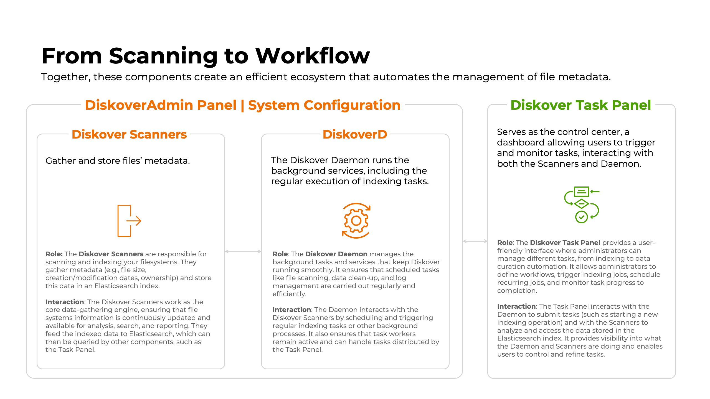
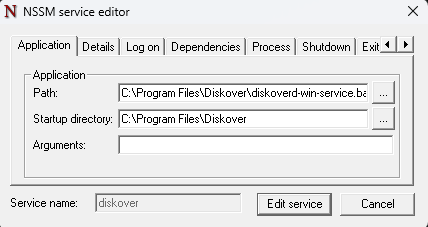

<p id="install_scanners"></p>

## Diskover Scanners/Workers Installation

### Overview

Diskover has a [distributed task system](#architecture_diagram) where scanners/workers can be distributed among many resources. For each resource providing a task worker, services need to have a [DiskoverD](#install_diskoverd) installed. The [Task Panel](#task_panel) will be covered after the installation and initial configuration of the main components. 

___



_[Click here for the full screen view of this diagram.](images/diagram_scanners_daemon_task_panel.png)_

- This section will walk you through installing node workers for your Diskover environment.

- During this process, you will need the latest [Diskover 2.4x software](#software_download).

- Once all components are installed, you will be able to [configure your scanning environment](#config_scanners). We strongly recommend following the deployment order outlined in this guide.

### Multiple Scanners/Workers Environment

If your environment includes multiple scanners, repeat the process in this chapter for each one of your workers. Once you have the zip file, you can `SCP` it to all machines that are designated to be a Diskover Worker. 

🔴 &nbsp;**On-prem** | Will scp the file to the root user's home directory:
```
scp <path to diskover.zip> root@ipAddress:~/
```

🔴 &nbsp;**AWS** | Will scp the file to the user's home directory. Example using Rocky:
```
scp -i <path to PEM file> <path to diskover.zip> rocky@bastion-IP:~/
```

⚠️ &nbsp;Note that the user will differ depending on your OS. It is best to consult your AWS EC2 Console to get the exact user to connect to the bastion. Generally, these are the users for the following OS:

| OS | User |
| --- | --- |
| Rocky Linux | rocky |
| Centos 7 or 8 | centos |
| RHEL or Amazon Linux | ec2-user |

### Linux Scanners/Workers

#### Python Installation

This section covers installing Python v3.12 and configuring it as the main Python 3 executable. Alternatively, use a [PyEnv](#pyenv) Python Environments. Additionally, some steps here, such as symlinking to the main Python 3 executable, might not be advisable if this system is used for other Python-based programs.

🔴 &nbsp;Install Python:
```
yum -y install python3.12 python3.12-devel gcc
unlink /usr/bin/python3
ln -s /usr/bin/python3.12 /usr/bin/python3
which python3
  -- /usr/bin/python3
python3 -V
  -- Python 3.11.11
```

🔴 &nbsp;Install PIP:
```
python3 -m ensurepip
python3 -m pip install --upgrade pip
```

#### Diskover Scanner Installation

🔴 &nbsp;Extract your [zip archive](#software_download):
```
unzip diskover-2.4.0.zip
```

🔴 &nbsp;Copy the Diskover folder:
```
cd diskover-2.4.0/
cp -a diskover /opt/
```

🔴 &nbsp;Install Python packages:
```
cd /opt/diskover
python3 -m pip install -r requirements.txt; python3 -m pip install -r requirements-aws.txt
```

🔴 &nbsp;Create **diskoverd** (Diskover Daemons) log directory:
```
mkdir -p /var/log/diskover
```

🔴 &nbsp;Create a diskoverd configuration file, allowing us to connect the worker to the Diskover-Web API Server:
```
mkdir -p /root/.config/diskoverd
cp /opt/diskover/configs_sample/diskoverd/config.yaml /root/.config/diskoverd/
```

🔴 &nbsp;Set the API URL for Diskover-Web:
```
vi /root/.config/diskoverd/config.yaml
```

🔴 &nbsp;Edit the **apiurl** property. You will need to replace the **${WEBHOST}** below with your **web nodes IP address or hostname**:
```
apiurl: http://${WEBHOST}:8000/api.php
```

<p id="install_diskoverd"></p>

#### DiskoverD Task Worker Daemon

Now that your first worker node is installed and configured, let’s daemonize this service with **systemd**.

🔴 &nbsp;Create **systemd** service file:
```
vi /etc/systemd/system/diskoverd.service
```

🔴 &nbsp;Add the following to the file and don't forget to save:
```
[Unit]
Description=diskoverd task worker daemon
After=network.target

[Service]
Type=simple
User=root
WorkingDirectory=/opt/diskover/
ExecStart=/usr/bin/python3 /opt/diskover/diskoverd.py -n worker-%H
Restart=always

[Install]
WantedBy=multi-user.target
```

🔴 &nbsp;Set permissions and enable the service:
```
chmod 644 /etc/systemd/system/diskoverd.service
systemctl daemon-reload
systemctl enable diskoverd
```

⚠️ &nbsp;Please proceed to the next sections, as you will be unable to start the diskoverd worker service until your API server and [license](#software_activation) are installed.

### Enable SSL for Task Workers

🔴 &nbsp;Copy the `http_ca.crt` to the Worker(s) server(s) and place into `/etc/pki/ca-trust/source/anchors/http_ca.crt`


🔴 &nbsp;Run the following command: 
```
sudo update-ca-trust ; mkdir /opt/diskover/elasticsearch-certs/ ; cp http_ca.crt /opt/diskover/elasticsearch-certs/
```

🔴 &nbsp;Navigate to **DiskoverAdmin → Web → Elasticsearch**:

    - Input your Elasticsearch IPs, and Elastic user + password.
    - For the SSL certificate path, you need to put the full path of where the certificate is held on the Web, including the name of the cert: `/opt/diskover/elasticsearch-certs/http_ca.cr`
    - Hitting **Test** on this page will result in a failure as the call for this test is coming from the [Web server](#install_diskover_web), so long as you can start your Worker up, you’re good to go!

### Mounting NFS Filesystems

In the example below, we will be mounting a volume called **vol1** from the server **nas01** into the directory called **/nfs/vol1**

🔴 &nbsp;Ensure the NFS client tools are installed:
```
dnf install -y rpcbind nfs-utils nfs4-acls-tools
```

🔴 &nbsp;Start the required NFS client services:
```
systemctl start rpcbind nfs-idmap
systemctl enable rpcbind nfs-idmap
```

🔴 &nbsp;Create the directory where we will mount the filesystem:
```
mkdir -p /nfs/vol1
```

🔴 &nbsp;Add an entry in the `/etc/fstab` configuration file to ensure the volume gets mounted on reboot:
```
nas01:/vol1 /nfs/vol1 nfs defaults 0 0
```

🔴 &nbsp;Mount the filesystem and display its capacity:
```
mount /nfs/vol1
df -h /nfs/vol1
```

⚠️ &nbsp;For detailed information about configuring NFS clients, consult the [RedHat NFS client documentation](https://docs.redhat.com/en/documentation/red_hat_enterprise_linux/7/html/storage_administration_guide/nfs-clientconfig).

### Mounting CIFS Filesystems

In the example below, we will be mounting a volume called **vol1** from the server **nas01** into the directory called **/cifs/vol1**

🔴 &nbsp;Ensure the CIFS packages are installed:
```
dnf install -y samba-client samba-common cifs-utils
```

🔴 &nbsp;Create the directory where we will mount the filesystem:
```
mkdir -p /cifs/vol1
```

🔴 &nbsp;Add an entry in the `/etc/fstab` configuration file to ensure the volume gets mounted on reboot. In the example below, change the `username`, `password`, and `domain` to match your environment.
```
systemctl start rpcbind nfs-idmap
systemctl enable rpcbind nfs-idmap
```

```
mount /nfs/vol1
df -h /nfs/vol1
```

```
\\nas01\vol1 /cifs/vol1 cifs username=winuser,password=winpassword, ˓→domain=windomain,vers=2.0 0 0
```

🔴 &nbsp;Mount the filesystem and display its capacity:
```
mount /cifs/vol1
df -h /cifs/vol1
```

⚠️ &nbsp;For additional information about configuring CIFS clients, visit [CentOS tips for mounting Windows shares](https://wiki.centos.org/TipsAndTricks(2f)WindowsShares.html#:~:text=Mounting%20Windows%20(or%20other%20samba,are%20used%20in%20our%20examples.&text=Word%20of%20warning:%20the%20default%20behaviour%20for%20mount.).


### Windows Scanners/Workers

#### Installation Requirements

##### Installer Build Directories

This installer requires an internet connection to install Python and the NSSM service. The Windows machine running the installer must have internet access. Currently, there’s no offline install option with this method. To install without internet access, you'd need to reverse-engineer the installer script and manually download and install Python and NSSM packages on the server.

##### Python on Windows

By default, Windows links the `python.exe` and `python3.exe` executables to the Microsoft Store. This means that if you try to run a command like `python script.py`it might prompt you to install Python from the Store, even if you've already installed it manually. The installer installs Python manually, so you'll need to disable this setting. To do so, search for Manage App Execution Aliases in the Windows search bar, then find python3 and python, and set both to **No** or **Off**.

#### Build Directories

##### Installer Build Directories

The installer creates a temporary build directory under the user account that is running the installer, or under the user account authenticated as an admin to execute the installer, depending on the situation. This temporary directory will contain the Diskover build contents.

```
diskover-2.4.0.zip
requirements.txt
```

Once the installer finishes and/or when the installer has completed but the **Finish** button has not been chosen, you can access the contents of this directory if ever necessary. Sample build directory temp path `C:\Users\Brandon Langley\AppData\Local\Temp\is-4MFN0.tmp`

##### Diskover Build Directories

During the initial part of the wizard, a few directories are created to host the diskover build and necessary configuration files: 

```
C:\Program Files\Diskover\
%APPDATA%\diskoverd
Sample Path : C:\Users\Brandon Langley\AppData\Roaming\
```

✏️ Note that this `%APPDATA%` string can be put in the search bar of the Windows file browser to go to the current users' application data directory. However, as mentioned above, the user running the installers and/or the user authenticating as admin to execute the installer will be the installer using the `%APPDATA%` path.

The issue here is if one user runs the installer, but then in the NSSM section, we tell another user to run the service. This means that this `\diskoverd` configuration directory and config file within will be in the wrong user path.

#### Python Installation

##### Python Installation

The `DiskoverTaskWorker-2.4.0.exe` installer will be installing Python3.12.0 on the Windows machine. The installation will do the following things : 

  - Download the `Python3.12.0.exe` installer within the `C:\Program Files\Diskover\folder`
  - Execute the installer with the following flags:
    - `/quiet` → to not display the Python installer UI while the DiskoverTaskWorker installer is running.
    - `InstallAllUsers=0` → to only install this `Python3.12.0` version - for the user that is running the installer.
    - `PrependPath=1` → to add the `Python3.12.0` executable to the Windows class path - for the user that is running the installer.

##### PIP Packages

A standard process using PIP during installer execution now that Python is installed. The `requirements.txt` file used here is the latest from the master at the time of 2.3.x being released and has been tested against `Python3.12.0`:

- Ensure PIP
- Upgrade PIP
- Install `requirements.txt`

#### Diskover Configuration

Given that a lot of the Diskover configurations are now in the database, the only actual configuration file is the `%APPDATA%\diskoverd\config.yaml` mentioned above. This contains the only input field into the DiskoverTaskWorker wizard : Diskover Web URL. This gives the worker the ability to register with the DiskoverAdmin service and fetch all of its other configurations.

#### NSSM

##### Install Process

The installer downloads NSSM Version 2.24 from the internet and places it within `C:\Program Files\Diskover\`. The zip file is extracted in that same directory, and then PowerShell commands are issued to add this directory to the classpath - for the user that is running the installer. This is the path: `C:\Program Files\Diskover\nssm-2.24\nssm-2.24\win64\`

##### Building the Diskover Service

Now that NSSM is installed and added to the `classpath`, the installer runs a few NSSM commands and creates a few files to bind Diskover to NSSM. 

🔴 A batch file is created at `C:\Program Files\Diskover\diskoverd-win-service.bat`

🔴 The contents of this file are the standard startup for DiskoverD: 
```
python "C:\Program Files\diskover\diskoverd.py" -n %COMPUTERNAME%
```

🔴 The installer executes this command to install the Diskover service in NSSM, `nssm.exe` installs diskover:
```
C:\Program Files\Diskover\diskoverd-win-service.bat
```

🔴 A few commands are executed to create service startup logging:
```
nssm.exe set diskover AppStdout "C:\Program Files\Diskover\logs\service-start-log"
nssm.exe set diskover AppStderr "C:\Program Files\Diskover\logs\service-start-error-log"
```

#### Manual Processes After Installation

##### NSSM 

Once the installer is complete, you'll need to bind the NSSM Diskover service to a user account.

🔴 Get current user account:
```
whoami
```

🔴 Edit the diskover service:
```
nssm edit diskover
```

Once you run this command, you will go to the **Log On** tab and select **This Account**, then simply put the output of the **whoami** command and insert the login credentials below. Finally click **Edit Service** to save the configurations. This means that the user data input will be the one that executes the Diskover Task Worker service on this Windows Machine.

This is a working example of what your service details should look like in NSSM:



##### Service Startup | Logging

Now that we have that figured out, let’s start the service and tail the log. 

🔴 Start diskover:
```
nssm start diskover
```

🔴 Service Startup Logs:
```
Get-Content -Path "C:\Program Files\Diskover\logs\service-start-error.log" -Tail 25 -Wait
```

🔴 Diskover Logs:
```
Get-Content -Path "C:\Program Files\Diskover\logs\diskoverd_subproc_$HOSTNAME.log" -Tail 25 -Wait
```

#### Troubleshooting | Nice to Know

##### Manual Scan

Once you have everything going, you can tail the log and run a manual scan:
```
python "C:\Program Files\Diskover\diskover.py" -i diskover-win-test "C:\Program Files\Diskover"
```

##### User Authentication Issues

When configuring NSSM to work with a user, we have seen issues where the Windows machine is bound to an AD domain, and the user attempts to go through the Log On portion of the NSSM setup and use that domain. It seems that the NSSM service (as configured) is not able to properly look up the SID values for the domain-bound users. Thus, there might be errors starting the Diskover Task Worker service.

When this occurs, you can choose to use the **Local System Account**. Given this occurs, it is possible that the `diskoverd\config.yaml` was installed in the `%APPDATA%` folder for the user that is running the installer. This will need to be move to the proper `%APPDATA% `folder for the **Local System Account**.

##### Diskover Admin - DiskoverD Configuration

If you are connecting this back to a single stack OVA that likely has the DiskoverD configuration for the ElasticSearch connection set to `localhost` you will need to change that to the OVA’s IPV4 address so that the Windows Task Worker can fetch that configuration for ES and be able to connect properly. 

### Mac Scanners/Workers

🚧 &nbsp;We're hard at work preparing these instructions. Meanwhile, [click here to open a support ticket](https://support.diskoverdata.com/), and we'll gladly assist you with this step of your deployment.
