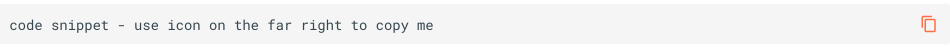

### Document Conventions

| TOOL | HOW IT HELPS |
| :---: | --- |
| **Copy/Paste Icon for Code Snippets** | Throughout this document, all code snippets can easily be copied to a clipboard using the copy icon on the far right of the code block:   |
| 🔴 | Proposed **action items** |
| ⚠️ | Important **notes and warnings** |
| **Features Categorization** | **IMPORTANT** <ul><li>Diskover repackaged its offerings as of January 2025.</li><li>Please refer to [Diskover's solutions page](https://diskoverdata.com/solutions/) for more details.</li><li>You can also consult our [detailed list of core features](https://diskoverdata.com/platform/features/).</li><li>[Contact us](https://diskoverdata.com/contact/) to discuss your use cases, size your environment, and determine which plan is best suited for your needs.</li><li>Throughout this guide, you'll find labels indicating the plan(s) to which some feature belongs.</li></ul> **Core Features →** &nbsp;&nbsp;&nbsp;&nbsp;&nbsp;&nbsp;&nbsp;&nbsp;  **Industry Add-Ons →** &nbsp;&nbsp;&nbsp;&nbsp;&nbsp;&nbsp;&nbsp;&nbsp; |
