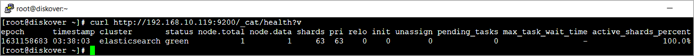

<p id=“maintenance_emergency”></p>

## Emergency Maintenance

The following section describes how to troubleshoot and perform emergency maintenance for Diskover components.

🚧 &nbsp;We're hard at work updating these instructions. Meanwhile, [click here to open a support ticket](https://support.diskoverdata.com/), and we'll gladly assist you with troubleshooting your critical issue.

### Diskover-Web

A few ways to identify and solve Diskover-Web issues.

#### Unable to Access Diskover-Web from Browser:

🔴 &nbsp;Ensure the Web server is running:
```
systemctl status nginx
```

```
systemctl status php-fpm
```

🔴 &nbsp;Check the NGINX Web server error logs:
```
tail -f /var/log/nginx/error.log
```

🔴 &nbsp;Trace access from Web session by reviewing NGINX access logs. Open a Web browser and attempt to access Diskover-Web; the access attempt should be evident in the access log:
```
tail -f /var/log/nginx/access.log
```

### Elasticsearch Domain

To identify and solve common Elasticsearch issues, refer to:
  - [Elastic Docs](https://www.elastic.co/docs)
  - [AWS Docs](https://aws.amazon.com/documentation-overview/?nc2=h_ql_doc_do)
  - [OpenSearch Troubleshooting](https://docs.aws.amazon.com/opensearch-service/latest/developerguide/handling-errors.html).

#### Helpful Commands

Here are some helpful Elasticsearch commands to get started.

🟨 &nbsp;Your Elasticsearch server is accessible at [http://elasticsearch:9200](http://elasticsearch:9200/)

🔴 &nbsp;Check your cluster health:
```
curl  [http://elasticsearch:9200/_cat/health?v](http://elasticsearch:9200/_cat/health?v)
```



🔴 &nbsp;List indices:
```
curl -X GET http://elasticsearch:9200/_cat/indices
```

🔴 &nbsp;Delete indices:
```
curl -X DELETE http://elasticsearch:9200/diskover-indexname
```

🔴 &nbsp;Username/Password - To query the Elasticsearch cluster with login credentials:
```
curl -u login:password https://elasticsearch:9200/_cat/indices
```
