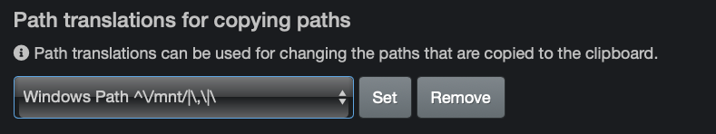
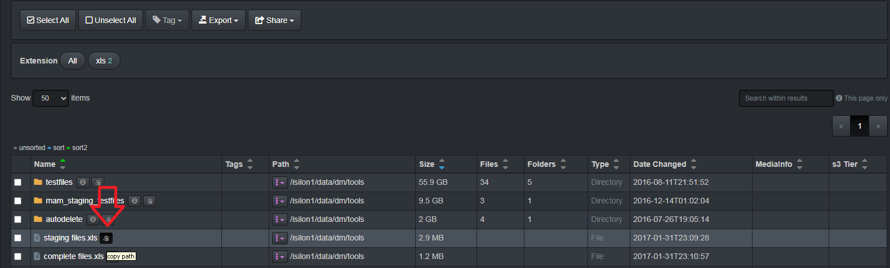

___
## Path Translation
___

The path translation feature is designed to support heterogenous client environments like Windows, MacOS, and Linux. The path for each client to access or locate a file or directory will vary depending on client operation system. For example, Windows operating systems use the backslash slash `\` and Linux operating systems use a forward `/`. Path translation provides the capability to translate paths within Diskover to appropriate the client’s operating system. The following describes two mechanisms for translating paths within Diskover.

___
### Translating Paths Stored in Elasticsearch Index

To translate paths that get stored within the Elasticsearch document, for example removing **/mnt** from a path like **/mnt/isilon1**

🔴  Open a terminal session:
```
vi /root/.config/diskover/config.yaml
```

🔴  Set **replace:** to **True**

🔴  Configure desired **from:** and **to:**


Which results in the following path displayed within the Diskover-Web user interface:


___
### Path Translation in Diskover-Web for Copy/Paste

To set client profiles that get translated when a user copies a path within the Diskover-Web user interface. 

🔴  For example, to translate from `/isilon1/data/dm/tools/staging files.xls` to `\\isilon1\data\dm\tools\staging files.xls`
```
vi /var/www/diskover-web/src/diskover/Constants.php
```


🔴  Configure client profile within the Diskover-Web user interface under the **Settings** page:



🔴  Copy a path within the Diskover-Web user interface for testing:



🔴  Resulting path within clipboard:


