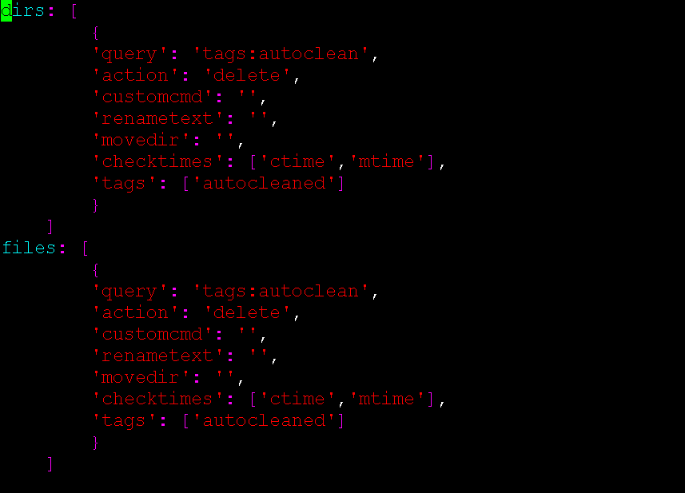

___
### Autoclean Plugin

&nbsp;&nbsp;

The autoclean plugin is designed to move, delete, rename or run custom commands on files and/or directories based on a set of highly configurable criteria. Any Elasticsearch query (tags, age, size, path, filename, etc.) can be used for the criteria providing very granular actions.

With the use of tags, the autoclean plugin can be used to implement a RACI model or approval process for archive and deletion (approved_archive, approved_delete, etc.) tag application. The plugin criteria can then be set to meet desired set of tags (times, etc.) to invoke action.

🔴 &nbsp;Check that you have the config file in `~/.config/diskover_autoclean/config.yaml`, if not, copy from default config folder in `configs_sample/diskover_autoclean/config.yaml`.

🔴 &nbsp;The autoclean plugin runs post as scheduled job operating on completed indices, to enable:
```
vim /root/.config/diskover_autoclean/config.yaml
```



🔴 &nbsp;Configure desired rules:
- Query can be any valid Elasticsearch query using [query string query](https://www.elastic.co/guide/en/elasticsearch/reference/current/query-dsl-query-string-query.html).
- Action can be: delete, rename, move or custom. Custom can be used to run a command or script.

> Note: When using custom action, custocmd value is required. The full file/directory path is passed as arg to customcmd.

Example using custom action:

Set action to custom and specifiy customcmd, in this example we are using a bash script:
```
dirs: [
    {
    'query': 'tags:archive AND type:directory',
    'action': 'custom',
    'customcmd': './scripts/autoclean_move_dir.sh',
    'renametext': '',
    'movedir': '',
    'checktimes': ['ctime', 'mtime'],
    'tags': ['autocleaned', 'custommove']
    }
]
```
Create bash script and make it executable for customcmd:

```sh
touch autoclean_move_dir.sh
chmod +x autoclean_move_dir.sh
vim autoclean_move_dir.sh
```

```sh
#!/bin/bash
#
# Move directory using Linux mv command.
# Before moving, check if the source directory has any 
# .doc files and if so, don't move it.
#
# Note: We don't need to check if source directory exists since autoclean 
# takes care of that before calling this script.
#

# get source path from arg 1
SRC_PATH=$1

# set destination directory
DST_PATH=/mnt/nas2/archive/

# make destination directory if it does not exist
if [ ! -d "$DST_PATH" ]; then
  mkdir -p "$DST_PATH"
  # check if mkdir worked
  if [ $? -gt 0 ]; then
    >&2 echo ERROR could not make destination directory $DST_PATH !
    exit 1
  fi
fi

# check for .doc files in source directory
echo Checking for any .doc files ...
file_count=$(find "$SRC_PATH" -type f -name "*.doc" 2> /dev/null | wc -l)
if [ $file_count -gt 0 ]; then
  >&2 echo WARNING $SRC_PATH contains $file_count .doc files, not moving!
  exit 1
fi

# check destination directory doesn't already exist
destination_dirname="$(basename "$SRC_PATH")"
destination="$DST_PATH/$destination_dirname"
if [ -d "$destination" ]; then
  >&2 echo ERROR $destination exists, not moving directory!
  exit 1
fi

# use mv command to move directory
echo Moving "$SRC_PATH" to "$DST_PATH" ...
mv "$SRC_PATH" "$DST_PATH"
# check if mv worked
if [ $? -gt 0 ]; then
  >&2 echo ERROR moving directory!
  exit 1
else
  echo Done.
fi
exit 0
```


#### Add Autoclean Task to Diskover-web

🔴 &nbsp;Create custom task in Task Panel to run on scheduled basis.

🔴 &nbsp;Set the following:
- Run Command Args: **python3**
- Post Command: **/opt/diskover/diskover-autoclean.py -V -l /mnt/snfs2**

🔴 &nbsp;Change **/mnt/snfs2** to the desired **top_level_path**, for example, if the desired volume to index is **isilon**, then the path would be **/mnt/isilon**


