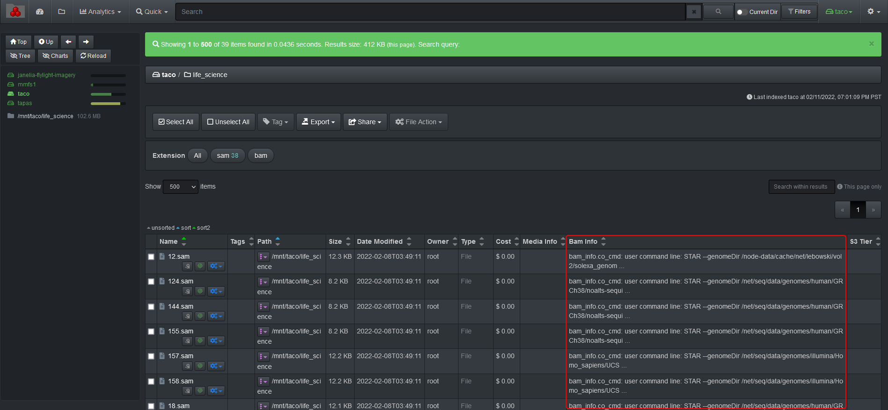
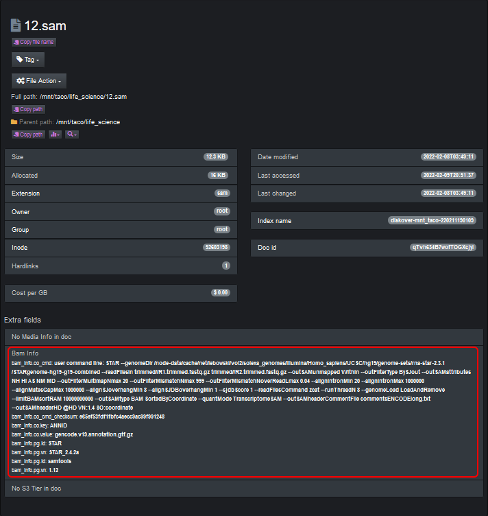
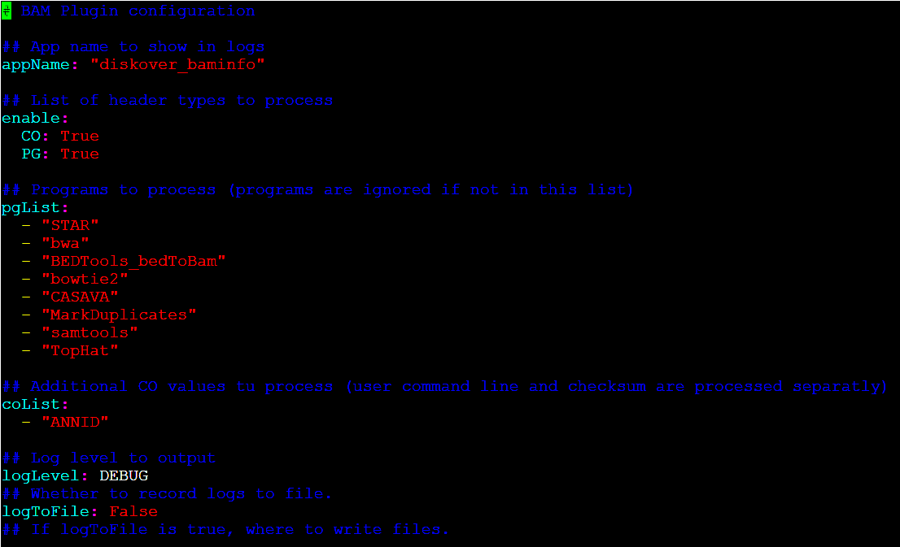
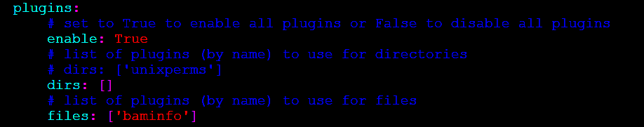
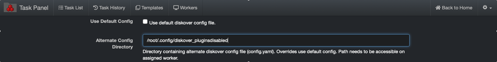

<p id="bam_plugin"></p>

___
### BAM Info Harvest Plugin


The BAM info harvest plugin is designed to provide BAM metadata attributes about a file without granting the Diskover user any read/write file system access.
The BAM info plugin enables additional metadata for the SAM and BAM file formats to be harvested at time of index, and are therefore searchable within Diskover.

The specification for the SAM file format can be found here:

[https://samtools.github.io/hts-specs/SAMv1.pdf](https://samtools.github.io/hts-specs/SAMv1.pdf)

The BAM info plugin uses the Python **pysam** to harvest attributes about the BAM and SAM files:

[https://pysam.readthedocs.io/en/latest/](https://pysam.readthedocs.io/en/latest/)

New indices will use the plugin and any SAM or BAM file will get additional info added to the Elasticsearch index’s **bam_info** field.

The attributes provide the ability to view storage and file system content from a workflow perspective, for example, all the frame rates on any given storage.

You can view and search on BAM info attributes in Diskover-Web since it will store it in a new field for video files, the field name is **bam_info**.



The BAM info fields are shown as additional searchable attributes to each file. You can view detailed attributes when opening up a file in Diskover.



#### Install BAM Info Dependencies

🔴 &nbsp;Copy the BAM info content in the install location:
```
cp __init__.py /opt/diskover/plugins/baminfo/
cp README.rnd /opt/diskover/plugins/baminfo/
cp requirements.txt /opt/diskover/plugins/baminfo/
mkdir /root/.config/diskover_baminfo/
cp config.yaml /root/.config/diskover_baminfo/
```

🔴 &nbsp;Edit the BAM info plugin to specify programs used within the software pipeline, in the example below the following programs are used:
```
  - "STAR"
  - "bwa"
  - "BEDTools_bedToBam"
  - "bowtie2"
  - "CASAVA"
  - "MarkDuplicates"
  - "samtools"
  - "TopHat"
```



🔴 &nbsp;The BAM info plugin requires the following dependencies on CentOS:
```
yum install  zlib-devel -y
yum install bzip2-devel
yum install xz-devel

cd /opt/diskover/plugins/baminfo/
pip3 install -r requirements.txt
```

🔴 &nbsp;The BAM info plugin runs as part of the indexing process, to enable:
```
vim /root/.config/diskover/config.yaml
```

🔴 &nbsp;Set > enable: `True`

🔴 &nbsp;Set > files: `[‘baminfo’]`



>*Note:* The BAM info plugin is currently not supported for S3 based object storage. If the BAM info plugin is enabled in the default configuration file, an alternate configuration file must be created where the media info plugin is disabled. The alternate configuration file must be invoked when indexing S3 based volumes:

```
/root/.config/diskover_pluginsdisabled
```



#### BAM Info Field within Diskover-Web

🔴 &nbsp;To display the `bam_info` fields within Diskover-Web, edit the `Contants.php` configuration:
```
vim /var/www/diskover-web/src/diskover/Constants.php
```

🔴 &nbsp;Add the following under `EXTRA_FIELDS`:
```
const EXTRA_FIELDS = [
    'Bam Info' => 'bam_info'
];
```


#### Search BAM Attributes within Diskover-Web

The BAM attributes can be used in a manual search query by using the BAM field name `bam_info`. The structure is as follow:
```
media_info.<key>:<value>
```

For example:

```
bam_info.pg.id:STAR
```
