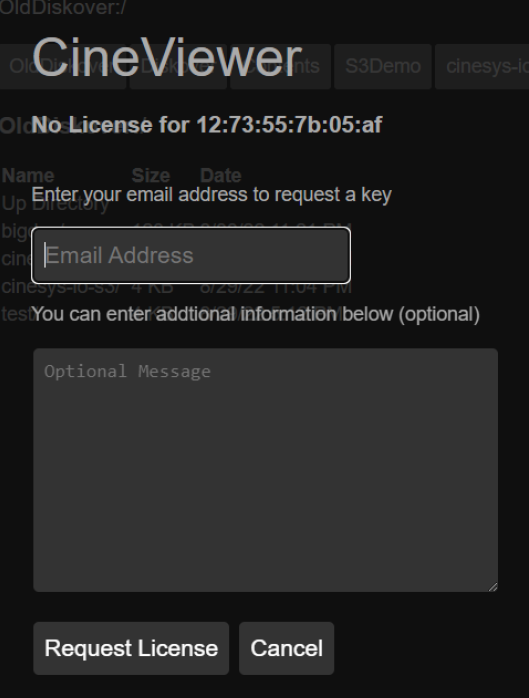
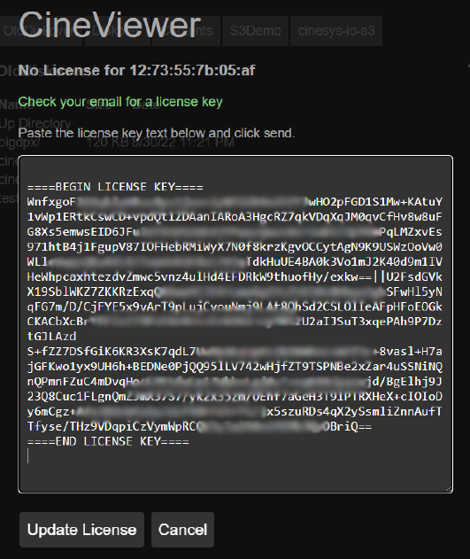

<p id="cineviewer_plugin"></p>

___
### CineViewer Player Plugin


Cineviewer is a video playback and management system designed for video and broadcast professionals. It is designed to securely view high resolution media from a remote browser, without giving users access to the source files, as well as play content that may not be supported by standard web browsers, including file formats such as ProRes and MXF. Additionally, Cineviewer allows users to play back image sequences in formats such as DPX and EXR. The player can be launched in one click from the AJA Diskover Media Edition user interface, allowing for seamless validation of media assets, therefore increasing productivity, while safeguarding your production network.

With its timecode-accurate playback and seeking capabilities, Cineviewer enables users to navigate through content with precision. The system also supports up to 16 channels of audio, providing a variety of audio configuration options to accommodate different projects. Furthermore,Cineviewer includes closed captioning functionality, ensuring an accessible experience for all users.

This user manual will guide you through the features and functions of Cineviewer, helping you utilize this tool effectively for your video and broadcast needs.


#### Supported Files & Systems

**Platforms:** CentOS 7x, other distro’s to follow (AWS EC2s, Mac, Windows, etc.)

**Browsers:** Chrome, Safari, Firefox

**File Formats:** The video player uses FFMPEG under the hood for real-time transcoding of creative content. Cineviewer supports a wide range of file types and codecs including Animation, AVC-Intra, AVI, Cineform, DNxHD, DNxHR, DV, DVCPPRO HD, H.264, HEVC/H.265, IMX, MKV, MOV/QT, MP4/M4V, MPEG/M2V/MPG, TS, MPEG-2, MXF, OGG, ProRes, OGG, ProRes, VP-8, VP-9, WebM

#### Linux Installation

Cineviewer runs best on Centos 7 Linux.

🔴 &nbsp;Untar the distribution:

```
tar xf cineviewer_dev_20230410-4.tgz
```

🔴 &nbsp;Run the install script:

```
$ cd cineviewer_dev_20230410/

$ sudo ./install

Cineviewer cineviewer_dev_20230410-4 Installer

Install Destination [/opt/cinesys/cineviewer]

Directory /opt/cinesys/cineviewer/releases exists.

Created directory /opt/cinesys/cineviewer/releases/cineviewer_dev_20230410-4
Copying directory . to /opt/cinesys/cineviewer/releases/cineviewer_dev_20230410-4
Linking /opt/cinesys/cineviewer/app to /opt/cinesys/cineviewer/releases/cineviewer_dev_20230410-4

Write systemd startup script ? [y/n] y
Writing systemd startup script /etc/systemd/system/cineviewer.service
usage: systemctl [start,stop,status,restart] cineviewer
Restarting cineviewer
restarting cineviewer

To start stop cineviewer use the systemctl command.
sudo systemctl [start,stop,restart,status] cineviewer

Version cineviewer_dev_20230410-4 installed successfully.
Default url is http://localhost:3000
```

🔴 &nbsp;At this point you should be able to browse to the Cineviewer page.

#### License Key Request and Installation

When Cineviewer is first installed or the license expires you will see the license key page appear.


🔴 &nbsp;To get a license key start by clicking the **Request License Key** button and fill out the required fields.



🔴 &nbsp;After clicking the **Request License** button you should the screen below.


🔴 &nbsp;The license key will be emailed to the address you entered in the previous step. Click **Enter License Key** and paste all the lines including **====BEGIN LICENSE KEY====** and **====END LICENSE KEY====** as shown in this example. Click **Update License**:



🔴 &nbsp;Cineviewer should reload the page and be operational.

#### Command Line Key Management

You can also edit the license file directly. Locate the keyfile at the install directory, by default `/opt/cinesys/cineviewer/license.dat`

🔴 &nbsp;Edit the file using `nano` or `vi…` after saving the file, you may need to restart Cinevieiwer using the following command:

```
sudo systemctl restart cineviewer
```

#### Command Line Process Management

Linux with systemctl.

🔴 &nbsp;To get application status:

```
systemctrl status cineviewer
```

🔴 &nbsp;To restart the application:

```
systemctrl restart cineviewer
```

🔴 &nbsp;To stop the application:

```
systemctrl stop cineviewer
```

🔴 &nbsp;To see logs in while the app is running:

```
journalctl --lines 0 --follow _SYSTEMD_UNIT=cineviewer.service
```

#### Configuration

Cineviewer has two configuration files to control the app. The first is the app defualt configuration, usually `/opt/cinesys/cineveiwer/app/configure-default.json` which contains all the default values for the app.

The other configuration file, usually `/opt/cinesys/cineveiwer/configure.json` contains the changes specific to the installation.

🔴 &nbsp;A `configure.json` only needs to assign values that are different from the defaults. For example the configure file to change the port used:

```
{ 
    "app": { 
        "port": "3001"
    }
}
```

🔴 &nbsp;A quick overview of some of the settings:

| transcode | test |
| cineplay | test |

**transcode** > for switching out transcoders ffmpeg
**cineplay** > for controlling the cache location
**toast** > for adding file mounts and access

#### User Configuration | Login Credentials

By default Cineviewer is not login protected. To enable basic logins a users config setting can be added. Note the app can also make use of the Active Directory module to enable logins at larger facilities.

```
"users": {
    "users": [
         { "name":"admin", "groups":["admin"], "pass":"******" },
         { "name":"guest", "groups":["staff"], "pass":"******" }
    ]
}
```

🔴 &nbsp;Once the user config settings are added, users will be prompted to enter their login credentials.


#### Transcoding Settings

By default, Cineviewer uses `ffmpeg` to do most transcoding. The paths can se modified to `ffprobe` using the transcode settings:

```
"transcode": {
    "ffmpeg":"./bin/ffmpeg/ffmpeg",
    "ffprobe":"./bin/ffmpeg/ffprobe"
}
```

#### Diskover Module Settings

The Diskover module option has multiple settings. The most important is the `diskover_url`.

```
"diskover": {
    "login": false, 
    "strict": true,
    "path": "/var/www/diskover-web",
    "sessdir": "/var/lib/php/session",
    "self_url": "https://diskover-demo.cinesys.io/cineplayer/",
    "diskover_url": "https://diskover-demo.cinesys.io/",
    "search_url": "https://diskover-demo.cinesys.io/searchjson.php",
    "login_page": "https://diskover-demo.cinesys.io/login.php"
}
```

#### Player Cache

```
"cineplay": {
    "cache": "./cache",
    "cache_expire": "120"
}
```

#### File Mounts

```
"toast": {
    "sortable": ["dpx", "exr"],
    "find_max_files": "2048",
    "mounts": [
    {
        "type":"fs",
        "prefix":"Diskover:",
        "name":"Diskover",
        "path": "/"
    }
   ]
}
```

#### Modes of Operation

Cineviewer has basically two modes of operation, the **file browser** and the **viewer**.

##### Using the File Browser

One of Cineviewer's biggest strengths is its file system abstraction layer called **Toast**. Toast allows the app to treat files on the local filesystem the same as files on S3 or even in an asset management system such as Portal or Iconik. Toast directories are configured via the `toast.mounts` configuration.


##### Configuring Different Types of File System

All file system mounts have 3 common fields:

**type**

