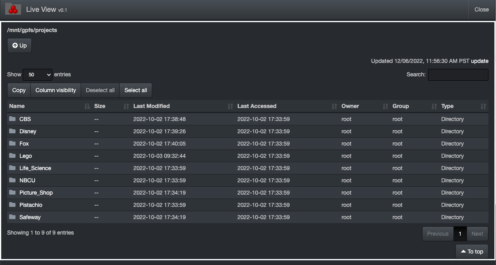
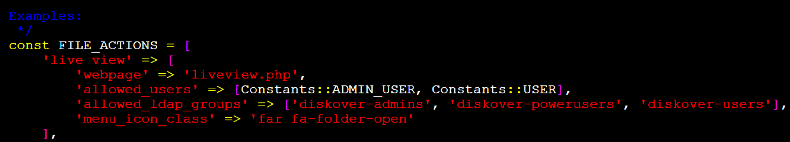

___
### File Action > Live View 

&nbsp;&nbsp;&nbsp;&nbsp;&nbsp;&nbsp;

#### [🍿 Watch Quick Tips](https://vimeo.com/767272643?share=copy)

The File Action Live View plugin is designed to provide a live view of the file system between indexing intervals. It provides users with a live view of the file system at that moment in time.

The Live View plugin requires mounts to the indexed storage in order to list the directories. The mounts do not need to be on the diskover-web server, they can be on a remote web server. See <a href="#Live-View-mounts-on-remote-web-server">Live View mounts on remote web server</a> below.




🔴 &nbsp;Install `php-process` with `yum` as required by Live View File Action's scandir.php:
```
yum install php-process
```
>Note: This needs to be installed on the web host serving scandir.php

🔴 &nbsp;Restart `php-fpm` service:
```
systemctl restart php-fpm
```

🔴 &nbsp;Copy default/sample files:
```
cp /var/www/diskover-web/public/fileactions/fileaction_samples/liveview.php /var/www/diskover-web/public/fileactions/
```
```
cp -a /var/www/diskover-web/public/fileactions/fileaction_samples/liveview /var/www/diskover-web/public/fileactions/
```

🔴 &nbsp;Set timezone in scandir.php:
```
vi /var/www/diskover-web/public/fileactions/liveview/scandir.php

// Timezone for file times
// set to your local time zone https://www.php.net/manual/en/timezones.php
$timezone = 'America/Vancouver';
```

🔴 &nbsp;Set if you want to hide hidden dot files in scandir.php:
```
// Ignore if file or folder is hidden (starts with .)
$ignorehidden = TRUE;
```

🔴 &nbsp;Set any path translations (from index path to mount path) in scandir.php:
```
// Path translation for listing files
$path_translations = array(
    '/^\//' => '/mnt/'
);
```

🔴 &nbsp;Set any path clipboard copy translations in scandir.php:
```
// Path translation for path copied to clipboard
$path_clipboard_translations = array(
    '/^\/mnt\//' => '/'
);
```


🔴 &nbsp;Add Live View to diskover-web config file:
```
vi /var/www/diskover-web/src/diskover/Constants.php
```




🔴 &nbsp;Set proper ownership:
```
chown -R nginx:nginx /var/www/diskover-web
```

<h4 id="Live-View-mounts-on-remote-web-server">Live View mounts on remote web server</h4>

If you do not want to mount all your storage on the diskover-web host, you can set Live View to use a remote web server which has the mounted file systems.

There are two options for remote scandir:

1) web browser client to remote web server communication
2) diskover-web web server to remote web server communication

**Option 1**

🔴 &nbsp;Edit the `liveview.js` file and change `scandir_url` located near the top of the file to be the url to your remote web server hosting scandir.php:
```
vi /var/www/diskover-web/public/fileactions/liveview/js/liveview.js

// location of ajax url to scandir.php
var scandir_url = 'https://<web server>:<port>/scandir.php';
```
>Note: When using https, you will need to set up and configure a valid ssl cert on the remote web server hosting scandir.php

🔴 &nbsp;Copy `fileactions/liveview/scandir.php` to the remote web server used in `liveview.js` file.

🔴 &nbsp;See above for setting timezone, path translations, etc for `scandir.php`.

**Option 2**

🔴 &nbsp;Edit the `liveview.js` file and change `scandir_url` located near the top of the file to be remotescandir.php:
```
vi /var/www/diskover-web/public/fileactions/liveview/js/liveview.js

// for web server to web server communication using php cURL instead of web browser ajax to remote web server use remotescandir.php
var scandir_url = 'liveview/remotescandir.php';
```

🔴 &nbsp;Edit the `remotescandir.php` file and change `remote_server_url` located near the top of the file to your remote web server host url:
```
vi /var/www/diskover-web/public/fileactions/liveview/remotescandir.php

// remote web server host url hosting scandir.php
$remote_server_url = "https://<web server host>";
```
>Note: When using https, you will need to set up and configure a valid ssl cert on the remote web server hosting scandir.php

🔴 &nbsp;Copy `fileactions/liveview/scandir.php` to the remote web server used in `remotescandir.php` file.

🔴 &nbsp;See above for setting timezone, path translations, etc for `scandir.php`.
