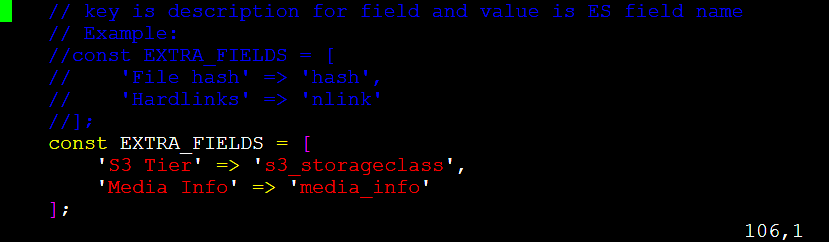
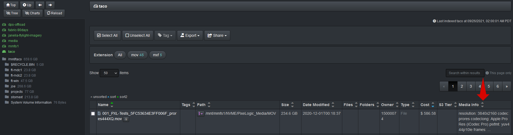

___
### Display Extra Fields on File Search Page

To display additional columns within the file search page of the Diskover-Web user interface, using Media Info as an example:
```
vim /var/www/diskover-web/src/diskover/Constants.php
```

🔴 &nbsp;Change ownership to **EXTRA_FIELDS**:
```
'Media Info' => 'media_info'
```



The Media Info column will now be displayed on the file search page of Diskover-web use interface:



#### List of Extra Fields

For an exhaustive list of extra fields, please refer to the Diskover-Web user interface > gear icon > Help > Default index fields.
