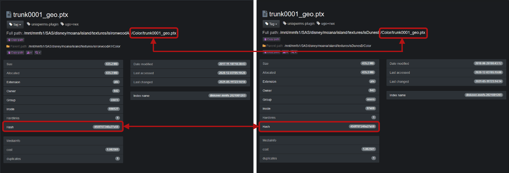

___
### Duplicates Finder Plugin

&nbsp;&nbsp;&nbsp;&nbsp;

The Diskover duplicates finder plugin (dupes-finder) leverages post processing of index to check for duplicates, across all file systems, or subset thereof. The plugin supports **xxhash**, **md5**, **sha1**, and **sha256** checksums. The plugin is designed for multiple use cases:

- To check for duplicate files across a single or all file systems (single or multiple indices) and indexing the file docs in index that are dupes
- Calculating file checksums/hashes for all duplicate files or all files and indexing hashes to file docs in index

Calculating file **hash checksums** is an expensive CPU/disk operation. The dupes-finder provides configuration options to control what files in the index get a hash calculated and marked as a dupe (`is_dupe` field in file docs set to `true`). In addition, the dupes-finder provides additional optimization mechanisms:

- The diskover-cache **sqlite3 db** can be used to store file hashes (-u cli option).
- An existing index can be used to lookup file hashes (-U cli option).
- The Elasticsearch fields for file type that get updated are `hash` and `is_dupe`. `hash` is an object field type and each hash type is stored in a sub-field: `hash.xxhash`, `hash.md5`, `hash.sha1`, `hash.sha256`. `is_dupe` is a boolean field and only gets added and set to `true` if the file is a duplicate file.

🔴 &nbsp;To use the default hashing mode **xxhash**, you will first need to install the **xxhash Python module**. Post indexing plugins are located in `plugins_postindex/` directory.
```
pip3 install xxhash
```

The dupes-finder can also be used to add file hashes to all the files in the index, not just the duplicates found.


The duplicates plugin will store hash values that can be stored only for duplicates or for all files.



🔴 &nbsp;Check that you have the config file in `/root/.config/diskover_dupesfinder/config.yaml`, if not, copy from the default config folder in `configs_sample/diskover_dupesfinder/config.yaml`.
```
mkdir /root/.config/diskover_dupesfinder
cd /opt/diskover/configs_sample/diskover_dupes_finder
cp config.yaml /root/.config/diskover_dupesfinder/
```

🔴 &nbsp;The dupes-finder plugin runs post index and  operates on completed indices as a scheduled job or on demand job to provide duplicates analysis on completed indices, to enable:
```
vim /root/.config/diskover_dupesfinder/config.yaml
```

🔴 &nbsp;At minimum configure the following:
- mode: desired checksum **xxhash**, **md5**, **sha1**, or **sha256**, can also be set using -m cli option
- minsize and maxsize: minimum and maximum size (in bytes) of files to hash
- extensions: desired file extensions to check, for all files use `[]`

🔴 &nbsp;Some additional settings:
- maxthreads: maximum number of threads to use for file hashing, leave empty/blank to auto-set based on number of cpu cores
- otherquery: additional Elasticsearch query when searching an index for which files to hash
- restoretimes: restore atime/mtime file times after hashing file
- replacepaths: for translating paths from index path to real path, example translating `/` to `/mnt/` . This is required if path translations were done in index or needing to convert to a Windows path.


🔴 &nbsp;To run the duplicates check via command line:
```
cd /opt/diskover/plugins_postindex
python3 diskover_dupesfinder.py diskover-<indexname>
```

🔴 &nbsp;To run the duplicates check and cache duplicate file hashes in sqlite cache db:
```
python3 diskover_dupesfinder.py diskover-<indexname> -u
```

🔴 &nbsp;To run the duplicates check and cache all file hashes in sqlite cache db, and hash all files (not just dupe files):
```
python3 diskover_dupesfinder.py diskover-<indexname> -u -a
```

🔴 &nbsp;To run the duplicates check and cache all file hashes in sqlite cache db, use hash mode sha1, and save all dupe files to csv:
```
python3 diskover_dupesfinder.py diskover-<indexname> -u -m sha1 -c
```

🔴 &nbsp;To run the dupes finder for multiple completed indices and compare dupes between indices:
```
python3 diskover-dupesfinder.py diskover-<indexname1> diskover-<indexname2>
```

🔴 &nbsp;Get help and see all cli options:
```
python3 diskover-dupesfinder.py -h
```
