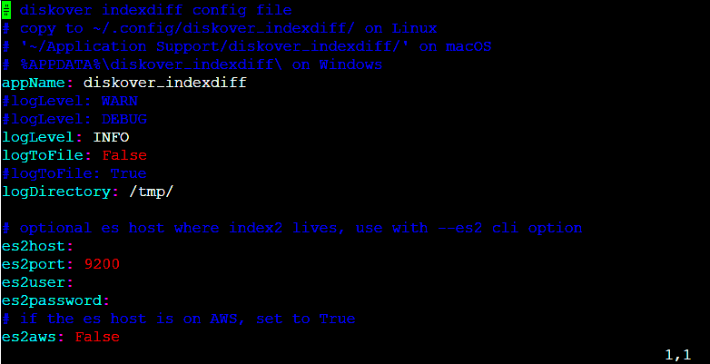
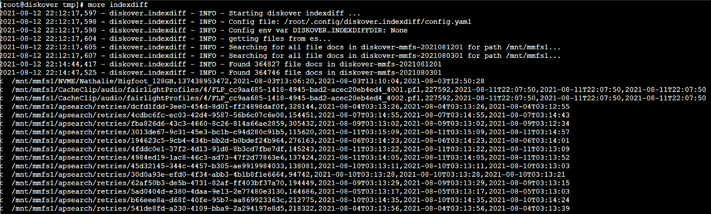

___
### Index Differential Plugin

&nbsp;&nbsp;&nbsp;&nbsp;&nbsp;&nbsp;

The index differential plugin is designed to provide a list of file differences between two indices (or points in time). The differential list can be used to feed synchronization tools (i.e. rsync) or identify deltas where two repositories should be identical. Outputs a CSV file containing the diffs between the two indices. It can also be used to compare checksums/hashes of files between two indices.

🔴 &nbsp;The index differential plugin runs post index and operates on completed indices as a scheduled job or on demand job to provide differences between two indices.

🔴 &nbsp;Copy default/sample config:

```
mkdir /root/.config/diskover_indexdiff
cd /opt/diskover
cp configs_sample/diskover_indexdiff/config.yaml /root/.config/diskover_indexdiff/
vim /root/.config/diskover_indexdiff/config.yaml
```

🔴 &nbsp;No configuration changes are usually required to the configuration file unless comparison involves indices from different Elasticsearch clusters, or changing default settings.



🔴 &nbsp;To run the index diff via command line and compare two indices with same top paths and output all diffs to csv file:
```
cd /opt/diskover/plugins_postindex
python3 diskover-indexdiff.py -i indexname1 -I indexname2 -d /mnt/stor1/foo
```

🔴 &nbsp;Compare two indices with different top paths and also compare file sizes (not just file names):
```
python3 diskover-indexdiff.py -i indexname1 -I indexname2 -d /mnt/stor1/foo -D /mnt/stor2/foo -s
```

🔴 &nbsp;Compare two indices and compare xxhash hash of files, tag indexname1 with diffs, and don't create csv file of diffs:
```
python3 diskover-indexdiff.py -i indexname1 -I indexname2 -d /mnt/stor1/foo -D /mnt/stor2/foo -c xxhash --tagindex --nocsv
```



🔴 &nbsp;To get help and see all cli options:
```
python3 diskover-indexdiff.py -h
```
