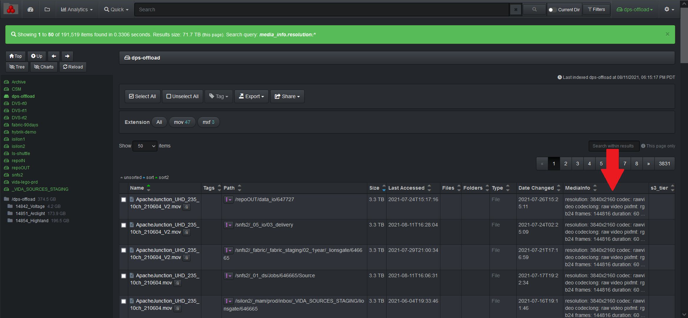
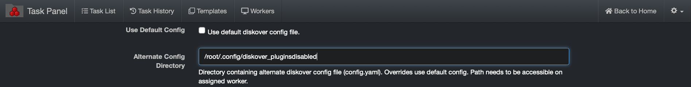

<p id="media_info_plugin"></p>
### Media Info Harvest Plugin

The media info harvest plugin is designed to provide media metadata attributes about a file without granting the Diskover user any read/write file system access.

The media info plugin enables additional metadata for video files to be harvested at time of index. The media info plugin uses **ffmpeg/ffprobe** to harvest attributes about the media file.

New indices will use the plugin and any video file will get additional media info added to the Elasticsearch index’s **media_info** field.

The attributes provide the ability to view storage and file system content from a workflow perspective, for example all the frame rates on any given storage.

You can view and search on media info attributes in Diskover-Web since it will store it in a new field for video files, the field name is **media_info**.



#### Install Media Info Dependencies

🔴 &nbsp;The media info plugin uses the **ffmpeg** [https://www.ffmpeg.org/](https://www.ffmpeg.org/) open-source package to harvest media attributes for media file types.
```
yum localinstall --nogpgcheck https://download1.rpmfusion.org/free/el/rpmfusion-free-release-7.noarch.rpm
yum install ffmpeg ffmpeg-devel
```

🔴 &nbsp;The media info plugin runs as part of the indexing process. To enable:
```
vim /root/.config/diskover/config.yaml
```
🔴 &nbsp;enable: set to **True**

🔴 &nbsp;files: **[‘mediainfo’]**


>_Note:_  The media info plugin is not supported for S3 based object storage. If the media info plugin is enabled in the default configuration file, and alternate configuration file must be created where the media info plugin is disabled. The alternate configuration file must be invoked when indexing S3 based volumes.


