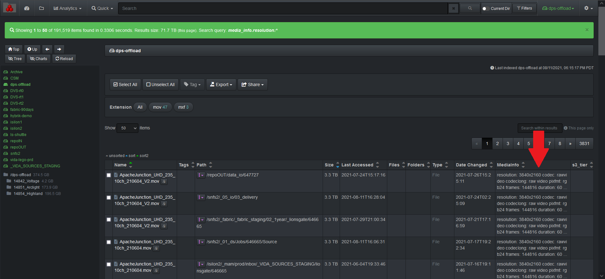

<p id="media_info_plugin"></p>

___
### Media Info Harvest Plugin


The media info harvest plugin is designed to provide media metadata attributes about a file without granting the Diskover user any read/write file system access.

The media info plugin enables additional metadata for video files to be harvested at time of index or post-index. The media info plugin uses **ffmpeg/ffprobe** to harvest attributes about the media file.

New indices will use the plugin and any video file will get additional media info added to the Elasticsearch index’s **media_info** field.

The attributes provide the ability to view storage and file system content from a workflow perspective, for example all the frame rates on any given storage.

You can view and search on media info attributes in Diskover-Web since it will store it in a new field for video files, the field name is **media_info**.



#### Install Media Info Dependencies

🔴 &nbsp;The media info plugin uses the **ffmpeg** [https://www.ffmpeg.org/](https://www.ffmpeg.org/) open-source package to harvest media attributes for media file types.

Install ffmpeg on Centos 7.x:

```
yum install epel-release
yum localinstall --nogpgcheck https://download1.rpmfusion.org/free/el/rpmfusion-free-release-7.noarch.rpm
yum install ffmpeg ffmpeg-devel
ffmpeg -version
```

Install ffmpeg on Centos 8.x:

```
dnf install epel-release dnf-utils
yum-config-manager --set-enabled PowerTools
yum-config-manager --add-repo=https://negativo17.org/repos/epel-multimedia.repo
dnf install ffmpeg
ffmpeg -version
```

Install ffmpeg on Ubuntu 18.x/20.x:

```
apt update
apt install ffmpeg
ffmpeg -version
```

🔴 &nbsp;The media info plugin runs as part of the indexing process. To enable:

```
vim /root/.config/diskover/config.yaml
```


  🔴 &nbsp;enable: set to **True**

  🔴 &nbsp;files: **[‘mediainfo’]**

🔴 &nbsp;Copy the default/sample media info config file:

```
mkdir /root/.config/diskover_mediainfo_plugin
cp /opt/diskover/configs_sample/diskover_mediainfo_plugin/config.yaml /root/.config/diskover_mediainfo_plugin
```

🔴 &nbsp;Edit the media info config file:

```
vim /root/.config/diskover_mediainfo_plugin/config.yaml
```

>_Note:_  The media info plugin is currently not supported for S3 based object storage. If the media info plugin is enabled in the default configuration file, an alternate configuration file must be created where the media info plugin is disabled. The alternate configuration file must be invoked when indexing S3 based volumes.


🔴 &nbsp;For reference, here are all the media info fields that are currently stored in the Elasticsearch index:

```
mediatext = {
                'resolution': str(stream['width']) + 'x' + str(stream['height']) if 'width' in stream and 'height' in stream else None,
                'codec': stream['codec_name'] if 'codec_name' in stream else None,
                'codeclong': stream['codec_long_name'] if 'codec_long_name' in stream else None,
                'codectag': stream['codec_tag_string'] if 'codec_tag_string' in stream else None,
                'pixfmt': stream['pix_fmt'] if 'pix_fmt' in stream else None,
                'frames': int(stream['nb_frames']) if 'nb_frames' in stream else None,
                'duration': duration,
                'framerate': framerate,
                'bitrate': bitrate
            }
```

🔴 &nbsp;Here is the ffprobe command used:

```
ffprobe -v quiet -print_format json -show_format -show_streams <file_path>
```

#### Visibility of the Media Info Field in Diskover UI

Technically at this point, the **media info** fields should be [visible](https://docs.diskoverdata.com/diskover_user_guide_companion_aja_media_edition/#hideunhide-media-info-column-in-search-results-pane) and [searchable](https://docs.diskoverdata.com/diskover_user_guide_companion_aja_media_edition/#general-notes-on-searching-media-attributes) in the Diskover UI, but if it's not:

🔴 &nbsp;Globally expose that column in the user interface:

```
cd /var/www/diskover-web/src/diskover/
```

```
vi Constants.php
```

🔴 &nbsp;Uncomment the **EXTRA_FIELDS** array to look something like this:


