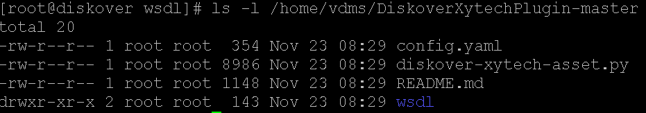
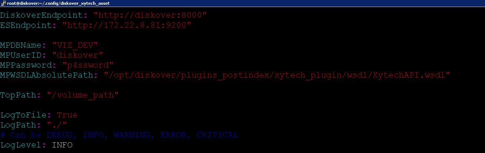
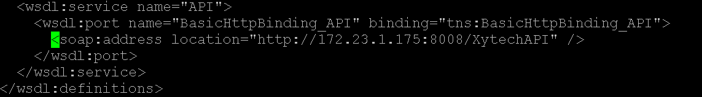
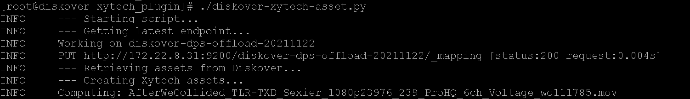

___
### Xytech MediaPulse Asset Creation Plugin


#### Xytech MediaPulse Asset Creation Plugin Introduction
Post facilities often have customer assets stored on LTO tape media. However, these assets are difficult to discover within Xytech MediaPulse if there is no MediaPulse Asset ID in the customers vault of assets. The plugin is designed to use the Diskover indexer to discover newly restored customer assets from any media. The assets are restored into a folder with naming convention **CustomerNumber_CustomerName**. 

The MediaPulse Asset Creation plugin then uses the Xytech API to create an asset for the customer in the vault library. The path location is added to the asset within MediaPulse and the asset # is assigned as a tag to the file/object within the Diskover index.

#### Xytech MediaPulse Asset Creation Plugin Installation

🔴 &nbsp;Extract **DiskoverXytechPlugin-master.zip**:

```
cd /tmp
unzip DiskoverXytechPlugin-master.zip
cd /tmp/DiskoverXytechPlugin-master.zip
```

🔴 &nbsp;Make destination directories:

```
mkdir /root/.config/diskover_xytech_asset
mkdir /opt/diskover/plugins_postindex/xytech_plugin
```

🔴 &nbsp;List plugin contents:

```
ls -l /tmp/DiskoverXytechPlugin-master
```



🔴 &nbsp;Copy files to proper locations:

```
cd /tmp/DiskoverXytechPlugin-master
mv config.yaml /root/.config/diskover_xytech_asset/
mv diskover-xytech-asset.py /opt/diskover/plugins_postindex/xytech_plugin/
mv wsdl/ /opt/diskover/plugins_postindex/xytech_plugin/
```

🔴 &nbsp;Configure plugin settings:

```
vim /root/.config/diskover_xytech_asset/config.yaml
```



**Diskover Endpoint:**

`DiskoverEndpoint: http://localhost:8000`

**ElasticSearch Endpoint:**

`ESEndpoint: http://172.22.8.31:9200`

**MediaPulse Credentials:**

`MPDBName: VIZ_DEV`

`MPUserID: diskover-dev`

`MPPassword: D1sk0v3r`


**MediaPulse WSDL file ABSOLUTE path:**

`MPWSDLAbsolutePath: /opt/diskover/plugins_postindex/xytech_plugin/wsdl/XytechAPI.wsdl`

**Diskover top path where assets will be restored:**

`TopPath: /volume_path`

**Plugin logging:**
```
LogToFile: True
LogPath: ./
LogLevel: INFO
```

🔴 &nbsp;Configure Xytech API Endpoint

```
vim /opt/diskover/plugins_postindex/xytech_plugin/XytechAPI.wsdl
```



**Set Xytech API Endpoint:**
```
<soap:address location="http://172.23.1.154:8008/XytechAPI" />
```

🔴 &nbsp;Run MediaPulse Asset Creation Plugin:

```
cd /opt/diskover/plugins_postindex/xytech_plugin/
```

🔴 &nbsp;Run Command:

```
./diskover-xytech-asset.py
```


