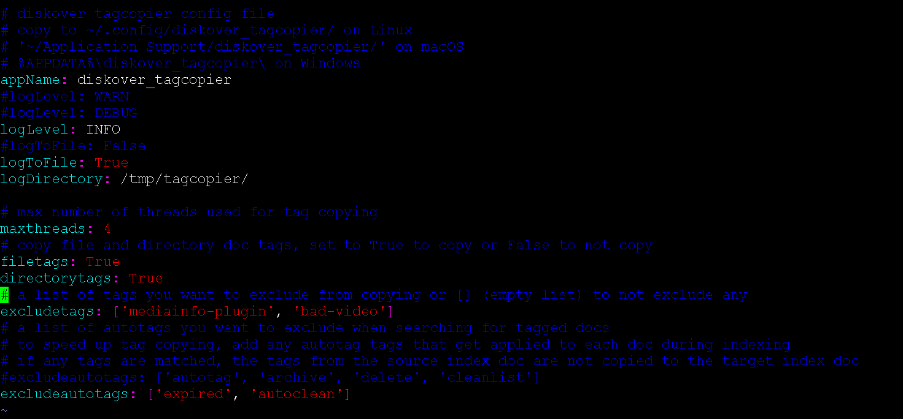
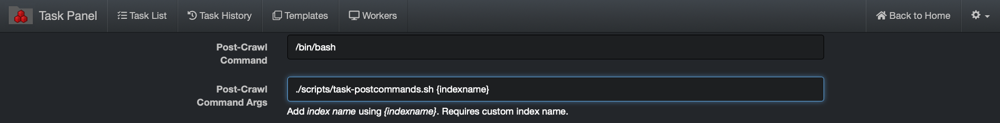

___
### Tag Copier Plugin

&nbsp;&nbsp;&nbsp;&nbsp;&nbsp;&nbsp;

The tag copier plugin is designed to migrate tags from one index to the next. Generally, these tags are not applied at time of index via autotag functionality, but are applied post index through:

1. Manual tag application.
1. Plugin tag application (harvest, duplicate hashes, etc.)

🔴 &nbsp;Check that you have the config file in `~/.config/diskover_tagcopier/config.yaml`, if not, copy from default config folder in `configs_sample/diskover_tagcopier/config.yaml`.

🔴 &nbsp;The tag copier runs post as scheduled job or immediately after index process copying tags from previous index to new index. To enable:
```
vim /root/.config/diskover_tagcopier/config.yaml
```

🔴 &nbsp;Configure for directories, files, or both.

🔴 &nbsp;Configure any tags to exclude from migration.



#### Invoke Tag Migration via Command Line

🔴 &nbsp;Tag migration can be invoked via a command line:
```
cd /opt/diskover
python3 diskover_tagcopier.py diskover-<source_indexname> diskover-<dest_indexname>
```

<p id="migrate_tags_from_previous_index"></p>

🔴 &nbsp;See all cli options:
```
python3 diskover-tagcopier.py -h
```

#### Configure Indexing Tasks to Migrate Tags from Previous Index

🔴 &nbsp;Create post command script to invoke tag roller:
```
cd /opt/diskover/scripts
cp cp task-postcommands-example.sh task-postcommands.sh
```

Set the following indexing tasks in Task Panel to migrate tasks from one index to the next:

🔴 &nbsp;In the post-crawl command add:
```
/bin/bash
```

🔴 &nbsp;In the post-crawl command Args add:
```
./scripts/task-postcommands.sh {indexname}
```


