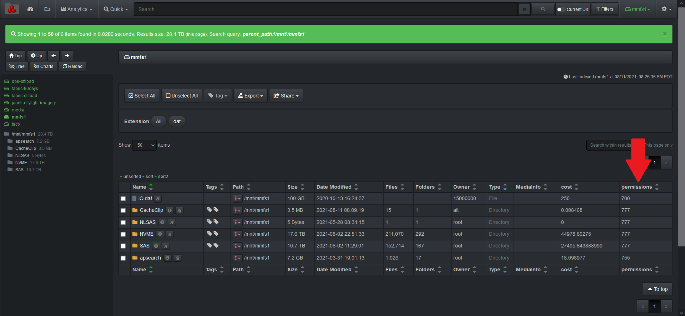
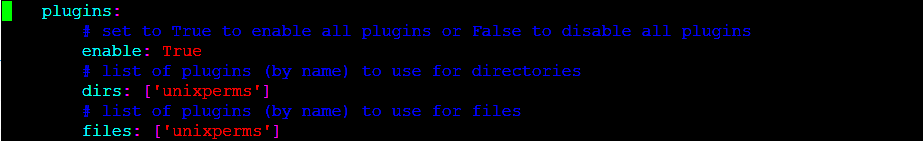

### Unix Permissions Plugin

The Unix permissions plugin adds the Unix permissions of each file and directory to the Diskover index at time of indexing. The field is populated with **ugo+rwx**  if a file or directory is found with fully open permissions.



🔴 &nbsp;The unixperms runs as part of the indexing process. To enable:
```
vim /root/.config/diskover/config.yaml
```

🔴 &nbsp;enable: set to **True**

🔴 &nbsp;dirs: **[‘unixperms’]**

🔴 &nbsp;files: **[‘unixperms’]**


