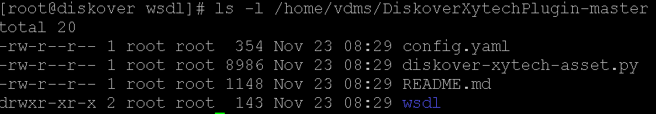
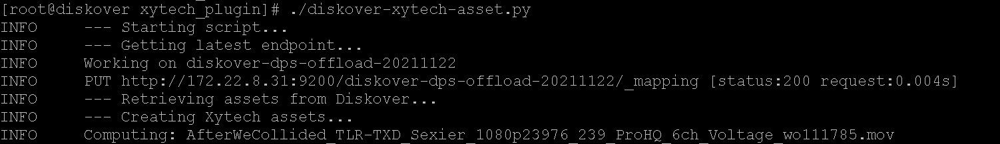

___
### Xytech Asset Creation Plugin


#### [🍿 Watch Demo Video](https://vimeo.com/660789118?share=copy)

#### Xytech Asset Creation Plugin Overview
Post facilities often have customer assets stored on LTO tape media. However, these assets are difficult to discover within the Xytech Media Operations Platform if there is no Asset ID in the customers vault of assets. The plugin is designed to use the Diskover indexer to discover newly restored customer assets from any media. The assets are restored into a folder with naming convention **CustomerNumber_CustomerName**. 

The Xytech Asset Creation plugin then uses the Xytech API to create an asset for the customer in the vault library. The path location is added to the asset within Xytech and the asset # is assigned as a tag to the file/object within the Diskover index.

#### Xytech Asset Creation Plugin Installation

🔴 &nbsp;Extract **DiskoverXytechPlugin-master.zip**:

```
cd /tmp
unzip DiskoverXytechPlugin-master.zip
cd /tmp/DiskoverXytechPlugin-master.zip
```

🔴 &nbsp;Make destination directories:

```
mkdir /root/.config/diskover_xytech_asset
mkdir /opt/diskover/plugins_postindex/xytech_plugin
```

🔴 &nbsp;List plugin contents:

```
ls -l /tmp/DiskoverXytechPlugin-master
```



🔴 &nbsp;Copy files to proper locations:

```
cd /tmp/DiskoverXytechPlugin-master
mv config.yaml /root/.config/diskover_xytech_asset/
mv diskover-xytech-asset.py /opt/diskover/plugins_postindex/xytech_plugin/
mv wsdl/ /opt/diskover/plugins_postindex/xytech_plugin/
```

🔴 &nbsp;Install Python dependencies:
```
pip3 install suds-community
```

🔴 &nbsp;Configure plugin settings:

```
vim /root/.config/diskover_xytech_asset/config.yaml
```


**Diskover Endpoint:**

`DiskoverEndpoint: http://localhost:8000`

**ElasticSearch Endpoint:**

`ESEndpoint: http://172.22.8.31:9200`

**Xytech Credentials:**

`MPDBName: VIZ_DEV`

`MPUserID: diskover`

`MPPassword: p4ssword`


**Xytech WSDL file ABSOLUTE path:**

`MPWSDLAbsolutePath: /opt/diskover/plugins_postindex/xytech_plugin/wsdl/XytechAPI.wsdl`

**Diskover top path where assets will be restored:**

`TopPath: /volume_path`

**Plugin logging:**

`LogToFile: True`

`LogPath: ./`

`LogLevel: INFO`

🔴 &nbsp;Configure Xytech API Endpoint

```
vim /opt/diskover/plugins_postindex/xytech_plugin/XytechAPI.wsdl
```


**Set Xytech API Endpoint:**
```
<soap:address location="http://172.23.1.154:8008/XytechAPI" />
```

🔴 &nbsp;Run Xytech Asset Creation Plugin:

```
cd /opt/diskover/plugins_postindex/xytech_plugin/
```

🔴 &nbsp;Run Command:

```
./diskover-xytech-asset.py
```


