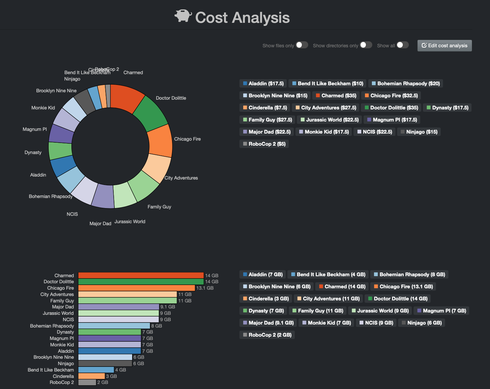
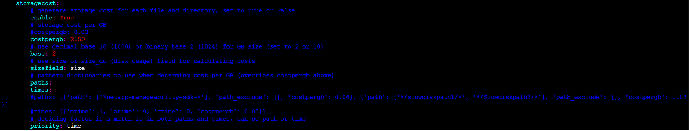
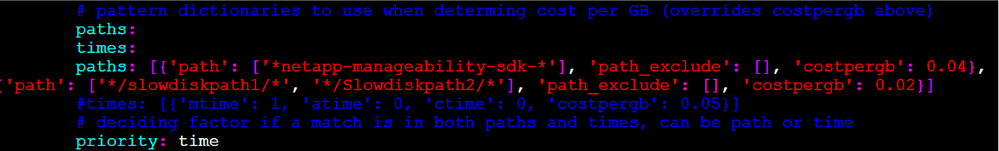
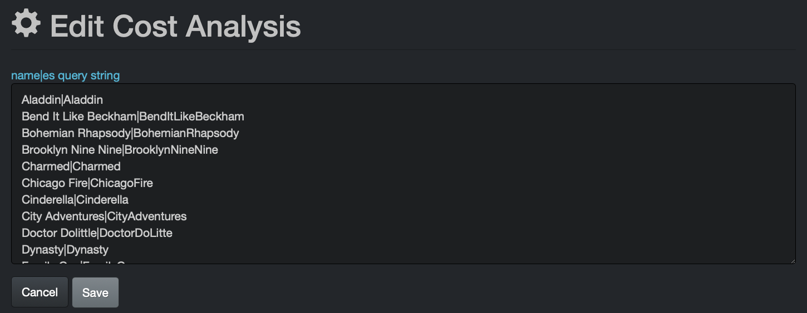

### Storage Cost Reporting

Storage Cost reporting are configured similar to Smart Searches. Cost reporting can be generated to align with business context and can be constructed from any Elasticsearch query. Therefore, any combination of names, tags, metadata fields, etc. can be used to construct business facing reports.

Storage cost can be set globally or per storage volume, directory, etc. This tool is designed to control operating costs by 1) charging clients accurately for storage of their projects, and 2) clean-up/data curation incentivizing.

The following report provides an example of cost analysis by **client** - The names in the report are fictitious and for demonstration only:



#### Storage Cost Configuration Overview Diagram


_[Click here for a full view of the diagram.](images/diagram_diskover_storage_cost_configuration_overview_with_border.png)_

#### Calculation of Cost Estimates

The storage cost can either be estimated globally or by storage volume, directory, etc. The estimations need to be done outside of Diskover. Beside the cost of the storage itself, other factors can be compounded like electricity, service contract, System Administrator’s salary, subscription fees, etc.

Estimation needs to be estimated and configured per gigabyte.

#### Storage Cost Configuration

🔴 &nbsp;Once the estimation per GB is achieve, open a terminal session:
```
vim /root/.config/diskover/config.yaml
```



🔴 &nbsp;Enable **storagecost** by changing to **True**:
```
enable: True
```

🔴 &nbsp;Enter global estimated cost per GB, example below at $2.50 per GB:
```
costpergb: 2.50
```

🔴 &nbsp;Enter base preference by typing **10** for decimal or **2** for binary, example below is set for binary:
```
base: 2
```

🔴 &nbsp;Enter size preference by typing **size** for file size or **size_du** for disk usage, example below is set for file size:
```
sizefield: size
```

🔴 &nbsp;Different costs can be assigned to specific paths, overriding the global cost per GB as described above, providing for very granular cost calculations:
```
paths: [{'path': ['*fast_storage*'], 'path_exclude': [], 'costpergb': 4.50}]
```

Different costs can also be configured by file aging, costs can be assigned based on age of data to incentivize movement of older data to less expensive storage:



🔴 &nbsp;In the case where storage cost could read either the **paths** or **times** override, you need to assign a priority preference either by **path** or **time**, example below is set for time:
```
priority: time
```

#### Accessing Storage Costs

Within the Diskover-Web user interface, cost information is displayed in different locations:

- **File search** page > **Cost** column in search results pane (**Cost** column might need to be unhidden from your **Settings** > **Hide fields in search results**)
- **Analytics** > **Cost Analysis** > to access a report, users can click on a report link.
- **Analytics** > **User Analysis**

#### Cost Analysis Reports Configuration

The Cost Analysis reports are repeatable queries which can be customized and are located in **Analytics** > **Cost Analysis**. Any users can access the reports, but only users with an admin level account can add/edit/delete reports.

- To add, edit or delete a report > **Analytics** > **Cost Analysis** > click the **Edit cost analysis** button.
- For queries syntax, please refer to **gear icon** > **Help** and/or Chapter 4 of the **User Guide**.

> **Cost Analysis** queries need to be built in the following format: **queryname|querycriteria**

Here are the very simple queries from the example displayed at the beginning of this section - you can copy the following queries and replace by your company's variables to achieve similar results:
```
Aladdin|Aladdin
Bend It Like Beckham|BendItLikeBeckham
Bohemian Rhapsody|BohemianRhapsody
Brooklyn Nine Nine|BrooklynNineNine
Charmed|Charmed
Chicago Fire|ChicagoFire
Cinderella|Cinderella
City Adventures|CityAdventures
Doctor Dolittle|DoctorDoLitte
Dynasty|Dynasty
Family Guy|FamilyGuy
Jurassic World|JurassicWorld
Magnum PI|MagnumPI
Major Dad|MajorDad
Monkie Kid|MonkieKid
NCIS|NCIS
Ninjago|Ninjago
RoboCop 2|RoboCop2
```


