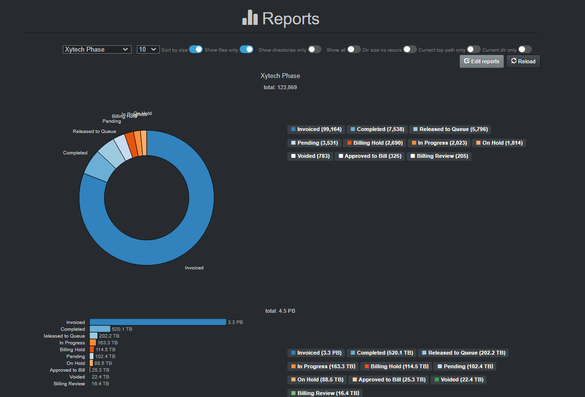
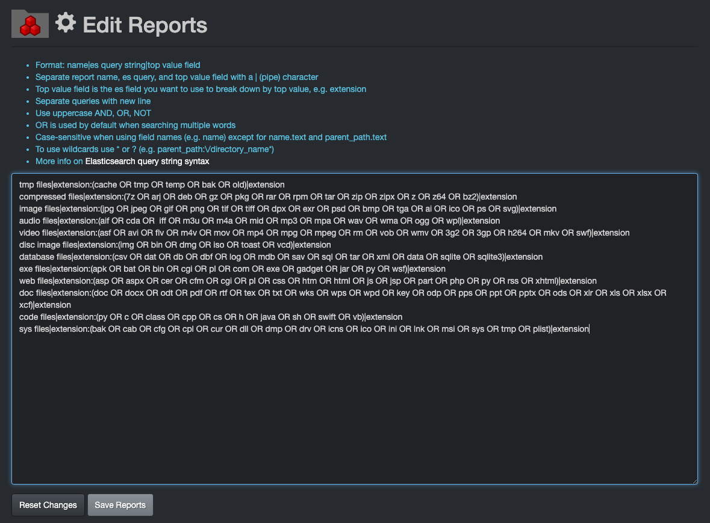

___
### Reports

&nbsp;&nbsp;&nbsp;


Reports provide a mechanism to create repeatable reports and search/analyze top results.

Any users can access Reports, but only users with an admin level account can add, edit or delete queries.

#### Accessing Reports

Within the Diskover-Web user interface, Reports is located under **Analytics** > **Reports**.

The following provides an example configured by **_order status_** when using the Xytech Order Status Plugin.



_[Click here for a full-screen view.](images/image_reporting_reports_report_example_diskover_ui.png)_

#### Using Reports

Please refer to the [Diskover User Guide](https://docs.diskoverdata.com/diskover_user_guide/#reports) for information on how to use **Reports**.

#### Reports Configuration

By default, Diskover has preconfigured reports by file types/extensions, but any type of queries with single or mixed criteria can be added and/or replace the default queries.

- To add, edit or delete a query > **Analytics** > **Reports** > click the **Edit reports** button.
- For queries syntax and rules, please refer to the Diskover User Guide:
    - Queries with [built-in search tools](https://docs.diskoverdata.com/diskover_user_guide/#built-in-search-tools)
    - [Syntax and rules for manual queries](https://docs.diskoverdata.com/diskover_user_guide/#manual-queries-syntax-and-rules)

> Reports queries need to be built in the following format: **report name|query|top value**

The example below is the default by **file type**:
```
tmp files|extension:(cache OR tmp OR temp OR bak OR old)|extension
compressed files|extension:(7z OR arj OR deb OR gz OR pkg OR rar OR rpm OR tar OR zip OR zipx OR z OR z64 OR bz2)|extension
image files|extension:(jpg OR jpeg OR gif OR png OR tif OR tiff OR dpx OR exr OR psd OR bmp OR tga OR ai OR ico OR ps OR svg)|extension
audio files|extension:(aif OR cda OR  iff OR m3u OR m4a OR mid OR mp3 OR mpa OR wav OR wma OR ogg OR wpl)|extension
video files|extension:(asf OR avi OR flv OR m4v OR mov OR mp4 OR mpg OR mpeg OR rm OR vob OR wmv OR 3g2 OR 3gp OR h264 OR mkv OR swf)|extension
disc image files|extension:(img OR bin OR dmg OR iso OR toast OR vcd)|extension
database files|extension:(csv OR dat OR db OR dbf OR log OR mdb OR sav OR sql OR tar OR xml OR data OR sqlite OR sqlite3)|extension
exe files|extension:(apk OR bat OR bin OR cgi OR pl OR com OR exe OR gadget OR jar OR py OR wsf)|extension
web files|extension:(asp OR aspx OR cer OR cfm OR cgi OR pl OR css OR htm OR html OR js OR jsp OR part OR php OR py OR rss OR xhtml)|extension
doc files|extension:(doc OR docx OR odt OR pdf OR rtf OR tex OR txt OR wks OR wps OR wpd OR key OR odp OR pps OR ppt OR pptx OR ods OR xlr OR xls OR xlsx OR xcf)|extension
code files|extension:(py OR c OR class OR cpp OR cs OR h OR java OR sh OR swift OR vb)|extension
sys files|extension:(bak OR cab OR cfg OR cpl OR cur OR dll OR dmp OR drv OR icns OR ico OR ini OR lnk OR msi OR sys OR tmp OR plist)|extension
```


