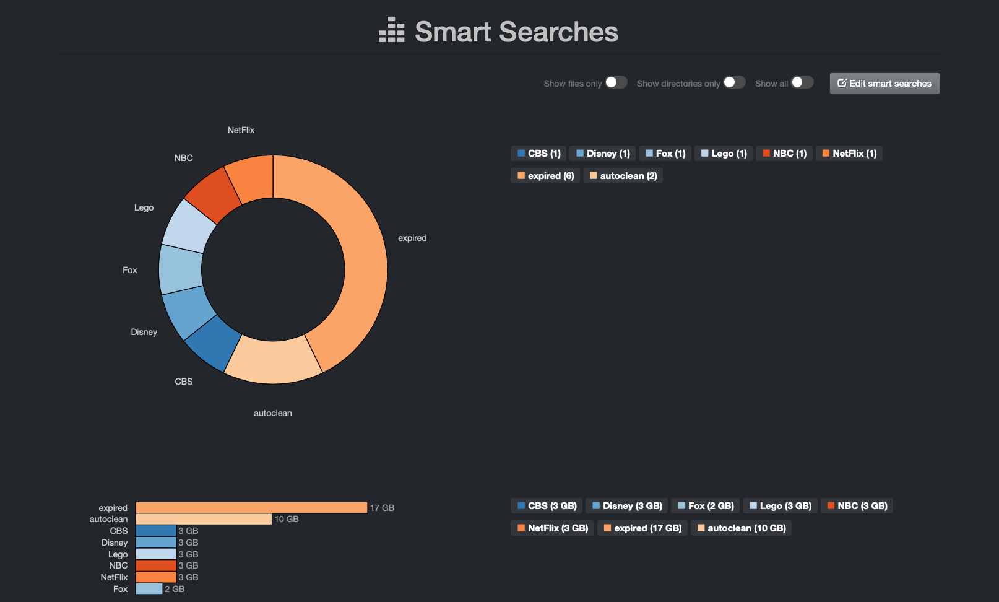
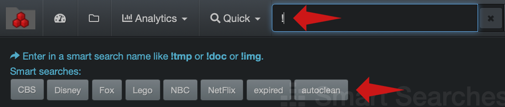
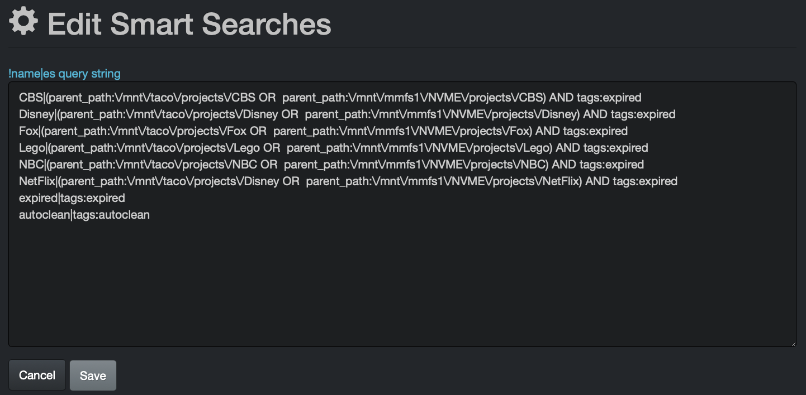

___
### Smart Searches

&nbsp;&nbsp;&nbsp;&nbsp;&nbsp;&nbsp;


Smart Searches provide a mechanism to create repeatable reports or bookmarks based on search queries. Any combination of names, tags, metadata fields, etc. can be used to construct business facing reports.

Any users can access Smart Searches, but only users with an admin level account can add, edit or delete queries.

#### Accessing Smart Searches

Within the Diskover-Web user interface, Smart Searches is located under **Analytics** > **Smart Searches**.

The following provides an example smart search configuration by **_client_** - The names in the report are fictitious and for demonstration only:



Business users can click on a report link in the **Smart Searches** page and/or launch the query by typing the **queryname** in the search bar starting with **!**, ex: **!queryname**

When typing a **!** in the search bar, the list of existing Smart Searches reports will appear under the search bar and you can just click on the one you want to launch or type the rest of the name of the report in the search bar:



#### Using Smart Searches

Please refer to the [Diskover User Guide](https://docs.diskoverdata.com/diskover_user_guide/#smart-searches) for information on how to use **Smart Searches**.

#### Smart Searches Configuration

By default, Diskover has preconfigured reports by file types/extensions, but any type of queries with single or mixed criteria can be added.

- To add, edit or delete a report > **Analytics** > **Smart Searches** > click the **Edit smart searches** button.
- For queries syntax and rules, please refer to the Diskover User Guide:
    - Queries with [built-in search tools](https://docs.diskoverdata.com/diskover_user_guide/#built-in-search-tools)
    - [Syntax and rules for manual queries](https://docs.diskoverdata.com/diskover_user_guide/#manual-queries-syntax-and-rules)


> Smart searches queries need to be built in the following format: **!report name|query**

The above example report by **_client_** was configured using these smart search logic queries - you can copy the following queries and replace by your company's own variables to achieve similar results:
```
CBS|(parent_path:\/mnt\/taco\/projects\/CBS OR  parent_path:\/mnt\/mmfs1\/NVME\/projects\/CBS) AND tags:expired
Disney|(parent_path:\/mnt\/taco\/projects\/Disney OR  parent_path:\/mnt\/mmfs1\/NVME\/projects\/Disney) AND tags:expired
Fox|(parent_path:\/mnt\/taco\/projects\/Fox OR  parent_path:\/mnt\/mmfs1\/NVME\/projects\/Fox) AND tags:expired
Lego|(parent_path:\/mnt\/taco\/projects\/Lego OR  parent_path:\/mnt\/mmfs1\/NVME\/projects\/Lego) AND tags:expired
NBC|(parent_path:\/mnt\/taco\/projects\/NBC OR  parent_path:\/mnt\/mmfs1\/NVME\/projects\/NBC) AND tags:expired
NetFlix|(parent_path:\/mnt\/taco\/projects\/Disney OR  parent_path:\/mnt\/mmfs1\/NVME\/projects\/NetFlix) AND tags:expired
expired|tags:expired
autoclean|tags:autoclean
```


