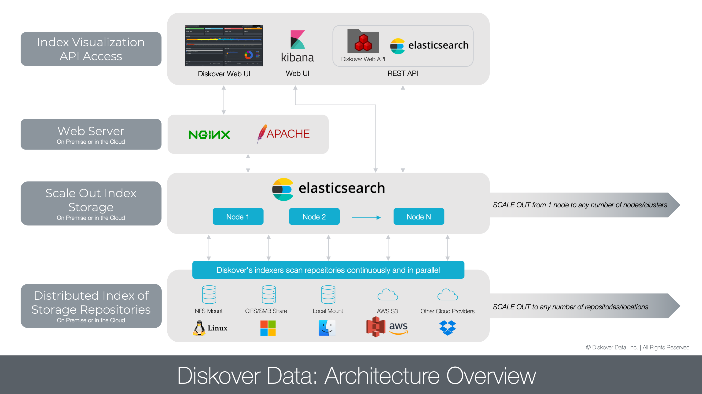
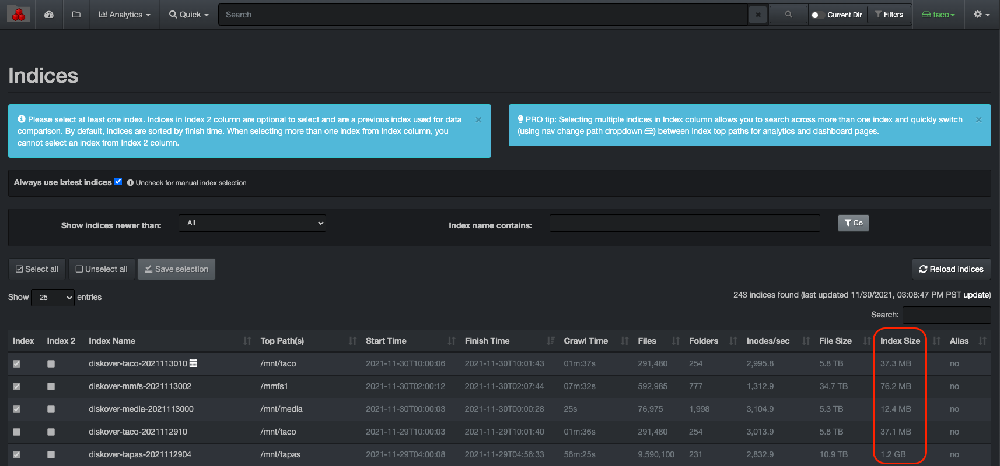

___
### Elasticsearch Requirements

For more detailed Elasticsearch guidelines refer to AWS sizing guidelines:

[https://docs.aws.amazon.com/opensearch-service/latest/developerguide/sizing-domains.html](https://docs.aws.amazon.com/opensearch-service/latest/developerguide/sizing-domains.html)

#### Architecture Overview and Terminology

Below is an overview of the Diskover architecture.

_[Click here for a full screen view of the Diskover Architecture Overview diagram.](images/diagram_diskover_architecture_overview.png)_

In order to better understand the terminology used by Elasticsearch and throughout the Diskover documentation, please refer to this diagram.

_[Click here for a full screen view of the Elasticsearch Architecture diagram.](images/diagram_diskover_elasticsearch_architecture.png)_

#### Elasticsearch Cluster

##### Production Deployments

>- Minimum 3 nodes for performance and redundancy
>- 16 CPU cores per node
>- 32 GB RAM per node (16 GB reserved to Elasticsearch memory heap)
>- 1 TB of SSD storage per node (see Elasticsearch Storage Requirements below)

##### Proof of Concept Minimum Deployment

>- Minimum of 1 node for testing
>- 8 CPU cores
>- 16 GB RAM per node (8 GB reserved to Elasticsearch memory heap)
>- 500 GB of SSD storage per node (see Elasticsearch Storage Requirements below)

#### Indices

##### Rule of Thumb Shard Size

>- Try to keep shard size between 10 – 50 GB
>- Ideal shard size approximately 20 – 40 GB

Once you have a reference for your index size, you can decide to shard if applicable. From the user inferface > gear icon > Indices:

##### Examples

>- Index that is 60 GB in size: you will want to set shards to 3 and replicas* to 1 or 2 and spread across 3 ES nodes.
>- Index that is 5 GB in size: you will want to set shards to 1 and replicas* to 1 or 2 and be on 1 ES node or spread across 3 ES nodes (recommended).
>
>\* _Replicas help with search performance and provide fault tolerance. When you change shard/replica numbers, you have to delete the index and re-index._

#### Estimating Elasticsearch Storage Requirements

##### Individual Index Size

>- 1 GB for every 5 million files / folders
>- 20 GB for every 100 million files / folders

##### Rolling Indices:

>- Each Diskover scan results in the creation of a new Elasticsearch index.
>- Multiple indexes can be maintained to keep the history of storage indices.
>- Elasticsearch overall storage requirements will depend on history index requirements.
>- For rolling indices, you can multiply the amount of data generated for a storage index by the number of indices desired for retention period. For example, if you generate 2 GB for a day for a given storage index, and you want to keep 30 days of indices, 60 GB of storage is required to maintain a total of 30 indices.
