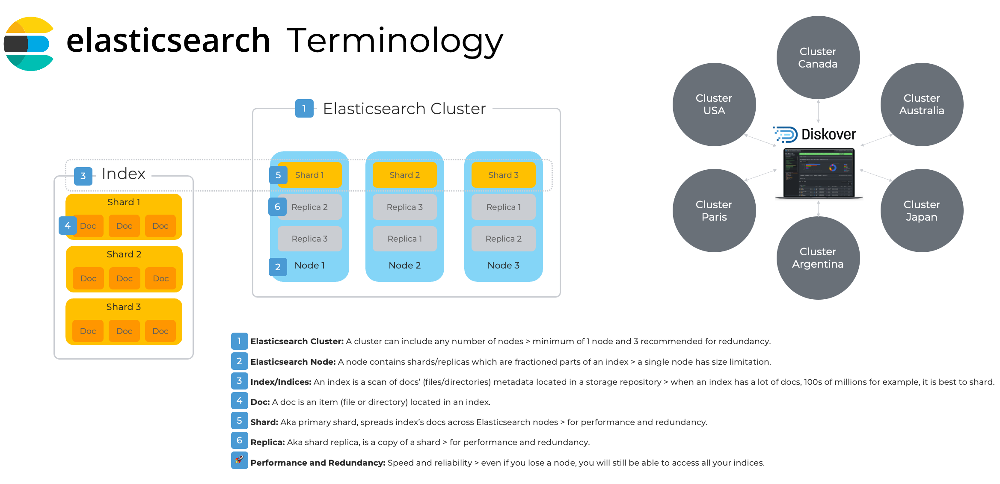

### Elasticsearch Requirements

#### Elasticsearch Version

Diskover is currently tested and deployed with Elasticsearch v8.x. Note that ES7 Python packages are required to connect to an Elasticsearch v8 cluster.

#### Elasticsearch Architecture Overview and Terminology

Please refer to this diagram to better understand the terminology used by Elasticsearch and throughout the Diskover documentation.

_[Click here for a full-screen view of the Elasticsearch Architecture diagram.](images/diagram_diskover_elasticsearch_architecture.png)_

#### Elasticsearch Cluster

- The foundation of the Diskover platform consists of a series of Elasticsearch indexes, which are created and stored within the Elasticsearch endpoint. 
- An important configuration for Elasticsearch is that you will want to [set Java heap mem size](https://www.elastic.co/guide/en/elasticsearch/reference/7.16/advanced-configuration.html#set-jvm-heap-size) - it should be half your Elasticsearch host ram up to 32 GB.
- For more detailed Elasticsearch guidelines, please refer to [AWS sizing guidelines](https://docs.aws.amazon.com/opensearch-service/latest/developerguide/sizing-domains.html).
- For more information on [resilience in small clusters](https://www.elastic.co/guide/en/elasticsearch/reference/current/high-availability-cluster-small-clusters.html).

#### Requirements for POC and Deployment

| | Proof of Concept | Production Deployment |
| --- | --- | --- |
| Nodes | 1 node | 3 nodes for performance and redundancy are recommended |
| CPU | 8 to 32 cores | 8 to 32 cores |
| RAM | 8 to 16 GB (8 GB reserved to Elasticsearch memory heap) | 64 GB per node (16 GB reserved to Elasticsearch memory heap |
| DISK | 250 to 500 GB of SSD storage per node (root 150 GB, home 25 GB, var 800 GB) | 1 TB of SSD storage per node (root 150 GB, home 25 GB, var 800 GB) |

#### AWS Sizing Resource Requirements

Please consult the [Diskover AWS Customer Deployment Guide](https://docs.diskoverdata.com/diskover_aws_deployment_guide/) for all details.

| | AWS Elasticsearch Domain | AWS EC2 Web-Server | AWS Indexers |
| ---| --- | --- | --- |
| Minimum | i3.large | t3.small | t3.large |
| Recommended | i3.xlarge | t3.medium | t3.xlarge |

#### Indices

##### Rule of Thumb for Shard Size

- Try to keep shard size between 10 – 50 GB
- Ideal shard size approximately 20 – 40 GB

Once you have a reference for your index size, you can decide to shard if applicable. To check the size of your indices, from the user interface, go to → ⛭ → **Indices**:

_[Click here for a full-screen view of this image.](images/indices_index_size.png)_

##### Examples

- An index that is 60 GB in size: you will want to set shards to 3 and replicas* to 1 or 2 and spread across 3 ES nodes.
- An index that is 5 GB in size: you will want to set shards to 1 and replicas* to 1 or 2 and be on 1 ES node or spread across 3 ES nodes (recommended).

⚠️ &nbsp; Replicas help with search performance, redundancy and provide fault tolerance. When you change shard/replica numbers, you have to delete the index and re-scan.

#### Estimating Elasticsearch Storage Requirements

##### Individual Index Size

- 1 GB for every 5 million files/folders
- 20 GB for every 100 million files/folders

⚠️ &nbsp; The size of the files is not relevant.

##### Replicas/Shard Sizes

Replicas increase the size requirements by the number of replicas. For example, a 20 GB index with 2 replicas will require a total storage capacity of 60 GB since a copy of the index (all docs) is on other Elasticsearch nodes. Multiple shards do not increase the index size, as the index's docs are spread across the ES cluster nodes.

⚠️ &nbsp; The number of docs per share is limited to 2 billion, which is a hard Lucene limit.

##### Rolling Indices

- Each Diskover scan results in the creation of a new Elasticsearch index.
- Multiple indexes can be maintained to keep the history of storage indices.
- Elasticsearch overall storage requirements will depend on history index requirements.
- For rolling indices, you can multiply the amount of data generated for a storage index by the number of indices desired for retention period. For example, if you generate 2 GB for a day for a given storage index, and you want to keep 30 days of indices, 60 GB of storage is required to maintain a total of 30 indices.
