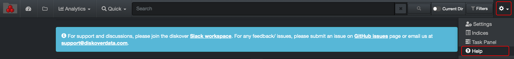

___

## Manual Search Syntax
___

Until you get familiar with Diskover, we strongly recommend using the built-in search tools and [filters](#filters) available in the interface when trying to achieve complex queries. Depending on what you are looking for, [quick searches](#quick_search) can also be an easy way to search.

The examples used in this chapter are media and entertainment related, but the logic can be applied to any type of industry.

The list of possible search queries and syntax is exhaustive therefore only the basics of manual searches will be explained in this chapter. For more search queries information, please visit  **gear icon** > **Help** at the top right corner of the user interface:

### Syntax Based on Elasticsearch Rules

As Diskover uses Elasticsearch in the backend, all search syntax within Diskover are based on Elasticsearch rules. We will discuss many of these rules in this chapter, but for more details and more examples, please visit: 

[https://www.elastic.co/guide/en/elasticsearch/reference/current/query-dsl-query-string-query.html](https://www.elastic.co/guide/en/elasticsearch/reference/current/query-dsl-query-string-query.html)

<h3 id="naming_convention">Search Problems Resulting from Naming Conventions</h3>

All organizations have issues with naming convention. Your search results might be limited if you try to be too restrictive when searching. For example, files associated with the movie **For Your Eyes Only** might be named:
- ForYourEyesOnly
- 4YourEyesOnly
- foryoureyesonly
- for_your_eyes_only
- for your eyes
- Not mentioning all the possible misspellings. 

Trying to launch a query with too many words and/or criteria, unless you know that a strict naming convention was followed, will limit your results and you might think that some files are missing.

Ways to either pinpoint or expand your results will be explained in this chapter.

### Basic Search and Query Rules

> 🔆 Pay attention to all the messages in the green and blue information bars, they are very helpful!

#### Range of Search

When typing a manual query, the value needs to be typed in the [search bar](#search_bar).

Unless you select a specific [storage volume and/or directory](#limiting_searches), Diskover will search all the storage volumes and their parent paths during a manual search.

#### Case Sensitivity

Search queries are mostly case insensitive, even if upper or lowercases are used in the file name or path.

But there are the few exceptions where queries are case sensitive:
- When [searching on time](#search_time).
- When searching on [field names](#search_field_names).

#### Grouping

At times you will need to group criteria, so Diskover can make sense of the queries.

- When writing complex queries, you will need to group some elements with parentheses `( )` as further described in [The Need of Grouping for Complex Queries](#complex_queries) section.

- The square brackets `[ ]` or curly brackets `{ }` need be used to contain ranges for **time**, **dates**, **numeric** or **string fields**. They can even be mixed `[ }`. You can find examples in the [Searching on time](#search_time) section. How to apply them:
	- **Inclusive** ranges need to be specified with square brackets, ex: **[min TO max]**, 

	- **Exclusive** ranges need to be specified with curly brackets, ex: **{min TO max}**

 

#### The Logic Behind Searching on a Single Word

When typing a single word in the search bar, Diskover will look for that **isolated word**. In order to "split" and find isolated words, Diskover/Elasticsearch uses **tokenizers** like **space, underscore, hyphen, forward slash, period, other punctuation, as well as upper cases** to make sense of what is included in a file name. For example:

- If your file name is **for_your_eyes_only.mov** and you launch a search with the word **eyes**, Diskover will find that file because that word is isolated between underscores.

- If your file name is **ForYourEyesOnly.mov** and you launch a search with the word **eyes**, Diskover will find that file because the first letters being capitalized are recognized as separate words.

- If your file name is **foryoureyesonly.mov** and you launch a search with the word **eyes**, Diskover would not find that file because the whole name/string looks like a single word.

<h3 id="wildcards">Wild Cards</h3>

**? *is used to replace a single character*** 

**\* *is used to replace zero, one or many characters*** (the most used wild card)

Wild cards are used to expand search results mostly due to [naming convention](#naming_convention), but also to go around possible misspellings, although the [fuzziness](#fuzziness) operator, covered later in this chapter, is a much better choice for misspellings.

>🔆 A search might be a tad slower when using wild cards, especially when it is placed in front of your query, because it is searching a much larger amount of data.

### Examples with Grouped Words or Numbers
When searching on a single word for example, the results might be limited if you type the word alone. Let's take the example of trying to find the following file **foryoureyesonly.mov**:

- If you only type **eyes**, that file would not be found as Diskover would search for that [isolated word](#search_single_word) and not being mixed with other characters right before and/or after.

- If you type **\*eyes** or **eyes\***, that file would not be found either.

- You would need to type **\*eyes\*** to find this file following this example as it is preceded and succeeded by other characters.

The same rule applies with numbers. For example:

- If the file name would be **SomethingGood_20161031.mp4**, you would need to either:
	- Type the all the numbers **20161031** to find that file with that specific date
	- Or typing **201610\*** would find all the files that have the year 2016 and the month of October, assuming that all those files were identified the same way with the same date format.

#### Examples with Isolated Words
If the file name would be **for_your_eyes_only.mov** or **ForYourEyesOnly.mov**:

- Launching a search with only **eyes** would find that file, but again, naming conventions being what they are, it is recommended to use an **\*** to expand your results at first to make sure you are not missing any files named differently.

- Also, if you are not sure if **eyes** is plural or singular in the file name, you could use **eye?** to replace a single character.

#### Examples with Season Number
Let's do another example with a season's number for a show. For example, if you want to search for **season 1**, the file name could have different spelling like **S1**, **season 1**, **s01**, **s_1**, etc. 

In order to expand your results to include all possibilities, without at the same time expending too much, the best search syntax would be **s*1** because the **\*** would catch everything in between the **s** and the **1**. Now, this would also find season 11 for example, but it's better to widen your results at first and then narrow them down once you have an idea of the possible results.

#### Find all Files in a Sequence

To find all files in a sequence, if you type for example **img\*.dpx** would find all files with the following similar names: img001.dpx, img002.dpx, etc.

#### Example Using * and ? in the Same Query
Both **?** and **\*** wild cards can be used in the same query, for example searching for Johnny Smith: **John\* Sm?th**

>🔆 If you prefer not typing the **\*** and ALWAYS want to use it by default, you can select that preference **> gear icon > settings > [predictive search](#predictive_search)**. Please be aware that using predictive search might expand your results way too much. Throughout this chapter, we will assume the predictive search has not been selected.

 

### Searches Using Field Names

Searching with field names can be effective if you search on a specific and/or hidden field and are looking for precise results.

The query needs to be typed in this exact format **fieldname:value**

>🔆 Searching on field names is case sensitive:
>- The **fieldname** needs to be in lower case.
>- The variable after the colon needs to be typed in upper and/or lower case to match exactly what you are searching for. 

Let's use the example of searching on tags:

- **tags:delete** would find all files and directories with the tag **delete** applied to them, it would not find a tag spelled **Delete** for example because of the capital D.

- **tags:(manual_delete AND approve_delete)** same logic as above and please refer to the section [grouping for complex queries](#complex_queries) regarding the use of the parentheses.

You can find mome examples with field names in the [Searching on Time](#search_time) and [Searching on Size](#search_size) sections.

Here are the detault field names. This list can also be found in the help page of the user interface:

- **atime** - access Time
- **costpergb** - storage space cost
- **ctime** - changed time
- **extension** - file extension
- **group** - can vary depending on how Diskover was configured, see [User Analysis Report](#user_analysis) section and/or ask your system administrator
- **ino** - file inode number
- **mtime** - modified time
- **name** - file name
- **name.text** - same as **name** but is not case sensitive
- **nlink** - number of [hardlinks](#hardlinks)
- **owner** - can vary depending on how Diskover was configured, see [User Analysis Report](#user_analysis) section and/or ask your system administrator(#user_analysis) 
- **parent_path** - ex: `\/some\/folder*` will search that folder and all sub-folders ([recursive](#recursive))
- **parent_path.text** - same as **parent_path** but is not case sensitive
- **size** - file size, in bytes, see [searching by size](#search_size) for more details
- **size_du** - disk usage size, aka allocated size, in bytes, see [searching by size](#search_size) for more details
- **tags** - any tag(s) associated with a file or directory
- **type** - file or directory

### Queries with File Extensions

When searching on file extensions, it is recommended to either:
- Use the dedicated fields in the [pre-built filters](#filters). 
- Type in the search bar the pre-determine field name for file extensions, example **extension:mov**

The reason being that the file extension letters might be part of the file name and give you misleading results. For example:
- If only typing **mov** in the search bar, the results would include all files with **.mov** extension, but could also return a file with the name **all_mov_titles_2021.txt**

- If only typing **jpg** in the search bar, the results would include all files with **.jpg** extension, but could also return a file with the name **montage_jpg_png_images.gif**

<h3 id="operators">Operators</h3>

You can use operators **AND OR NOT**  to narrow down a manual search. Although the operators in this section are capitalized for ease of understanding, the operators can be typed in lower case in the search bar.

>🔆 IMPORTANT! When searching with more than one criteria, you don't need to put **AND** if that is the operator you would otherwise type, as Diskover uses the **AND** operator by default when non others are used. See examples below.

Let's take the series **The Jungle Book** and that a similar naming convention was respected: **thejunglebook_s01_ep05_en.mov** (series The Jungle Book, season 1, episode 5, English sub)

Here are some examples of queries using operators to narrow your searches.

- **\*jungle\* AND s01** would find all episodes within season 1, in any language or you could type **\*jungle\*  s01** as the AND is used by default as previously explained.

- **\*jungle\* AND s01 NOT e*5** would find season 1 in any languages and all episodes except the ones with 5 in them. It is recommended to use the AND when mixing operators in the same query.

>🔆 When using more than one, but especially a mix of different operators in a query, it is highly recommended to use parentheses **( )** to group some elements as described in the next section, in order to help Diskover make sense of the query and return the desired results.

>🔆 Operators can only be used in the main search bar  at the top of the user interface. They cannot be used in the **search within results** field.
 
 

 
### The Need of Grouping for Complex Queries

When using more than one operator, it is recommended to use parentheses **( )** in order to group some elements and help Diskover make sense of the query. A few examples while still using the file name structure **thejunglebook_s01_ep05_en.mov**:

#### Examples with Single Grouping

- **\*jungle\* AND (s\*1 OR s\*2)** would find all files related to season 1 and season 2 for The Jungle Book series.

- **\*jungle\* AND e*5 AND (en OR it)** would find all Italian (assuming **it** was respected in the naming convention) and English translations of episode 5.

- **\*jungle\* AND s*1 AND extension:(mov OR mp4)** would find all files of season 1 with .mov and .mp4 extension, a less precise query could be **\*jungle\* AND s*1 AND (mov OR mp4)**

Another type of example with words only, and let's use **New York City**. If you only want to find files that have all those 3 words in them, you can type **(new york city)** assuming that all the words are isolated of course.

#### Examples with Multiple Groupings

- **\*jungle\* AND (s*1 OR s*2) (NOT (en OR it))** still using the same file name example as above, would find all files for season 1 and season 2, but in all other languages than English or Italian.

- Let say that you have files with "quick brown fox", "quick fox", "brown fox", "Fox News", etc. this would be the query to use **((quick AND fox) OR (brown AND fox) OR fox) AND NOT news** to respect the following conditions:
	- **fox** must be present
	-  **news** must be excluded
	-  **quick** and **brown** are optional — their presence increases the relevance

<h3 id="fuzziness">Fuzziness</h3>

You can run fuzzy queries with the **tilde ~** operator. 

Fuzziness is mostly used to catch human misspellings, and will return vast results if not used with any other restrictions.

The query uses the  [Damerau-Levenshtein distance](https://en.wikipedia.org/wiki/Damerau-Levenshtein_distance)  to find all terms with a maximum of two changes, where a change is the insertion, deletion or substitution of a single character, or transposition of two adjacent characters.

If used alone, by default the **~** will look for the maximum of 2 changes, but it is best practice to use **~1** in order to limit the changes to 1, which should be sufficient to catch 80% of all human misspellings. 

A few examples of words that would be found with and without limiting the changes to 1:

- **jungle~1** would find: jungle, jingly, jingle, jingles.
- **jungle~** would find: jungle, jingly, jingle, jingles, june, judge, single, bundle, uncle.

>🔆 Do NOT mix fuzziness and wild cards as it is not supported, and only one of the operators would be applied, example of what NOT to do: **jungle\*~1**

Be aware that launching a query with the fuzziness operator can use an enormous amount of memory and perform badly, ending in a "timed out" situation.

 

### Searching on File Size

Diskover shows file size (size) and allocated size (size_du) in bytes. We recommend using the [filters](#filters), as well as [quick search](#quick_search) when searching on size, but these fields can also be searched manually. Some examples:

- **size:>1048576**  would find all files larger than 1 MB

- **size:>5242880 AND (type:file OR type:directory)**  would find all files and folders larger than 5 MB

- **size:>=5242880 AND size:<=10485760**  would find all files equal or larger than 5 MB but equal or smaller than 10 MB

- **extension:mov AND size:>32212254720** would find all files with .mov extension and larger than 30 GB

>🔆 When unsure how to translate size from MB, GB, etc. to bytes, you can use any free *byte converter* available online.

### Searching on Time

Although it is strongly advised to use [filters](#filters) or [quick search](#quick_search) to query time, below are a few examples on how to do so with a manual query.

#### Definitions
- **atime**: last accessed
	- The file may have been opened by you, or may have been accessed by some other program or a remote machine. Anytime a file has been accessed, its access time changes.
- **ctime**: last changed 
	- The modification can be in terms of its content or in terms of its attributes. Whenever anything about a file changes (except its access time), its ctime changes.
- **mtime**: last modified 
	- Indicates the time the contents of the file has been changed. Mind you, only the contents, not the attributes. For instance, if you open a file and change some (or all) of its content, its mtime gets updated. If you change a file's attribute (like read-write permissions, metadata), its mtime doesn't change, but ctime will.

#### Formatting
Format to use when searching for date and time. 

- Date: **d** = day, **M** = month, **Y** = year
- Time: **h** = hour, **m** = minute, **s** = second
- These two types of brackets `[ ]` or `{ }` can be used to contain a range of time, they can even be mixed `[ }`

>🔆 Searching on time is case sensitive when it comes to formatting as detailed above, as well as writing the field name in lower case only.

#### Examples to Find Recent Files
A few helpful queries for looking for the **latest indexed files** for example. Variables can easily be adjusted to your needs:

- Files that have been modified or changed within the last 30 minutes:
	-  **ctime:[now-30m TO now]  OR mtime:[now-30m TO now]**
- Files that have been modified or changed in the last hour:
	- **ctime:[now-1h TO now]  OR mtime:[now-1h TO now]**
- Files that have been modified or changed in the past day: 
	- **ctime:[now-1d TO now]  OR mtime:[now-1d TO now]**

#### Examples to Find Old Files
Some helpful queries when looking for old files where you can easily change the variables to adjust the queries to your needs:

- Files that haven't been modified in over 3 months but less than 5 years:
	- **mtime:[now-5Y TO now-3M]**
- Files that haven't been modified or accessed in over 1 year (* in this case is used to represent "any time in the past"):  
	- **mtime:[\* TO now-1Y] AND atime:[\* TO now-1Y]**

### Limiting your Searches to a Specific Volume and/or Directory

When wanting to limit your searches to a specific storage volume or directory, there are a many ways to achieve that, here are the easiest ones:
1. You can use **current dir** toggle button at the top of the user interface once you've selected the particular path (volumes and/or directory) which you want to use to narrow your searches. Be aware that this selection will remain active until you go back and move that toggle button.
1. You can use the [filters](#filters), top right corner **search path** and select your option from the drop-down list. Remember that filters remain active until you go back and clear them.
1.  To search on a specific volume, select the desired index following the instructions in the [indices section](#indices) of this guide. Be aware that this selection will remain active until you go back and reselect **Always use latest indices**.
