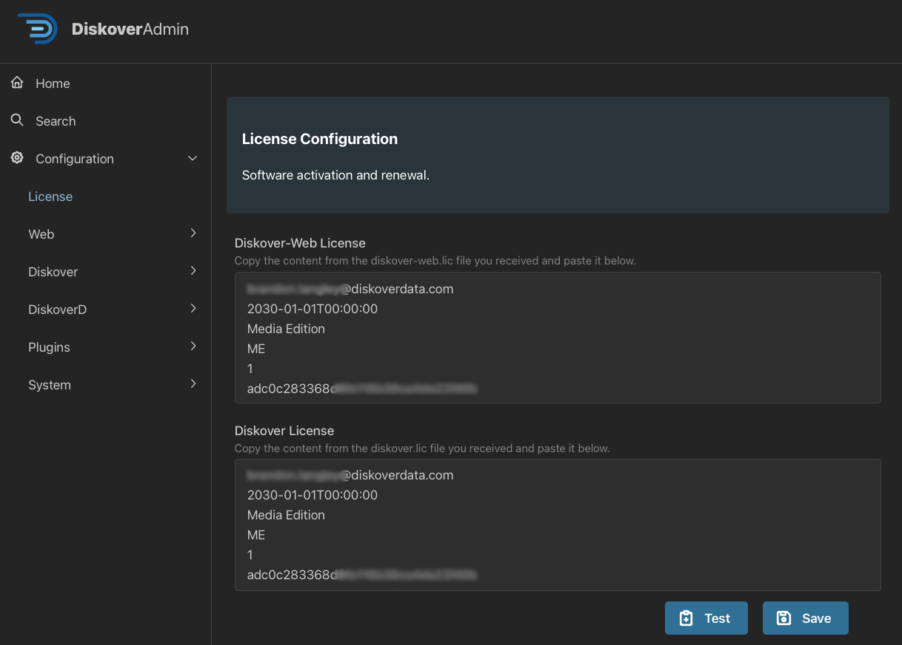

<p id="software_activation"></p>

## Software Activation

### Licensing Overview

The [**Diskover Community Edition**](https://github.com/diskoverdata/diskover-community/releases) doesn't require a license key and can be used for an unlimited time. 

The [**Diskover annual subscription Editions**](https://diskoverdata.com/solutions/) require a license. Unless otherwise agreed:
- A trial license is usually valid for 30 days and is issued for 1 Elasticsearch node.
- A paid subscription license is valid for 1 year. Clients will be contacted about 90 days before their license expiration with a renewal proposal.

Please reach out to your designated Diskover contact person or [contact us](mailto:licenses@diskoverdata.com) directly for more information.

### License Issuance Criteria

Licenses are created using these variables:
1. Your email address
2. Your [hardware ID number](#hd_id)
3. Your [Diskover Edition](https://www.diskoverdata.com/solutions/)
4. The number of Elasticsearch nodes.

<p id="hd_id"></p>

### Hardware ID Generation

Your hardware ID should have been automatically generated when going through the [Initial Configuration](#config_initial) section. The following command is listed in case you need to manually generate your hardware ID. Please [send that unique identifier along with your license request](mailto:licenses@diskoverdata.com) as needed.

🔴 &nbsp;Become the root user:
```
sudo -i
```

🔴 &nbsp;To manually create your hardware ID:
```
cd /opt/diskover
python3 diskover_lic.py -g
```

After installing Diskover and completing the basic configuration, you will need to generate a hardware ID. Please [send that unique identifier along with your license request](mailto:info@diskoverdata.com).

⚠️ &nbsp;**IMPORTANT!**

- Check that you have configured your Elasticsearch host correctly, as it is part of the hardware ID encoding process.
- Note that if your Elasticsearch cluster ID changes, you will need new license keys.

<p id="license_location"></p>

### License Key Locations in DiskoverAdmin Panel

1. From the main Diskover user interface, click on the ⛭ at the top right corner.
2. Select **⛭ System Configuration** or navigate to [**http://localhost:8000/diskover_admin/config/License**](http://localhost:8000/diskover_admin/config/License)
3. Open the **License** tab and paste the files into their respective boxes.


