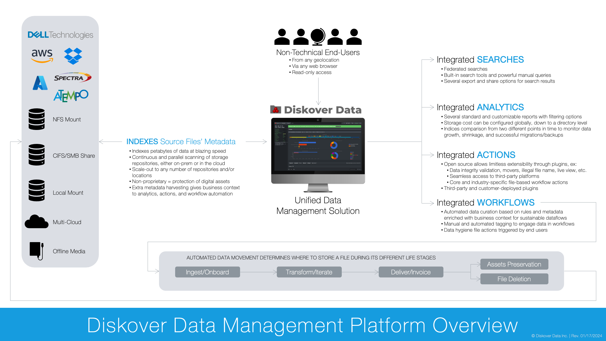
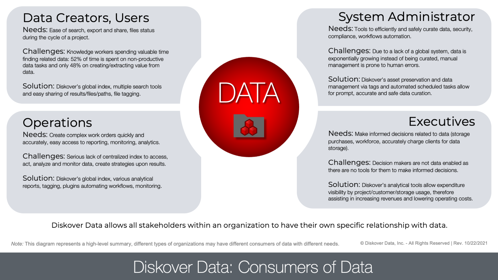

___

## Software Overview

#### [🍿 Watch Quick Tips | Fundamentals](https://vimeo.com/766235515)
___

### You Can't Break Anything

As an end-user, you can’t break anything. You can't personally edit, move, or delete the files that you see in the user interface because Diskover only contains an index of the metadata of the files, not the files themselves. So don’t be shy to click around.

_[Click here for a full-screen view of the Diskover Overview.](images/diagram_diskover_overview_with_dell_2024011701.png)_

___
### Features Overview

Diskover offers several integrated features and plugins that are configurable depending on your own environment and needs.

- **SEARCHES**: Global and powerful searches using built-in tools, manual queries, or a combination of both.

- **ANALYTICS**: Several pre-established and customizable reports allowing for informed decision-making.

- **ACTIONS**: Limitless possibilities through plugins, for example, seamless integration with third-party platforms, automated actions, in-house plugins to automate your own specific in-house workflows, etc.

- **WORKFLOWS**: Data automation configured based on rules and using the rich indexed metadata, for example, data movement to different storage, deletion, archival, etc.

___
### Consumers of Data

Diskover allows all stakeholders within an organization to have their own specific relationship with data. Here is an example of a line of business users, their needs, and challenges:

_[Click here for a full-screen view of the Consumers of Data diagram.](images/diagram_diskover_consumers_of_data_2023021401.png)_

___
### Access to Features

Even though some plugins may allow users some actionable power over the data (ex, data movement), Diskover will mostly remain a search and read-only tool, data integrity and protection being the ultimate objective.

DisKover allows all end-users to have access to the data via a global index in a read-only format for them to make informed decisions and then, in turn, for the System Administrators to curate the data in a secure and controlled environment.

Your System Administrator creates all [login](#login) accounts. Depending on your role, your account level will be as an end-user or an admin, the latter allowing for additional editing access (reports, etc.). While working with Diskover as an end-user, you might come across the icon below, indicating that you need to communicate any requests with someone with an admin-level account.

Here is a brief list of shared roles:

| FEATURE | END-USER | ADMIN | SYS ADMIN |
| --- | :---: | :---: | :---: |
| Software install and config | | | ✔ |
| File search and search tools | ✔ | ✔ | ✔ |
| Analytics access and filters | ✔ | ✔ | ✔ |
| Analytics editing | | ✔ | ✔ |
| Export and/or share results | ✔ | ✔ | ✔ |
| Manual tagging | ✔ | ✔ | ✔ |
| Manual tags editing | | ✔ | ✔ |
| Automated tags | | | ✔ |
| Plugins/File actions use | ✔ | ✔ | ✔ |
| Plugins/File actions config | | | ✔ |
| Scheduled automated tasks for data curation | | | ✔ |
