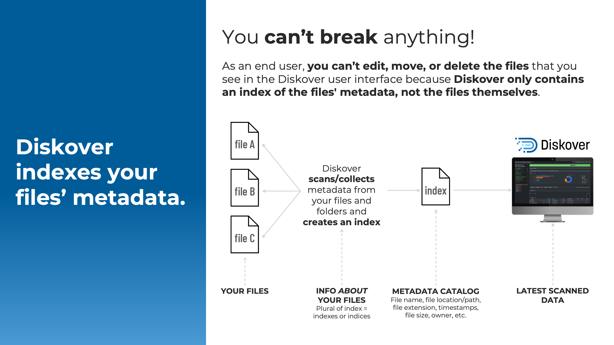

## Software Overview

#### [🍿 Watch Baiscs & Beyond | Software Overview](https://vimeo.com/1074368189)

### You Can't Break Anything

As an end-user, you can’t break anything. You can't personally edit, move, or delete the files that you see in the user interface because Diskover only contains an index of the metadata of the files, not the files themselves. So don’t be shy to click around.

### Features Overview

Diskover offers several [features and plugins](https://diskoverdata.com/platform/features/) depending on your environment and needs.

| FEATURE | DESCRIPTION |
| --- | --- |
| **Search** | Global searches using [built-in tools](#builtin_search_tools), [manual queries](#manual_queries), or a combination of both. |
| **Analytics** | Several pre-established and customizable [reports](#analytics) allow for informed decision-making. |
| **Enrich** | Diskover’s powerful harvest plugins collect extra attributes, adding rich business context to your [metadata catalog](#search_field_names). |
| **Actions** | Limitless possibilities through [File Action plugins](#file_action) serving various purposes. |
| **Orchestrate** | Automated workflows, usually set by your data manager or sys admin, allowing for your data lifecycle management. |

### Access to Features

While some plugins may offer users limited control over data (e.g., data movement), Diskover primarily functions as a search and read-only tool, with a strong focus on maintaining data integrity and protection. As an end-user working with Diskover, you may encounter the icon below. This indicates that you’ll need to reach out to someone with an admin-level account to address your request.

| FEATURE | USER| ADMIN | SYS ADMIN |
| --- | :---: | :---: | :---: |
| Software install and config | | | ✔ |
| Search | ✔ | ✔ | ✔ |
| Analytics | ✔ | ✔ | ✔ |
| Analytics editing | | ✔ | ✔ |
| Export and share results | ✔ | ✔ | ✔ |
| Manual tagging | ✔ | ✔ | ✔ |
| Manual tags editing | | ✔ | ✔ |
| Automated tagging | | | ✔ |
| File Action plugins | as authorized | ✔ | ✔ |
| Automated workflows | | | ✔ |

