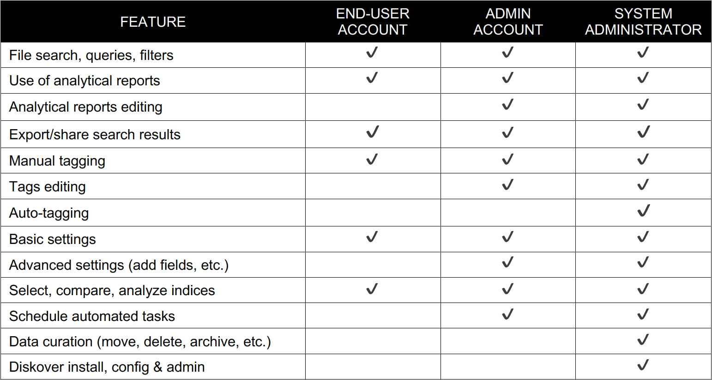

___

## Software Overview

#### [🍿 Watch Quick Tips](https://vimeo.com/766235515)
___

### What is Data Curation

Data curation is the practice of managing data collected from various sources as a valuable asset to unlock its potential and organization. Managing data effectively requires having a data strategy and reliable methods to access, integrate, cleanse, govern, store, and prepare data for analytics. The value of the data is maintained over time and remains available for reuse and preservation.

___
### The Basics of Diskover

- Efficiently and quickly searches data fragmented across heterogenous repositories bringing you all the answers in one global view.
-  Works with Elasticsearch giving you extraordinary speed and reliability, as well as continuously updates all your indices in parallel in real-time.
- Provides a global index in non-proprietary format, enabling organizations to maintain data independence of their index.
- Well suited for long term asset preservation.
- 100% open-source tool allows for add-on plug-ins to be developed.
- Supports all known file types.

___
### Features Overview

- Diskover scales data by using Elasticsearch search engine in the backend, allowing for massive amounts of data to be searched instantaneously. It is able to scan/index all your storage volumes at the same time, without limitation in numbers. Elasticsearch is used by giants like ebay, airbnb, Adobe, Walmart, etc.
- Enables everyone to accurately answer questions with the simplicity of clever search queries, which provide immediate relevant information.
- Diskover can be accessed from any web browser.
- Diskover harvests metadata to add business context to extensive searches and analytics.
- Points in time indices snapshots, allowing to search and compare indexed data, as well as analyze anomalies.
- The various analytical tools assist all stakeholders in making the right data related decisions about time, resources, and investments.
- Enhances collective efficiency by streamlining file-based workflows.
- Significantly improves the efficiency of the organization and its people, in addition to reducing storage cost.
- The [cost analysis tool](#cost_analysis) assist with charging clients accurately for storage space.

___
### Consumers of Data

Diskover allows all stakeholders within an organization to have their own specific relationship with data. Here is an example of Line of Business Users, their needs, and challenges:

_[Click here for a full screen view of the Consumers of Data diagram.](images/diagram_diskover_consumers_of_data_with_border.png)_

___
### Access to Features

Even though several features will be added over time, Diskover will mostly remain a search and read-only tool for the end-users; data integrity and protection being the ultimate objective.

Diskover allows all end-users to have access to the data via a global index  in a read-only format, for them to make informed decisions, and then in turn for the System Administrators to curate the data in a secure and controlled environment.

Your System Administrator creates all [login](#login) accounts. Depending on your data relation needs within your scope of work, your account level will be as an end-user or an admin, the latter allowing for additional editing access (reports, etc.). While working with Diskover as an end-user, you might come across the icon below, indicating that you need to communicate any requests with someone with an admin level account.

Here is a brief list of shared roles:

___
### Use Cases

Diskover offers numerous search tools, reports, and other manual, as well as automated functions, to fulfill the needs of all stakeholders and different business verticals.

Let’s use the example of the Media and Entertainment environment. With theatrical workflows, there is the need to protect content from piracy; facilities often build two completely independent networks 1) where users have access to the internet, and 2) a production network with no internet access and strict controls on personnel that have access to this network. However, in production workflows, Customer Service Representatives, Producers, and Operations often need to search the production network. Diskover provides visibility to search for content, without providing access to the actual content.

_[Click here for a full screen view of the Tools and Workflow Overview diagram.](images/diagram_diskover_tools_and_workflow_overview_with_border.png)_
