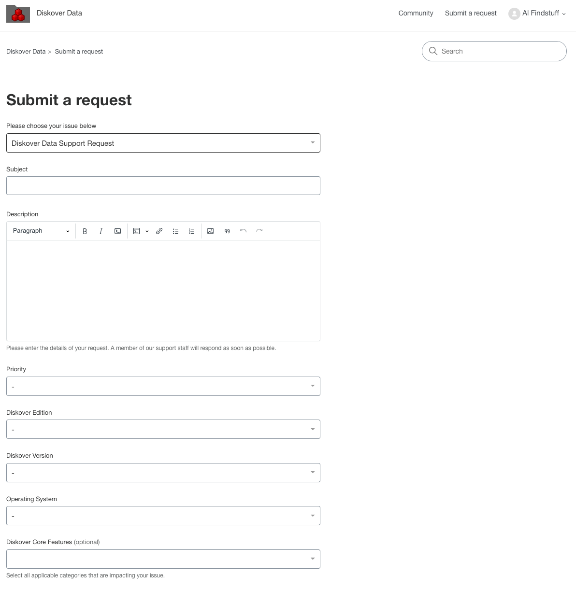
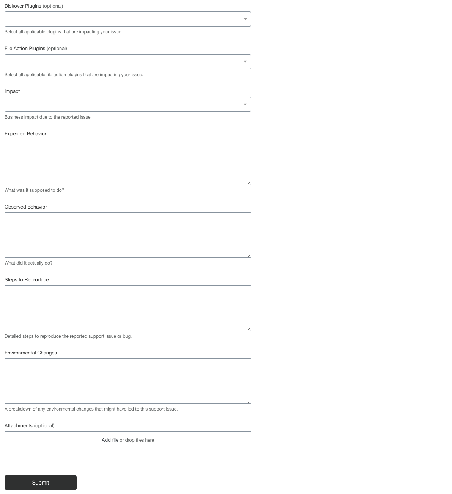
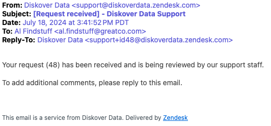
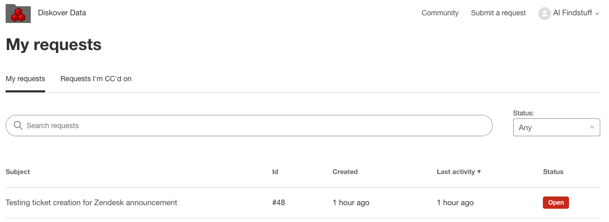
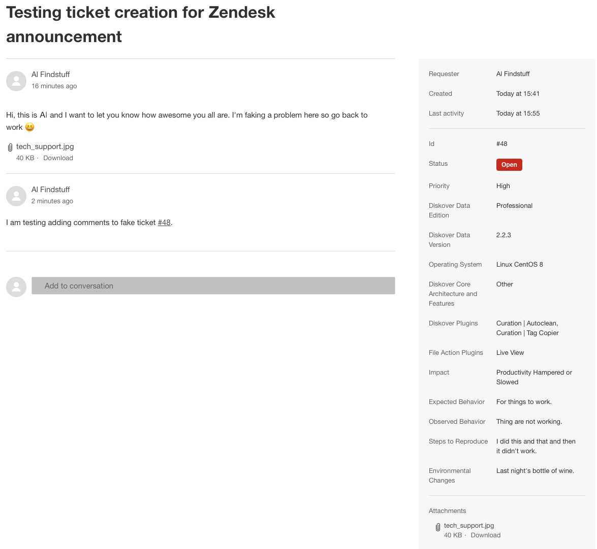

## Overview of Diskover Support through Zendesk

Diskover has partnered with [Zendesk](https://diskoverdata.zendesk.com/) to enhance our customer support experience. This collaboration and AI-powered platform brings you:

- **Streamlined Support**: Access our knowledge base and submit tickets through a user-friendly interface.
- **Faster Resolution**: The rich information contained in ticket submission allows for quick routing and resolution.
- **Self-Service Options**: Find answers quickly with an extensive, searchable knowledge base.
- **Diskover Community**: Share, learn, and connect with other awesome Diskover users.
  

## Create a Zendesk Account

Creating an account is unfortunately unavoidable, but will only take a few minutes.

### Step 1 | Sign Up

🔴 &nbsp;Go to [https://diskoverdata.zendesk.com/](https://diskoverdata.zendesk.com/) and click on **Sign up**:

### Step 2 | Confirm

🔴 &nbsp;Enter your **full name** and **email** and click **Sign up** to submit your account request:

🔴 &nbsp;You will then get this confirmation message to check your emails:

### Step 3 | Create a Password

🔴 &nbsp;Open the email and confirm by clicking the **Create a password** link to complete your account creation. Can't find the email in your inbox? Check your junk folder:

🔴 &nbsp;Pick a **strong password**, copy and save it somewhere safe, or better, save it using a password manager. click **Set password** and voila, your account is created:

⚠️ &nbsp;Note that we do not collect personal information and we do not use/sell your email/name to marketers. If you get a **Accept cookies** pop-up message from Zendesk, make sure to opt out of any possible parameters allowing the platform to use your email for marketing purposes unless you really enjoy spam emails and/or phone calls. Diskover doesn't have control over possible Zendesk cookies, unfortunately.

### Step 4 | You're Ready to Use Zendesk

🔴 &nbsp;This is the main support page where the following options are available:

| | OPTION | DESCRIPTION |
| --- | --- | --- |
| 1 | **Create a support ticket** | Start the process by clicking **Submit a request** in the top menu beside your profile |
| 2 | **Search our knowledge base** | Use the **search field** in the middle of the header to search our knowledge base |
| 3 | **See all articles by category** | Click on a **subject/button** to see all the related articles |
| 4 | **Diskover Community** | Access the [Community space](https://support.diskoverdata.com/hc/en-us/community/topics) by clicking **Join the conversation** or **Community** in the top menu |
| 5 | **Your profile** | The drop-down list will offer the following options: - **Profile**: To see/edit your profile information - **Requests**: To see/access your support tickets - **Activities**: To see/access your contributions to Diskover Community - **Change password** - **Sign out**

## Create a Support Ticket

### Step 1 | Create a New Ticket

🔴 &nbsp;Start by choosing the reason for your ticket.

### Step 2 | Suggested Articles

🔴 &nbsp;When you start typing the subject of your issue, Zendesk will search the knowledge base and gather possible articles related to the keywords. You can click on any suggested article and you may find an immediate resolution to your issue without having to create a ticket.

### Step 3 | Fill Out the Form

🔴 &nbsp;If a solution to your issue is not found in the knowledge base, please complete the support request form and fill out as many fields as possible. This will help us solve your issue rapidly by reducing the number of back-and-forth communications asking for more details.

### Step 4 | Ticket Submission Confirmation

Once you click **Submit**, you will get a confirmation of your ticket information and the assigned ticket number:

### Step 5 Optional | Add Comments to Your Ticket

🔴 &nbsp;You will receive an email with the ticket number information once submitted. If you think of something else to help us help you, you may add more information to your ticket by simply replying to the email at any time.

### View Your Tickets in Zendesk

🔴 &nbsp;If you login to Zendesk, you can find the list of your ticket(s) under **Your Name/Profile** and select **Requests**. You can also easily see the status of any tickets you submitted:

🔴 &nbsp;When you open an existing ticket, you can see all the details including additional comments you may have added by replying to the email. You can also directly add comments to your ticket from that view.

### Post-Submission Process

1. Your ticket will be rapidly assigned to one of our support team members.
2. You will get email notifications anytime the status is changed, collaborative exchanges, etc.
3. The problem/solution to your ticket may be anonymously added to our knowledge base for future use if our support team evaluates that it can help someone else.

## Troubleshooting via Zendesk Knowledge Base

We already have key troubleshooting articles providing self-help in [Zendesk](https://diskoverdata.zendesk.com/). What we are very excited about is that ticket problems/resolutions may be used to grow the knowledge base, offering a rich catalog of ready-to-go answers.

## Diskover Community

[Zendesk](https://diskoverdata.zendesk.com/) offers a [Community space](https://support.diskoverdata.com/hc/en-us/community/topics) where all Diskover users can share, learn, and collaborate.

### Community Space

🔴 &nbsp;Once you create an account, you'll be able to create and view posts from other fabulous collaborators like you, as well as propose new features in the [Diskover Community space](https://support.diskoverdata.com/hc/en-us/community/topics).

### Create a Post in Diskover Community

🔴 &nbsp;Under **Topic** you can choose **General Discussion** or **Feature Requests**, then fill out the rest of the form and click on **Submit**. You can see all your submissions by going to your **Profile** then select **Activities**:

### Go Back to the Support Page

🔴 &nbsp;Click on the logo at the top left corner of the page to leave the [Diskover Community space](https://support.diskoverdata.com/hc/en-us/community/topics) and return to the main [support page](https://diskoverdata.zendesk.com/).
