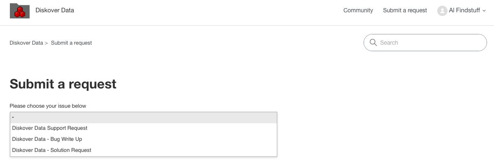

___
## Diskover Support through Zendesk
___

We're thrilled to announce that Diskover Data has partnered with [Zendesk](https://diskoverdata.zendesk.com/) to enhance our customer support experience. This transition brings you:

- Streamlined Support: Access our knowledge base and submit tickets through a user-friendly interface.
- Faster Resolution: Benefit from AI-powered assistance and improved ticket routing.
- Self-Service Options: Find answers quickly with an extensive, searchable knowledge base.
- [Diskover Community](https://support.diskoverdata.com/hc/en-us/community/topics): Share, learn, and connect with other awesome Diskover users.
  
___
## Troubleshooting via Zendesk Knowledge Base

We already have key troubleshooting articles providing self-help in [Zendesk](https://diskoverdata.zendesk.com/). What we are very excited about is that each ticket and resolution will grow the knowledge base, offering a rich catalog of ready-to-go answers.

___
## Diskover Community

[Zendesk](https://diskoverdata.zendesk.com/) offers a [Community space](https://support.diskoverdata.com/hc/en-us/community/topics) where all Diskover users can collaborate.

### Community Space

🔴 &nbsp;Once you create an account as described in the next section, you'll be able to create and view posts from other fabulous collaborators like you, as well as propose new features, in the [Diskover Community space](https://support.diskoverdata.com/hc/en-us/community/topics).

### Create a Post in Diskover Community

🔴 &nbsp;Under **Topic** you can choose:

- General Discussion
- Feature Requests

🔴 &nbsp;Click on the logo at the top left corner of the page to leave the [Diskover Community space](https://support.diskoverdata.com/hc/en-us/community/topics) and return to the main support/ticketing page.

___
## Create a Zendesk Account

Good news! We've upgraded to Zendesk for even better support. The super small inconvenient? You'll need to create a shiny new account. Think of it as joining an exclusive club ... Welcome to the Diskover Support Squad 🚀

### Step 1 - Sign Up

🔴 &nbsp;Go to [https://diskoverdata.zendesk.com/](https://diskoverdata.zendesk.com/) and click on **Sign up**

### Step 2 - Confirm

🔴 &nbsp;Enter your **full name** and **email** and click **Sign up** to submit your account request.

### Step 3 - Create a Password

🔴 &nbsp;Check your emails and confirm by clicking the **Create a password** link to complete your account creation. Can't find the email in your inbox? Check your junk folder.

🔴 &nbsp;Pick a **strong password**, copy and save it somewhere safe, or better, save it using a password manager. click **Set password** and voila, your account is created. 

⚠️ &nbsp;Note that No personal information is collected and we do not use/sell your email/name to marketers. If you get a **Accept cookies** pop-up message from Zendesk, make sure to opt out of any possible parameters allowing the platform to use your email for marketing purposes, unless you really enjoy spam emails and/or phone calls! Diskover doesn't have control over possible Zendesk cookies, unfortunately.

### Step 4 - You're Ready to Use Zendesk

🔴 &nbsp;This is the main support page where you can:

| ACTION | DESCRIPTION |
| --- | --- |
| **Search** | Click on the **search bar** in the middle of the header and search our knowledge base |
| **See all articles by category** | Click on a **subject/button** to see all the related articles |
| **Diskover Community** | Access the [Community space](https://support.diskoverdata.com/hc/en-us/community/topics) by clicking **Join the conversation** or **Community** in the top menu |
| **Create a support ticket** | Click **Submit a request** in the top menu beside your profile |
| **Your profile** | The drop-down list will offer the following options: - **Profile**: To edit your profile and see basic information - **Requests**: To see your support tickets - **Activities**: To see your contributions to Diskover Community - **Change password** - **Sign out**

___
## Open a Ticket

### Create a New Ticket

### Add Comments

