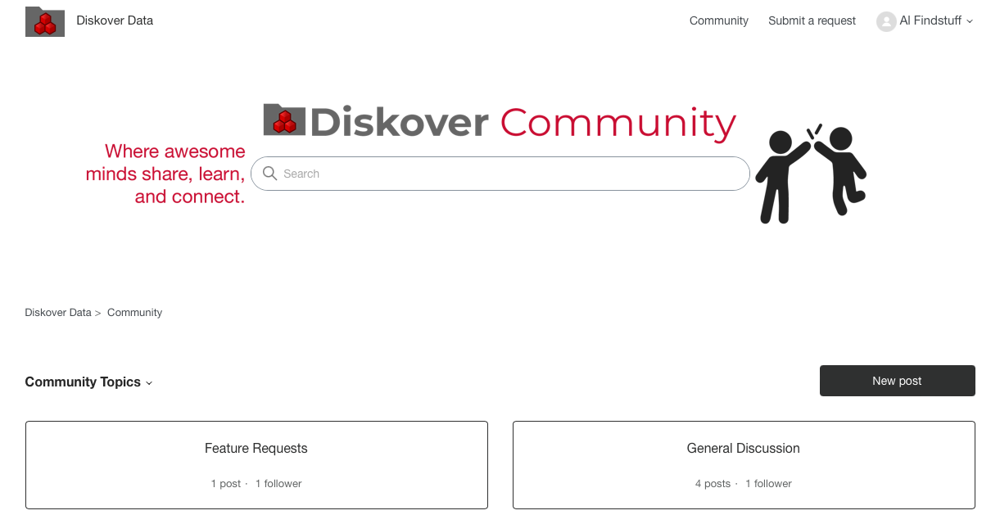
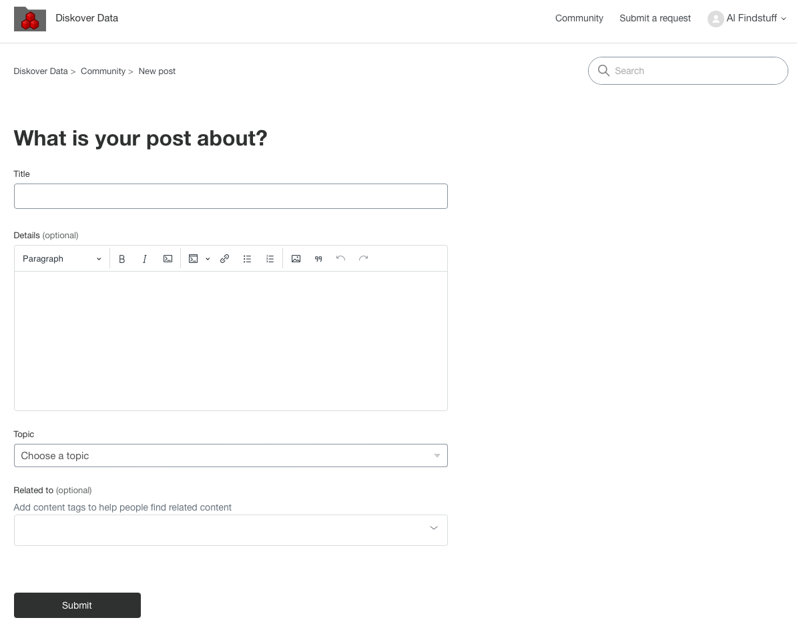

___
## Diskover Support through Zendesk
___

We're thrilled to announce that Diskover Data has partnered with [Zendesk](https://diskoverdata.zendesk.com/) to enhance our customer support experience. This transition brings you:

- Streamlined Support: Access our knowledge base and submit tickets through a user-friendly interface.
- Faster Resolution: Benefit from AI-powered assistance and improved ticket routing.
- Self-Service Options: Find answers quickly with an extensive, searchable help center.
- Community Collaboration: Share, learn, and connect with other awesome Diskover users.
  
___
## Troubleshooting via Zendesk Knowledge Base

We already have several articles providing self-help in [Zendesk](https://diskoverdata.zendesk.com/). What we are excited about is that each ticket and resolution will grow the knowledge base, offering a rich catalog of ready-to-go answers.

___
## Diskover Community

[Zendesk](https://diskoverdata.zendesk.com/) offers a [Community space](https://support.diskoverdata.com/hc/en-us/community/topics) where all Diskover users can collaborate.

Once you create an account as described in the next section, you'll be able to create and view posts from other fabulous collaborators like you, as well as propose new features, in the [Diskover Community space](https://support.diskoverdata.com/hc/en-us/community/topics).

Under **Topic** you can choose:

- General Discussion
- Feature Requests

___
## Create a Zendesk Account

Good news! We've upgraded to Zendesk for even better support. The catch? You'll need to create a shiny new account. Think of it as joining an exclusive club ... Welcome to the Diskover Support Squad 🚀

___
## Open a Ticket

### Create a New Ticket

### Add Comments

