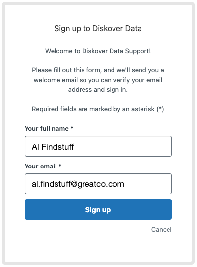
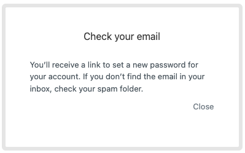
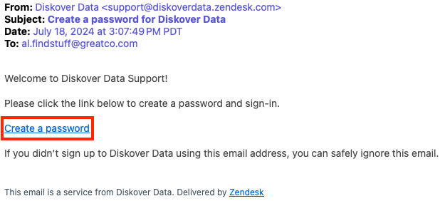
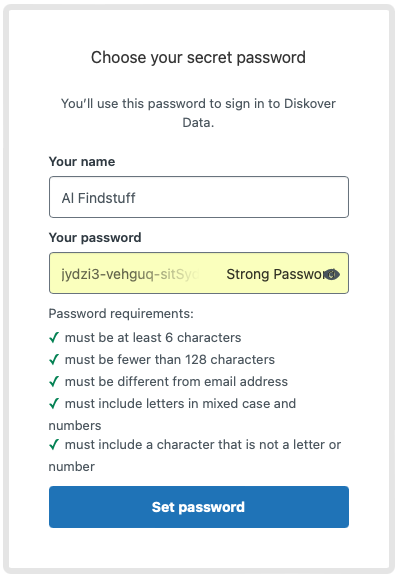
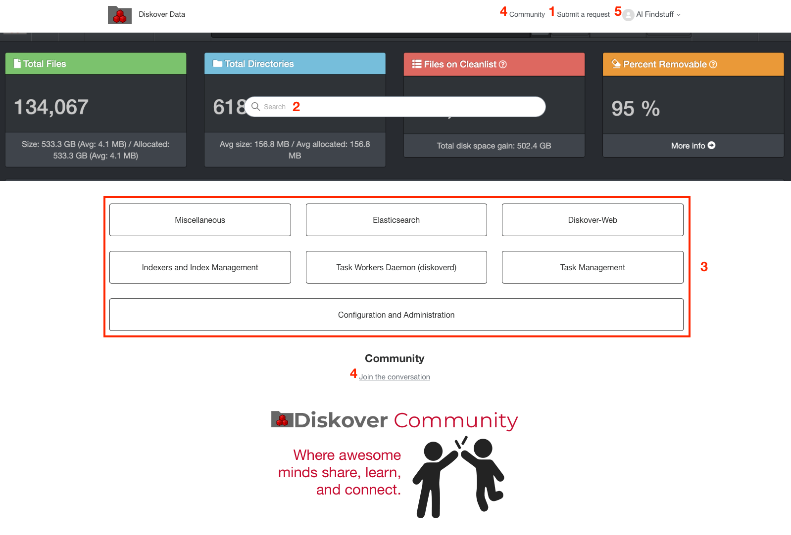

___
## Overview of Diskover Support through Zendesk
___

Diskover has partnered with [Zendesk](https://diskoverdata.zendesk.com/) to enhance our customer support experience. This collaboration and AI-powered platform brings you:

- **Streamlined Support**: Access our knowledge base and submit tickets through a user-friendly interface.
- **Faster Resolution**: The rich information contained in ticket submission allows for quick routing and resolution.
- **Self-Service Options**: Find answers quickly with an extensive, searchable knowledge base.
- **[Diskover Community](https://support.diskoverdata.com/hc/en-us/community/topics)**: Share, learn, and connect with other awesome Diskover users.
  
___
## Create a Zendesk Account

Creating an account is unfortunately unavoidable, but will only take a few minutes.

### Step 1 | Sign Up

🔴 &nbsp;Go to [https://diskoverdata.zendesk.com/](https://diskoverdata.zendesk.com/) and click on **Sign up**:

### Step 2 | Confirm

🔴 &nbsp;Enter your **full name** and **email** and click **Sign up** to submit your account request:

🔴 &nbsp;You will then get this confirmation message to check your emails:

### Step 3 | Create a Password

🔴 &nbsp;Open the email and confirm by clicking the **Create a password** link to complete your account creation. Can't find the email in your inbox? Check your junk folder:

🔴 &nbsp;Pick a **strong password**, copy and save it somewhere safe, or better, save it using a password manager. click **Set password** and voila, your account is created:

⚠️ &nbsp;Note that we do not collect personal information and we do not use/sell your email/name to marketers. If you get a **Accept cookies** pop-up message from Zendesk, make sure to opt out of any possible parameters allowing the platform to use your email for marketing purposes unless you really enjoy spam emails and/or phone calls. Diskover doesn't have control over possible Zendesk cookies, unfortunately.

### Step 4 | You're Ready to Use Zendesk

🔴 &nbsp;This is the main support page where you can:

| OPTION | DESCRIPTION |
| --- | --- |
| **Create a support ticket** | Click **Submit a request** in the top menu beside your profile |
| **Search** | Use the **search field** in the middle of the header to search our knowledge base |
| **See all articles by category** | Click on a **subject/button** to see all the related articles |
| **Diskover Community** | Access the [Community space](https://support.diskoverdata.com/hc/en-us/community/topics) by clicking **Join the conversation** or **Community** in the top menu |
| **Your profile** | The drop-down list will offer the following options: - **Profile**: To edit your profile and see basic information - **Requests**: To see your support tickets - **Activities**: To see your contributions to Diskover Community - **Change password** - **Sign out**

___
## Create a Support Ticket

### Step 1 | Create a New Ticket

🔴 &nbsp;Start by choosing the reason for your ticket.

### Step 3 | Suggested Articles

🔴 &nbsp;When you start typing the subject of your issue, Zendesk will search the knowledge base and gather possible articles related to the keywords. You can click on any suggested article and you may find an immediate resolution to your issue without having to contact support.

### Step 2 | Fill out the Form

🔴 &nbsp;If a solution to your issue is not found in the knowledge base, please complete the support request form and fill out as many fields as possible. This will help us solve your issue rapidly by reducing the number of back-and-forth communications asking for more details.

### Step 3 | Ticket Submission Confirmation

Once you click **Submit**, you will get a confirmation of your ticket information and the assigned ticket number:

Add Comments

___
## Troubleshooting via Zendesk Knowledge Base

We already have key troubleshooting articles providing self-help in [Zendesk](https://diskoverdata.zendesk.com/). What we are very excited about is that each ticket and resolution will grow the knowledge base, offering a rich catalog of ready-to-go answers.

___
## Diskover Community

[Zendesk](https://diskoverdata.zendesk.com/) offers a [Community space](https://support.diskoverdata.com/hc/en-us/community/topics) where all Diskover users can collaborate.

### Community Space

🔴 &nbsp;Once you create an account, you'll be able to create and view posts from other fabulous collaborators like you, as well as propose new features in the [Diskover Community space](https://support.diskoverdata.com/hc/en-us/community/topics).

### Create a Post in Diskover Community

🔴 &nbsp;Under **Topic** you can choose:

- General Discussion
- Feature Requests

🔴 &nbsp;Click on the logo at the top left corner of the page to leave the [Diskover Community space](https://support.diskoverdata.com/hc/en-us/community/topics) and return to the main [support/ticketing page](https://diskoverdata.zendesk.com/).
