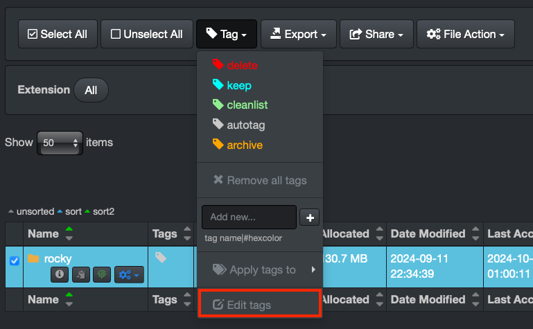

## Tags

&nbsp;&nbsp;&nbsp;&nbsp;&nbsp;&nbsp;

### Overview

One of Diskover's powerful features is the ability to add business context to files and directories through tags, which enables the following:

- Increased findability and searchability based on one or more combinations of [fields/metadata](#metadata), for example, name and tag value.
- More informed and accurate data curation decisions.
- Ability to build an approval process (or RACI model) for data curation decisions.
- Reporting aligned with business context, changing reports from _disk language_ (size, age, extension, etc.) to _business language_ (projects, clients, status, etc.)
- [Engage tags in workflows via Diskover Task Panel](#task_panel) to automate data movement, deletion, archival, etc.

⚠️ &nbsp;**IMPORTANT!**

- All tags are stored in the **tag** field in the Elasticsearch index.
- There is no limit on the number of tags per item.

### Tagging Methods

Tags can be applied using various methods within Diskover:

- [AutoTag](#autotag)
- [Tag application via Diskover API](#tags_via_api)
- [Tag application via Harvest Plugins](#tags_via_harvest_plugins)
- [Manual tagging](#manual_tags)

⚠️ &nbsp;**IMPORTANT!** If you want to use tags in your environment, make sure to [configure your tags' migration](#tags_migration) so they get copied from one index to the next.

### AutoTag

Tags can be applied automatically through a set of configurable rules applied to directories or files. AutoTags can be configured for each of your scanners in:

**DiskoverAdmin** → **Configuration → Diskover → Configurations**. 

The rules can be very powerful based on a combination of keys/metadata:

- File names to include
- File names to exclude
- Paths to include
- Paths to exclude
- File times (mtime, atime, ctime)
- File extensions
- Directory names to include
- Directory names to exclude
- Parent path to include
- Parent path to exclude
- Directory times (mtime, atime, ctime)
- Combined with any other fields from the Elasticsearch metadata catalog containing [base metadata](https://docs.diskoverdata.com/diskover_user_guide/#field-names-basic-metadata) and possibly [extra business-context metadata](https://docs.diskoverdata.com/diskover_user_guide/#field-names-extra-metadata), depending on your environment.

Once AutoTags are configured and scheduled using the [Task Panel](#task_panel), they will get copied from one index to the next.

Note that AutoTags will display as a gray color in Diskover-Web.

### Tag Application via Diskover API

Tags can be applied via the Diskover API. Updating file/directory tags is accomplished with the PUT method. A JSON object is required in the body of the PUT method. The call returns the status and number of items updated.

Examples of tag applications can be found in the Diskover-Web user interface under ⛭ → **Help**, as well as in the [Diskover SDK and API Guide](https://docs.diskoverdata.com/diskover_dev_guide/#using-the-diskover-web-api).

### Tag Application via Harvest Plugins  

[Harvest/Index plugins](#plugins_index) are typically designed to:

- Harvest extra business-context metadata from file headers.
- Correlate the Diskover index to some other business application, for example, an order management or scheduling system.

These plugins typically run 1) during the indexing process or 2) on a scheduled basis. Harvest plugins are designed to correlate various systems or applications, typically using a key identifier within a directory/filename (for example, research grant ID) to harvest additional metadata from another database (for example, Primary Investigator for a specific grant ID). Therefore, tags will be reapplied if a key identifier and connection to an external database exists at the time of re-index/harvest.

### Manual Tagging

In general, manual processes are 1) difficult to scale and 2) prone to human errors. Therefore, careful consideration must be applied when determining when to use a manual tag application. Ideally, manual tags should be used sparingly or as part of a workflow approval or RACI model. 

Please refer to our [Diskover User Guide](https://docs.diskoverdata.com/diskover_user_guide/#tags) to learn about:

- Manual tags application.
- Manual tags removal.

⚠️ &nbsp;**IMPORTANT!** As Diskover exists today, you need to use the [Tag Copier Plugins](#tags_migration) to migrate the tags from one index to the next.

### Manual Tags Customization

The tags displayed within the Diskover-Web user interface can be customized, their names and colors, by authorized users in **DiskoverAdmin → Configuration → Web → Custom Tags**.

You can also get redirected to the **Custom Tags** configuration page when selecting **Edit tags** on the search page:

### Tag Copier Plugins for Tags Migration

The Diskover scanning process creates a new index or point-in-time snapshot of the volume at time of index. Tags that are applied during the scanning process via [AutoTag](#autotag) rules will be automatically re-applied to the next index based on the configuration rules.

However, as the software exists today, the Diskover scanner has no knowledge of tags applied outside of the scanning process. Therefore, tags that have been applied 1) [manually](#manual_tags), 2) via [Diskover API](tags_via_api), or 3) via [plugins through the API](#tags_via_harvest_plugins) **must be migrated from one index to the next** using the Tag Copier Plugins.

#### Index Tag Copier Plugin 

**DiskoverAdmin → Configuration → Plugins → Index → Tag Copier**

The index tag copier is designed to apply tags during the scanning process. This plugin leverages Diskover’s [AutoTag](#autotag) functionality, which automatically assigns tags based on a set of predefined rules. These rules can include file size, type, date, location, or other metadata. As files and directories are being indexed, tags are applied in real-time, ensuring that the data is immediately categorized with business-relevant context.

#### Post-Index Tag Copier Plugin

**DiskoverAdmin → Configuration → Plugins → Post Index → Tag Copier**

The post-index Tag Copier plugin is used to apply or migrate tags after the scanning process has been completed. It’s typically used when tags need to be adjusted or added once files and directories are already indexed or when tags from a previous index need to be copied to a new index.

### Tags Display in Diskover-Web

Please refer to the [Diskover User Guide](https://docs.diskoverdata.com/diskover_user_guide/#tags) to learn how to view and work with tags.

### Tags Search

Please refer to the [Diskover User Guide](https://docs.diskoverdata.com/diskover_user_guide/#tags) to learn how to search on tags.

### Tags Analytics

Please refer to the [Diskover User Guide](https://docs.diskoverdata.com/diskover_user_guide/#tags) to learn more about reporting for tags.

