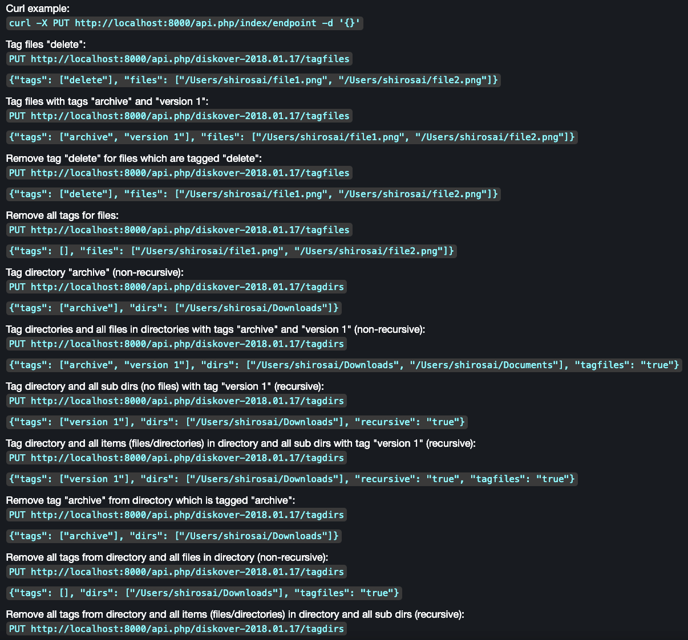

## Tags

&nbsp;&nbsp;&nbsp;&nbsp;&nbsp;&nbsp;

### Overview

One of Diskover's powerful features is the ability to add business context to file indexing, which enables the following:

- Increased findability and searchability based on one or more combinations of [fields/metadata](#metadata), for example, name and tag value.
- More informed and accurate data curation decisions.
- Ability to build an approval process (or RACI model) for data curation decisions.
- Reporting aligned with business context, changing reports from _disk language_ (size, age, extension, etc.) to _business language_ (projects, clients, status, etc.)
- Engage tags in workflows to automate data movement, deletion, archival, etc.

🟨 &nbsp;**Important Notes**:

- All tags are stored in the **tag** field in the Elasticsearch index.
- There are no limit on the number of tags per item.

### Tagging Methods

The following sections outline the various methods for applying tags in Diskover:

- [AutoTag](#autotag)
- [Tag application via Diskover API](#tags_via_api)
- [Tag application via Harvest Plugins](#tags_via_harvest_plugins)
- [Manual tagging](#manual_tags)

If you want to use tags in your environment, make sure to [configure your tags migration](#tags_migration) so they get copied from one index to the next.

### AutoTag

Tags can be applied automatically via a series of configurable rules applied to directories or files. AutoTags can be configured for each of your indexers within **DiskoverAdmin** → **Configuration → Diskover → Configurations**. Note that AutoTags will display as a gray color in Diskover-Web.

The rules can be very powerful based on a combination of keys/metadata:

- File names to include
- File names to exclude
- Paths to include
- Paths to exclude
- File times (mtime, atime, ctime)
- File extensions
- Directory names to include
- Directory names to exclude
- Parent path to include
- Parent path to exclude
- Directory times (mtime, atime, ctime)

#### Tag Application via Diskover API

Tags can be applied via the Diskover API. Updating file/directory tags is accomplished with the PUT method. A JSON object is required in the body of the PUT method. The call returns the status and number of items updated.

Examples of tag applications can be found in the Diskover-Web user interface under ⛭ → **Help**, as well as in the [Diskover SDK and API Guide](https://docs.diskoverdata.com/diskover_dev_guide/#using-the-diskover-web-api).

#### Tag Application via Harvest Plugins  

[Harvest/Index plugins](#plugins_index) are typically designed to:

- Harvest extra business-context metadata from file headers.
- Correlate the Diskover index to some other business application, for example, an order management or scheduling system.

These plugins typically run 1) during the indexing process or 2) on a scheduled basis. Harvest plugins are designed to correlate various systems or applications typically using a key identifier within a directory/filename (example: research grant ID) to harvest additional metadata from another database (for example: Primary Investigator for a specific grant ID). Therefore, tags will be reapplied if a key identifier and connection to an external database exists at the time of re-index/harvest.

### Manual Tagging

In general, manual processes are 1) difficult to scale and 2) prone to inconsistencies. Therefore, careful consideration must be applied when determining when to use a manual tag application. Ideally, manual tags should be used sparingly or as part of a workflow approval or RACI model. 

Please refer to our [Diskover User Guide](https://docs.diskoverdata.com/diskover_user_guide/#tags) to learn about:

- Manual tags application.
- Manual tags removal.

### Manual Tags Customization

The tags displayed within the Diskover-Web user interface can be customized, their names and colors, by authorized users in **DiskoverAdmin → Configuration → Web → Custom Tags**.

You can also get to the **Custom Tags** configuration page when selecting **Edit tags** on the search page:

### Tags Migration

The Diskover indexing process creates a new index or point in time snapshot of the volume at time of index. Tags that are applied during the indexing process via autotag rules will be automatically re-applied based on the configuration rules in the configuration file.

However, the Diskover indexer has no knowledge of tags applied outside of the indexing process, those tags that have been applied: a) manually, b) via Diskover API, or c) via plugins thru the API. Therefore, these tags must be migrated from one index to the next.

**Please refer to our dedicated chapter [Tag Copier Plugin](https://docs.diskoverdata.com/diskover_configuration_and_administration_guide/#tag-copier-plugin) for more information.**

### Tags Display in Diskover-Web

Please refer to our [Diskover User Guide](https://docs.diskoverdata.com/diskover_user_guide/#tags) to learn how to handle tags.

### Tags Search

Please refer to our [Diskover User Guide](https://docs.diskoverdata.com/diskover_user_guide/#tags) to learn how to search for tags.

### Tags Analytics

Please refer to our [Diskover User Guide](https://docs.diskoverdata.com/diskover_user_guide/#tags) to learn more about reporting for tags.

