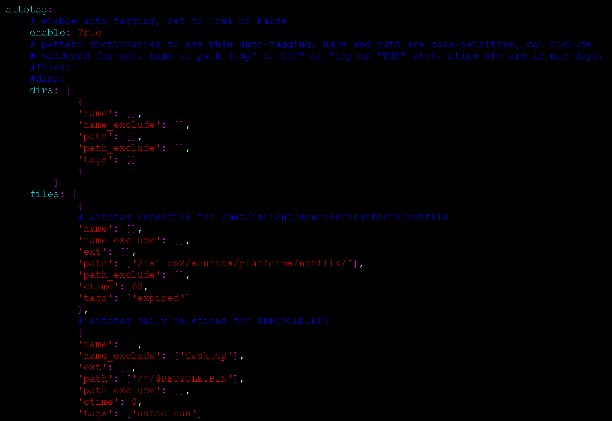
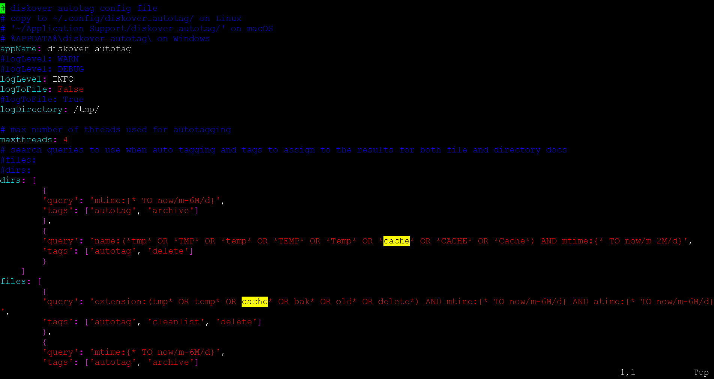
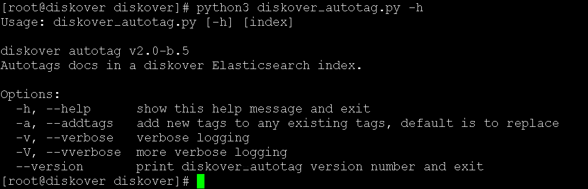

#### Tag Application via Autotag

Tags can be applied automatically via a series of rules applied to directories or filenames. The rules can be very powerful based on a combination of name, location, age, tags, etc.

##### Autotag During Index

To enable tags to be applied during the index process, autotagging must be enabled and a series of rules configured to determine what tags to apply and under what conditions.

🔴 &nbsp;Set autotag to **True** and define tagging rules.
```
vim /root/.config/diskover/config.yaml
```



In the following example, the rules will:

- Apply the **expired** tag to files in the **netflix** folder after **60** days
- Apply the **autoclean** tag to files in the **$RECYCLE.BIN**

```
        files: [
                {
                # autotag retention for /mnt/isilon2/sources/platforms/netflix
                'name': [],
                'name_exclude': [],
                'ext': [],
                'path': ['/isilon2/sources/platforms/netflix/'],
                'path_exclude': [],
                'ctime': 60,
                'tags': ['expired']
                },
                # autotag daily deletions for $RECYCLE.BIN
                {
                'name': [],
                'name_exclude': ['desktop'],
                'ext': [],
                'path': ['/*/$RECYCLE.BIN'],
                'path_exclude': [],
                'ctime': 0,
                'tags': ['autoclean']
                }
            ]
```

##### Autotag an Existing Index (Post Index Process)

Tag application can be executed via a shell to an existing index (post actual index process). 

🔴 &nbsp;To configure post index autotag rules:
```
vi /root/.config/diskover_autotag/config.yaml
```



🔴 &nbsp;Run manually from shell:
```
cd /opt/diskover
```

🔴 &nbsp;Usage:
```
python3 diskover_autotag.py -h
```

