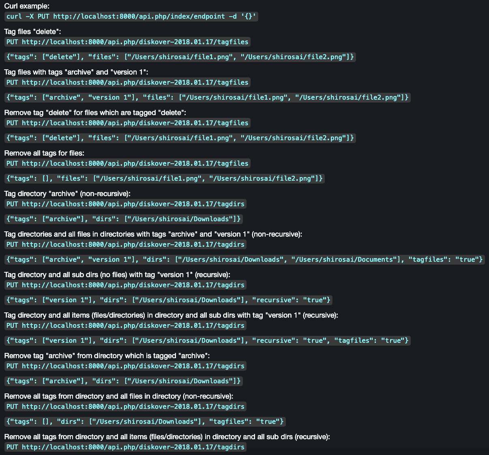

#### Tag Application via Diskover API

Tags can be applied via the Diskover API. Updating file/directory tags is accomplished with the PUT method. A JSON object is required in the body of PUT method. The call returns the status and number of items updated.

Examples of tag application that can be found in the Diskover-Web user interface under **gear icon** > **Help** page:

