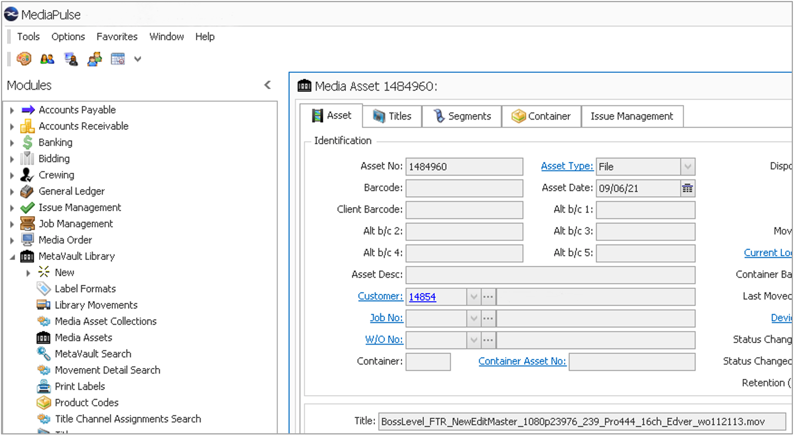
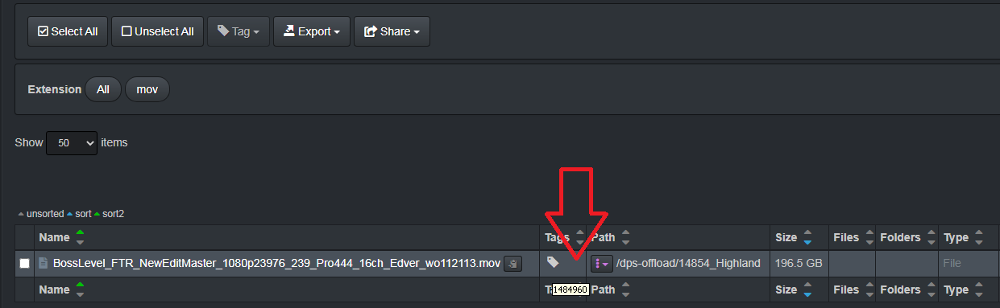

#### Tag Application via Harvest Plugins

Harvest plugins are typically designed to:

- Harvest metadata from file headers, for example the [media info plugin ](#media_info_plugin).
- Correlate the Diskover index to some other business application, for example an order management or scheduling system.

These plugins typically run a) during index process, or b) on a scheduled basis. Harvest plugins designed to correlate various systems or applications typically use a key identifier within a directory/filename (example: research grant ID) to harvest additional metadata from another database (for example: Primary Investigator for specific grant ID). Therefore, tags will be reapplied if a key identifier and connection to external database exists at time of re-index/harvest.

The Xytech Asset Creation is an example of a harvest plugin where the “Asset Number” is harvested from the Xytech MediaPulse application and applied as a tag to the file asset within Diskover.

In the following example, the Asset Number **1484960** will be applied as a tag within Diskover to the file **BossLevel_FTR_NewEditMaster_1080p23976_239_Pro444_16ch_Edver_wo112113.mov**

