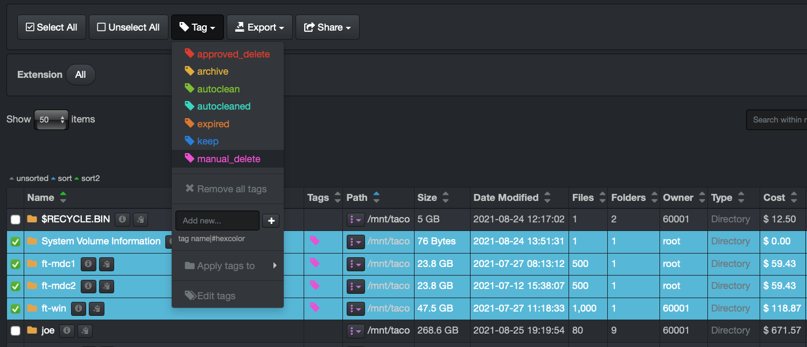
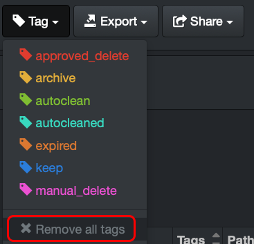

#### Tag Application via Manual Processes

In general, manual processes are a) difficult to scale, and 2) prone to inconsistencies. Therefore, careful consideration must be applied when determining when to use manual tag application. Ideally, manual tags should be used sparingly or as part of a workflow “approval” or RACI model. The following outlines sample tag configuration when used as part of workflow approval processes.

##### Apply a Tag Manually

From the **file search page** > select **one or multiple files and/or directories** > select the **Tag** drop-down list > apply a tag.

_Note:_ A file or directory can be assigned several tags.

##### Removal of a Single Tag Manually

Basically, redo the same steps as above > from the **file search page** > select **one or multiple files and/or directories** with the specific tag that you want to remove > select the **Tag** drop-down list > select the tag you want to remove.

##### Removal of All Tags Manually

From the **file search page** > select **one or multiple files and/or directories** with any tag(s) that you want to remove > select the **Tag** drop-down list > select **Remove all tags**.

>_**WARNING!**_ This operation cannot be undone.

