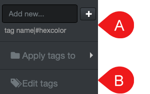
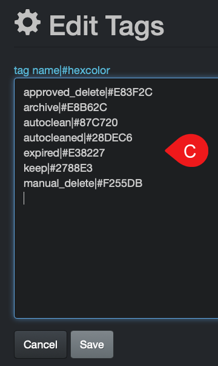

___
### Tag Display and Editor within Diskover-Web User Interface

The tags displayed within the Diskover-Web user interface can be customized by users with an admin account and can be achieved from 1) the **file search page** or 2) **Analytics** menu > **Tags**.

>Format to follow for tags: **tag name|#hexcolor** (instead of #hexcolor code, you can also type a simple color name, ex: red)

>Note: If a tag name is missing from the list and has no color assigned to it, a gray colored tag will be shown.

A) From the **file search page** > select any file and/or directory > **Tag** drop-down list > type/add a new tag in the **Add new** field.

B) From the **file search page** > select any file and/or directory > **Tag** drop-down list > **Edit tags** will open a C) window and allow you to add, delete or edit exiting tags.

C) From **Analytics** menu > select **Tags** > **Edit tags** button > will open C) window and allow you to add, delete or edit exiting tags.

 &nbsp; 
