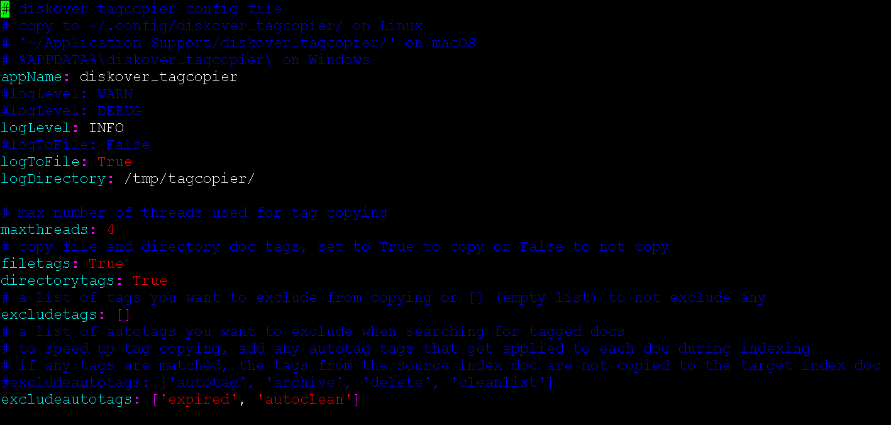

___
### Tags Migration via Tag Copier Plugin | Copying from One Index to Another

&nbsp;&nbsp;&nbsp;

The Diskover indexing process creates a new index or point in time snapshot of the volume at time of index. Tags that are applied during the indexing process via autotag rules will be automatically re-applied based on the configuration rules in the configuration file.

However, the Diskover indexer has no knowledge of tags applied outside of the indexing process, those tags that have been applied: a) manually, b) via Diskover API, or c) via plugins thru the API. Therefore, these tags must be migrated from one index to the next.

#### Tag Migration / Copy from Previous Index via Shell

The following describes how to initial a tag migration/copy from a shell.

🔴 &nbsp;Confirm existing of **tagcopier** configuration file:
```
cat /root/.config/diskover_tagcopier/config.yaml
```

🔴 &nbsp;If the file does not exist:
```
mkdir /root/.config/diskover_tagcopier/
cp /opt/diskover/configs_sample/diskover_tagcopier/config.yaml /root/.config/diskover_tagcopier/
```

🔴 &nbsp;Configure any tags or tags applied via autotag process to exclude from migration:



🔴 &nbsp;Copy tags from source to destination index:
```
cd /opt/diskover/
python3 diskover_tagcopier.py diskover-<source_indexname> diskover-<dest_indexname>
```

🔴 &nbsp;To view usage options:
```
python3 diskover_tagcopier.py -h
```

#### Tag Migration / Copy from Previous Index via Task Panel

Tags can also be migrated from one index to the next index via the Diskover-Web task panel, see [how to Configure Indexing Tasks to Migrate Tags from Previous Index](#migrate_tags_from_previous_index).
