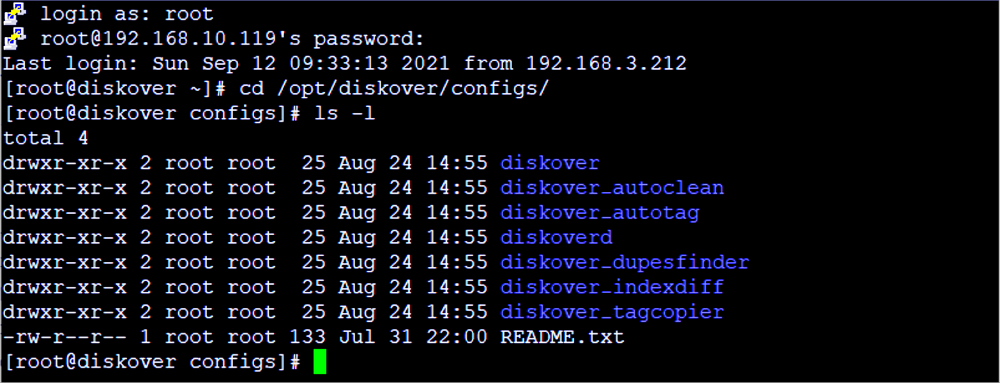
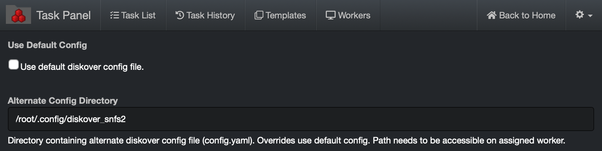
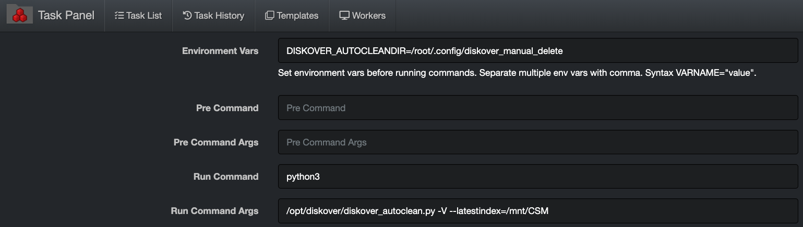

<p id="task_config_files"></p>

___
## Task Configuration Files

&nbsp;&nbsp;&nbsp;&nbsp;

___

### Configuration of File Locations

Diskover worker nodes use a series of YAML files for various configuration settings. A worker node can be a local distributed node that can perform a variety of tasks from indexing, tagging, check for duplicates, autoclean, or any other custom task. YAML is a human-readable data serialization standard that can be used in conjunction with all programming languages and is often used for configuring file settings.

Diskover task workers use a separate directory for each config file. At time of installation, example **config.yaml** files are located in **/opt/diskover/configs/**



At time of installation, these files are copied to:

- Linux:  `/root/.config/`
- Windows:  `%APPDATA%\`
- MacOS:  `~/.config/`

During installation, at least one index worker is configured, that configuration file is located at: `/root/.config/diskover/config.yaml`

___
### Using Alternate Configuration Files

Diskover provides default configuration files for tasks which are located in `/opt/diskover/configs_sample`

Diskover provides the ability for tasks to use alternate configuration files to match the task requirements via the **altconfig** variable. Alternate configuration files can be invoked both via the command line and with the Diskover **Task Panel**.

#### Alternate Configuration Invocation Via Command Line

Worker nodes typically launch tasks from the Diskover application directory. Depending on the worker’s task, different environment variables need to be exported to invoke usage of the desired alternate configuration file. The convention for exporting alternate configuration files is:

**Alternate Configuration Export Variable**: Is the `DISKOVER_NAMEOFTASKDIR` where `NAMEOFTASK` equals the name of python executable, for example the export variable for `diskover_autoclean.py` is `DISKOVER_AUTOCLEANDIR`

There are separate configs for diskover crawler, autotag, dupes-finder, diskoverd, etc. The default config files are not used by diskover crawler, etc., they are default/sample configs and need to be copied to the appropriate directory based on the OS.

For example, in Linux the config files are in `~/.config/<appName>/config.yaml`. Each config file has a setting **appName** that matches the directory name where the config file is located. For diskover dupes-finder for example, this would be `~/.config/diskover_dupesfinder/config.yaml`.

>*Note*: When editing config.yaml files, use spaces in config files, not tabs. 
>
>If you get an error message when starting diskover.py like `Config ERROR: diskover.excludes.dirs not found, check config for errors or missing settings from default config.`, check that your config file is not missing any lines from default/sample config or there are no errors in your config like missing values.

To invoke alternate configuration files instead of the default configuration files:

🔴 &nbsp;**Indexing tasks**: The DISKOVERDIR variable is used to invoke the alternative configuration file for indexing tasks:
```
export DISKOVERDIR=/someconfigfile.yaml
```

🔴 &nbsp;**Autoclean tasks**: The DISKOVER_AUTOCLEANDIR variable is used to invoke the alternative configuration file for autoclean tasks.
```
export DISKOVER_AUTOCLEANDIR=/path/alt_config_dir/
```

🔴 &nbsp;**Autotag tasks**: The DISKOVER_AUTOTAGDIR variable is used to invoke the alternative configuration file for post-index autotag tasks.
```
export DISKOVER_AUTOTAGDIR=/path/alt_config_dir/
```

🔴 &nbsp;**Duplicate finder tasks**: The DISKOVER_DUPESFINDERDIR variable is used to invoke the alternative configuration file for duplicate finder tasks.
```
export DISKOVER_DUPESFINDERDIR=/path/alt_config_dir/
```

🔴 &nbsp;**Tag copier tasks**: The DISKOVER_TAGCOPIERDIR variable is used to invoke the alternative configuration file for tag copier tasks.
```
export DISKOVER_TAGCOPIERDIR=/path/alt_config_dir/
```

>*Note*: It is recommended to test any changes to alternative configuration files via the command line for errors. If you get an error message when starting `diskover.py` like **Config ERROR: diskover.excludes.dirs not found**, check config for errors or missing settings from the default configuration file. Ensure that your config file is not missing any lines from default/sample config or there are no errors in your config like syntax errors or missing values.

#### Alternate Configuration Invocation Via Task Panel

Detailed discussion on configuration and administration of Diskover Task Management functionality can be found in [the Task Management Chapter](#task_management). To maintain context, the following describes how to use alternate configuration files within the Diskover Task Panel.

##### Indexing Tasks

🔴 &nbsp;To invoke the use of alternate configuration file for indexing tasks > Uncheck  **Use default diskover config file** and enter alternate configuration directory in  **Alternate Config Directory**  dialog box.



##### Custom Tasks

🔴 &nbsp;To invoke the use of alternate configuration file for custom tasks > Enter alternate configuration export command in **Environment Vars**  dialog box.


