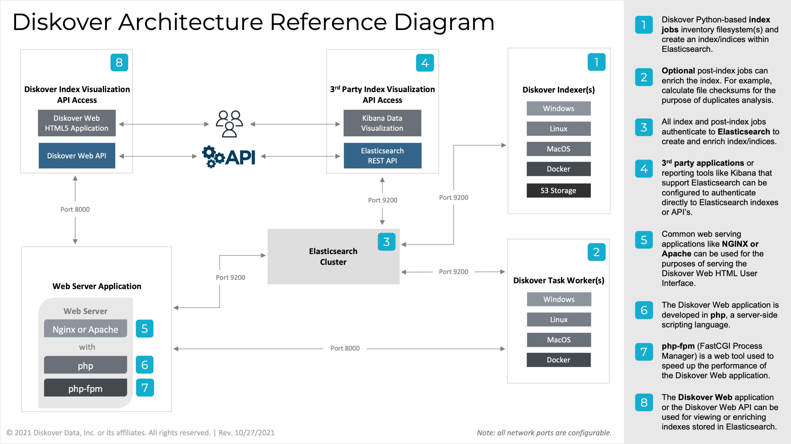
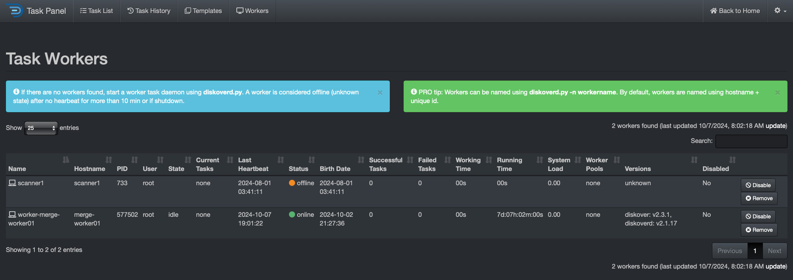
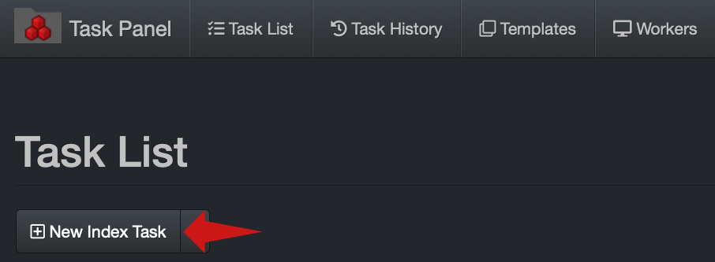
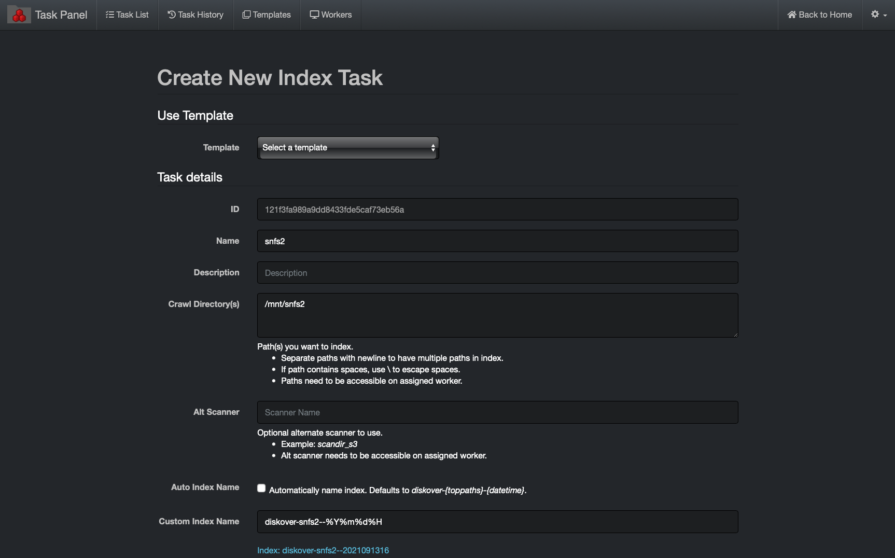
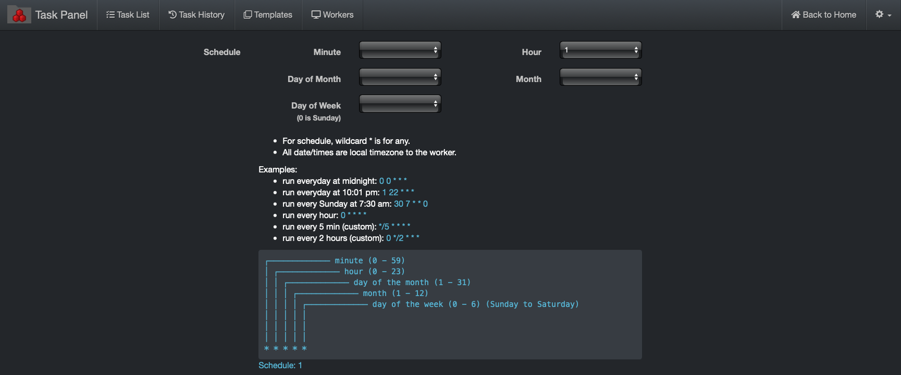
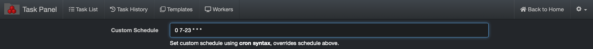
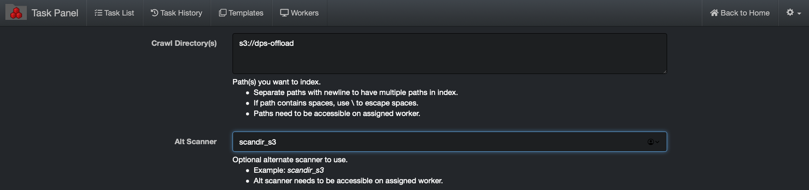
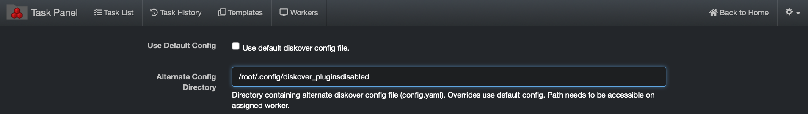
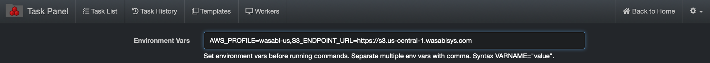

<p id="task_management"></p>

___
## Task Management

&nbsp;&nbsp;&nbsp;&nbsp;

___

The task panel can be used to schedule building indices or running any type of file action task such as copying files, running duplicate file finding, checking permissions on directories, etc. The task panel is a swiss-army knife for data management.

### Distributed Architecture and Management

Diskover has a distributed task system where workers can be distributed among many resources. For each resource providing a task worker, services will need to have  **diskoverd**  installed. Please refer to instructions on how to set up the the  **diskoverd** task service in the [Diskover Installation Guide - Setting Up Diskover Task Worker Daemon](https://docs.diskoverdata.com/diskover_installation_guide/#setting-up-diskover-task-worker-daemon). This section will describe setting up both indexing and custom tasks within the Diskover-Web Task Panel.



_[Click here for a full view of the diagram.](images/diagram_diskover_architecture_reference_generic_with_border.png)_

___
### Validate Task Management System has Task Worker(s)

🔴 &nbsp;Open the Task Panel within the Diskover-Web user interface > **gear icon** > **Task Panel** and go to **Workers** tab.

🔴 &nbsp;Ensure the presence of at least one online task worker under **Status** column.



___
### Managing Diskover Tasks via the Task Panel

The following will illustrate how to create basic indexing and custom tasks via the Diskover Task Panel.

#### Index Tasks

A default indexing task is provided in the task panel. The configuration of indexing tasks is different for Posix File Systems and S3 based object storage, the following will illustrate setting up basic indexing tasks for each.

##### Posix File System Indexing Task

🔴 &nbsp;Select **New Index Task** from > **Task Panel** > **Task List** tab:



The following **Create New Index Task** dialog box will appear. Configure as follow:

🔴 &nbsp;Name: **index-_volumename_** (where _**volumename**_ is the name of volume, in this example **snfs2**)

🔴 &nbsp;Crawl Directory(s): **/mnt/_volumedir_** (where _**volumedir**_ is the volume mountpoint, in this example **/mnt/snfs2**)
>Note: Paths are case sensitive and must exist on the indexing task worker host. For Windows task worker, set the crawl directory to for example `H:\\Somefolder` or `C:\\` using double backslashes (escaped).

🔴 &nbsp;Auto Index Name: unselect box

🔴 &nbsp;Custom Index Name: **diskover-_volumename_-%Y%m%d%H**



🔴 &nbsp;A schedule is required to create the indexing task. The example below > **Hour** > **1** will run the indexing task every day at 1:00 am.



🔴 &nbsp;To use a custom schedule to set the volume to index every hour from 7 am to 11pm for example, enter the following in the  **Custom Schedule**  box:
```
0 7-23 * * *
```



🔴 &nbsp;Then select **Create Task**:


##### S3 Bucket Indexing Task

Indexing tasks for S3 buckets are slightly different than Posix File systems, the following outlines the configuration differences required in the **Create New Index Task** in the Task Panel.

Configure the following differences for indexing S3 buckets:

🔴 &nbsp;Crawl Directory(s): **s3://_bucketname_**

Where **bucketname** is the actual name of the S3 bucket desired for indexing, in example below, the bucket name is **dps-offload:**



🔴 &nbsp;If the [media info plugin](#media_info_plugin) is enabled in the default **config.yaml file**, then configure the following to disable the media info plugin for S3 based storage as described in [Task Configuration Files chapter](#task_config_files).



##### Non S3 Bucket Indexing Task

Indexing tasks for non-AWS S3 buckets is slightly different than the previous section. The following outlines the configuration differences required for alternate credentials and endpoints.

In addition, you need to configure the **Environment Vars** for non-AWS S3 buckets:

🔴 &nbsp;Where **profile** is the name of **_desired_profile_**, as found in **/root/.aws/credentials** (where **_desired_profile_** in this example is **wasabi-us**)

🔴 &nbsp;Where **_alternate_endpoint.com_** is the URL of the S3 bucket (where **_alternate_endpoint.com_** in this example is **https://s3.us-central-1.wasabisys.com**)
```
AWS_PROFILE=profile,S3_ENDPOINT_URL=https://alternate_endpoint.com
```


