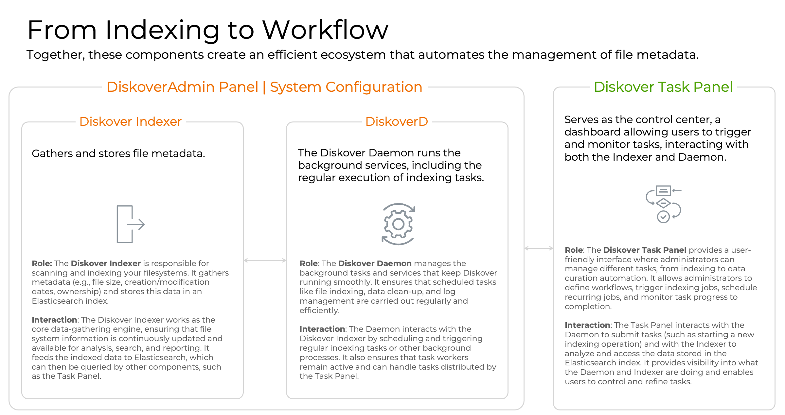
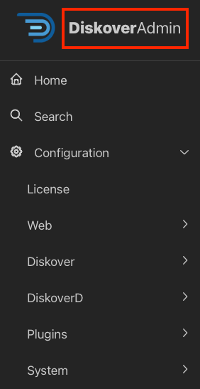
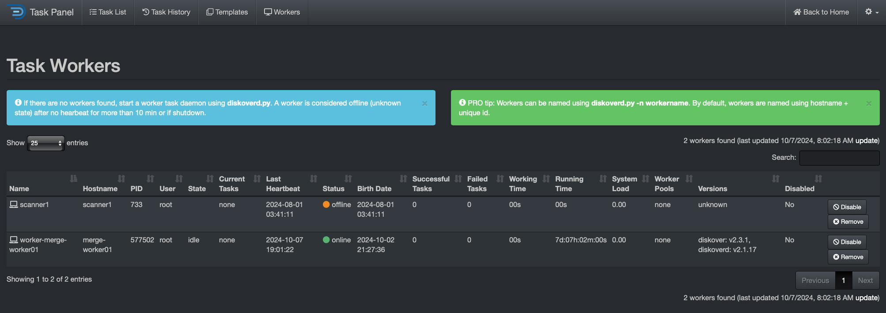
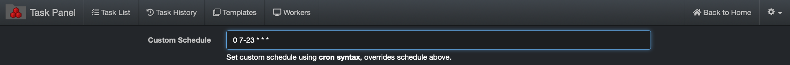
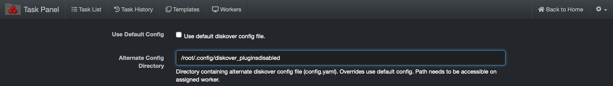

___
## Task Management via Task Panel

        
___

### Task Panel Overview

#### Usage

The Task Panel can be used to schedule indexing tasks or run any custom task, such as data curation via the AutoClean plugin, copying files, running duplicate file findings, checking permissions on directories, etc.

Diskover has a [distributed task system]() where [**indexers/workers**]() can be distributed among many resources. For each resource providing a task worker, services need to have a [**DiskoverD**]() installed. This section will describe setting up both indexing and custom tasks within the Diskover-Web **Task Panel**.



_[Click here for the full screen view of this diagram.](images/diagram_indexer_daemon_task_panel.png)_

#### Accessing the Task Panel

🔴  **From the DiskoverAdmin panel**: Click on **DiskoverAdmin**.



🔴  **From the Diskover user interface**: â›­ > **Task Panel** > **Workers** tab.


#### Task Panel Options

These tabs work together to give you full control over task creation, execution, monitoring, and overall management, ensuring smooth and efficient data indexing and task processing in Diskover.


#### Task List Tab

The Task List shows the current and pending tasks in Diskover. It allows you to see all the tasks that are currently active, queued, or scheduled to run.

- You can create new tasks from this tab.
- You can view task details, such as task type, configuration, and status (e.g., running, paused, queued).
- This tab is where you can manage active tasks, pause them, or cancel them if needed.


#### Task History Tab

The Task History keeps a log of completed tasks, allowing you to review past tasks and their outcomes.

- Provides details on tasks that have finished running, including success or failure status, duration, and any logs or error messages related to the task.
- Useful for tracking performance and identifying any issues that occurred during past operations, which is crucial for troubleshooting.
- Find useful information to fine-tune future tasks.

#### Templates Tab

Default indexing tasks are available in the **Templates** tab of the Task Panel, for both [Posix File System Indexing]() and [S3 Bucket Indexing](). 

Also, when creating a new task, you have the option at the bottom of the page to save the settings as a template. This is particularly useful if you have multiple similar repositories to index, as it allows you to reuse the same configuration for future tasks. 


Once that template is created, you can find it under the **Templates** tab.


#### Workers Tab

The Workers tab shows the status and performance of task workers, which are responsible for executing tasks such as file indexing.

- Provides a real-time overview of all active workers, their current workloads, and any tasks they are processing.
- You can monitor the health and activity of workers, ensuring that they are functioning properly.
- If workers are stuck, idle, or overloaded, you can take corrective actions (e.g., restart or adjust their configuration).
- Useful for optimizing resource allocation by distributing tasks evenly across workers.


### Fields Description for Indexing Task

| Field | Description |
| --- | --- |
| **Template** | Select a template whenever possible to pre-populate some of the fields. |
| **ID** | Diskover will automatically assign an ID number to a task. This field is non-editable. |
| **Name** | Assing a custom name to your **task**. Note that this name is not related to any configuration in the DiskoverAdmin panel. |
| **Description** | You can enter a detailed description for this indexing task. |
| **Crawl Directory(s)** | Specify top path where to start the crawl, for example: **/mnt/snfs2** or **/home** |
| **Alt Scanner** | Enter the name of an [alternate indexer]() if applicable for this task, for example: scandir_s3, scandir_azure, scandir_offline_media. You can [configure your alternate indexers via the DiskoverAdmin panel](). <br><br> |
| **Use DirCache** | Check this box to optimize future scanning, make sure to [configure DirCache accordingly in the DiskoverAdmin panel](). |
| **CLI Options/Flags** | Allows users to fine-tune tasks directly through additional parameters, providing more control over how the indexing runs. Follow the help instructions in the interface. |
| **Auto Index Name** | Check this box for Diskover to assign a name to your index using the format **diskover-_toppath_-_datetime_** |
| **Custom Index Name** | Assign a custom name to your **index** and read the help text in the interface for guidance. Note that this name has no correlation with the [indexer's name in the DiskoverAdmin panel](). |
| **Overwrite Existing** | Checking that box will delete any existing index with the same name and create a new index. |
| **Add to Index** | To add paths to an existing index. Requires a custom index name for this to work. |
| **Use Default Config** | This field correlates with the configured indexer(s) in the DiskoverAdmin Panel. Check this box if you only have one indexer for which the name was left at **Default**. |
| **Alternate Config Name** | Enter a [custom indexer name/config] that you created in the DiskoverAdmin panel. |
| **Schedule** | Using the drop-down lists, schedule the frequency at which you want this task to run OR use the **Custom Schedule** field. |
| **Custom Schedule** | Any entry in this field will overide values in the **Schedule** fields. This field is for expert users who want to use a chron schedule. |
| **Environment Vars** | Provide a flexible way to configure tasks and their behavior at runtime. They allow users to manage dynamic settings like paths, credentials, and system configurations without needing to modify the other settings. |
| **Pre-Crawl Command** |  It specifies a command/action to run before the crawling task starts, for example, zip files, cleanup, etc. Refer to the help in the interface. |
| **Pre-Crawl Command Args** | This field is used to specify arguments/parameters that are passed to the pre-crawl command. It provides additional information that the command may need to execute properly. |
| **Post-Crawl Command** | It specifies a command/action to run after the crawl, for example, unzip, etc. Refer to the help in the interface. |
| **Post-Crawl Command Args** | This field is used to specify arguments/parameters that are passed to the post-crawl command. It provides additional information that the command may need to execute properly. |
| **Retries** | Enter the number of times to retry running the task if the task fails to complete successfully. |
| **Retry Delay (sec)** | Enter the delay, in seconds, in between retries. |
| **Timeout (sec)** | Enter the amount of time, in seconds, after which to stop a task running long. Note that this field is different than [**Time Limit for Long-Running Tasks** in DiskoverD in the DiskoverAdmin panel]. |
| **Assigned Worker** | Select the appropriate **DiskoverD** config for this task.<br><br> |
| **Email** | Overrides what's in DiskoverD config. task panel will overide what's in admin panel |
| **Disabled** | Check this box to disable this task without deleting it. |
| **Make Template** | If you wish to reuse the settings from this task, check this box to create a template that will be saved under the **Templates** tab. |
| **Template Name** | Enter the custom template name you want to give to this group of settings. |


Enter the name of the [indexer]() you created and configured in the DiskoverAdmin panel. If the task you are creating is for an alternate scanner, then leave this field empty and enter the **Alt Scanner** name a few fields below<br>


### Fields Description for Custom Task

#### Validate Task Worker Configuration

🔴 &nbsp;Ensure the presence of at least one online task worker under the **Status** column.



### Create an Indexing Task

Our goal is to help you run your first index as quickly as possible. However, keep in mind that some configurations may still require customization, even if we haven’t reached those steps yet.

The configuration for indexing tasks varies between Posix File Systems and S3-based object storage.

 The following sections will guide you through setting up basic indexing tasks for each. However, in both cases, start here:

 🔴 &nbsp;From the **Task Panel** go to > **Task List** tab > select **New Index Task**:


#### Posix File System Indexing Task

> _Note:_ Paths are case-sensitive and must exist on the indexing task worker host. For Windows task worker, set the crawl directory to for example `H:\\Somefolder` or `C:\\` using double backslashes (escaped) or for UNC paths use `\\\\UNC\\share`.

🔴 &nbsp;Auto Index Name: unselect box

🔴 &nbsp;Custom Index Name: **diskover-_volumename_-%Y%m%d%H**


🔴 &nbsp;A schedule is required to create the indexing task. The example below > **Hour** > **1** will run the indexing task every day at 1:00 am.


🔴 &nbsp;To use a custom schedule to set the volume to index every hour from 7 am to 11pm for example, enter the following in the  **Custom Schedule**  box:
```
0 7-23 * * *
```



🔴 &nbsp;Then select **Create Task**:


#### S3 Bucket Indexing Task


Indexing tasks for S3 buckets are slightly different than Posix File systems, the following outlines the configuration differences required in the **Create New Index Task** in the Task Panel.

Configure the following differences for indexing S3 buckets:

🔴 &nbsp;Crawl Directory(s): **s3://_bucketname_**

Where **bucketname** is the actual name of the S3 bucket desired for indexing, in the example below, the bucket name is **dps-offload:**


🔴 &nbsp;If the [media info plugin](#media_info_plugin) is enabled in the default **config.yaml file**, then configure the following to disable the media info plugin for S3 based storage as described in [Task Configuration Files chapter](#task_config_files).



#### Non-S3 Bucket Indexing Task

Indexing tasks for non-AWS S3 buckets is slightly different than the previous section. The following outlines the configuration differences required for alternate credentials and endpoints.

In addition, you need to configure the **Environment Vars** for non-AWS S3 buckets:

🔴 &nbsp;Where **profile** is the name of **_desired_profile_**, as found in **/root/.aws/credentials** (where **_desired_profile_** in this example is **wasabi-us**)

🔴 &nbsp;Where **_alternate_endpoint.com_** is the URL of the S3 bucket (where **_alternate_endpoint.com_** in this example is **https://s3.us-central-1.wasabisys.com**)
```
AWS_PROFILE=profile,S3_ENDPOINT_URL=https://alternate_endpoint.com
```


#### Validate Task Worker Configuration

🔴 &nbsp;Ensure the presence of at least one online task worker under the **Status** column.


### Create a Custom Task

🔴 &nbsp;From the **Task Panel** go to > **Task List** tab > select **New Custom Task**:


🚧 Instructions to follow.

### Actions for Existing Tasks
