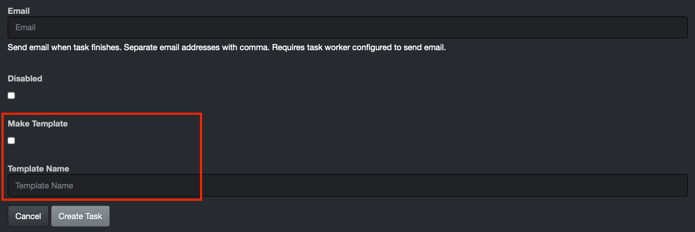
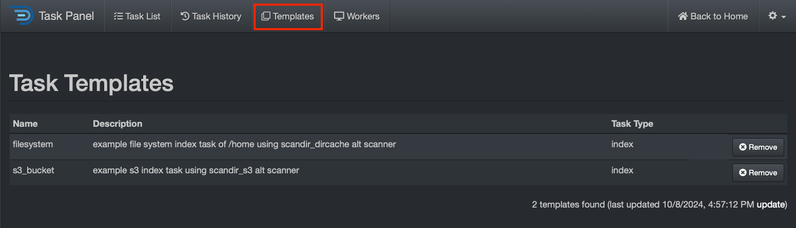
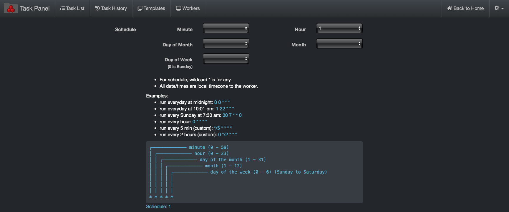
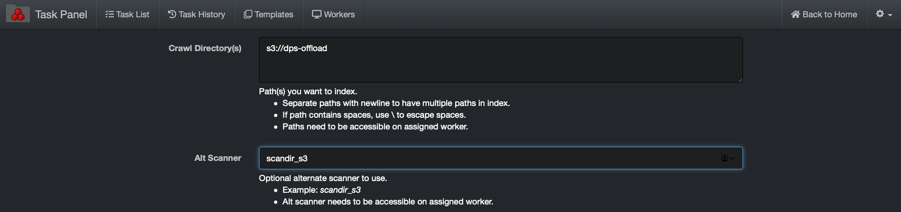
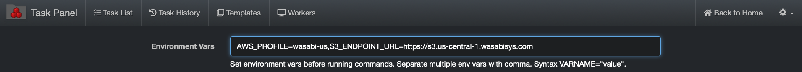

___
## Task Management

&nbsp;&nbsp;&nbsp;&nbsp;&nbsp;&nbsp;&nbsp;&nbsp;
___

### Task Panel Overview

#### Usage

The Task Panel can be used to schedule indexing tasks or run any custom task, such as data curation via the AutoClean plugin, copying files, running duplicate file findings, checking permissions on directories, etc.

Diskover has a [distributed task system]() where **indexers/workers** can be distributed among many resources. For each resource providing a task worker, services need to have a [**DiskoverD**]() installed. This section will describe setting up both indexing and custom tasks within the Diskover-Web **Task Panel**.


#### Accessing the Task Panel

Access the Task Panel within the Diskover-Web user interface > ⛭ > **Task Panel** > **Workers** tab.


These tabs work together to give you full control over task creation, execution, monitoring, and overall management, ensuring smooth and efficient data indexing and task processing in Diskover.


#### Task List Tab

The Task List shows the current and pending tasks in Diskover. It allows you to see all the tasks that are currently active, queued, or scheduled to run.

- You can create new tasks from this tab.
- You can view task details, such as task type, configuration, and status (e.g., running, paused, queued).
- This tab is where you can manage active tasks, pause them, or cancel them if needed.


#### Task History Tab

The Task History keeps a log of completed tasks, allowing you to review past tasks and their outcomes.

- Provides details on tasks that have finished running, including success or failure status, duration, and any logs or error messages related to the task.
- Useful for tracking performance and identifying any issues that occurred during past operations, which is crucial for troubleshooting.
- Find useful information to fine-tune future tasks.


#### Templates Tab

When creating a new task, you have the option at the bottom of the page to save the settings as a template. This is particularly useful if you have multiple similar repositories to index, as it allows you to reuse the same configuration for future tasks. 



Once that template is created, you can find it under the **Templates** tab.



#### Workers Tab

The Workers tab shows the status and performance of task workers, which are responsible for executing tasks such as file indexing.

- Provides a real-time overview of all active workers, their current workloads, and any tasks they are processing.
- You can monitor the health and activity of workers, ensuring that they are functioning properly.
- If workers are stuck, idle, or overloaded, you can take corrective actions (e.g., restart or adjust their configuration).
- Useful for optimizing resource allocation by distributing tasks evenly across workers.


#### Index Tasks

A default indexing task is provided in the task panel. The configuration of indexing tasks is different for Posix File Systems and S3-based object storage, the following will illustrate setting up basic indexing tasks for each.

##### Posix File System Indexing Task

🔴 &nbsp;Select **New Index Task** from > **Task Panel** > **Task List** tab:


The following **Create New Index Task** dialog box will appear. Configure as follow:

🔴 &nbsp;Name: **index-_volumename_** (where _**volumename**_ is the name of volume, in this example **snfs2**)

🔴 &nbsp;Crawl Directory(s): **/mnt/_volumedir_** (where _**volumedir**_ is the volume mountpoint, in this example **/mnt/snfs2**)

> _Note:_ Paths are case-sensitive and must exist on the indexing task worker host. For Windows task worker, set the crawl directory to for example `H:\\Somefolder` or `C:\\` using double backslashes (escaped) or for UNC paths use `\\\\UNC\\share`.

🔴 &nbsp;Auto Index Name: unselect box

🔴 &nbsp;Custom Index Name: **diskover-_volumename_-%Y%m%d%H**


🔴 &nbsp;A schedule is required to create the indexing task. The example below > **Hour** > **1** will run the indexing task every day at 1:00 am.



🔴 &nbsp;To use a custom schedule to set the volume to index every hour from 7 am to 11pm for example, enter the following in the  **Custom Schedule**  box:
```
0 7-23 * * *
```


🔴 &nbsp;Then select **Create Task**:


##### S3 Bucket Indexing Task

Indexing tasks for S3 buckets are slightly different than Posix File systems, the following outlines the configuration differences required in the **Create New Index Task** in the Task Panel.

Configure the following differences for indexing S3 buckets:

🔴 &nbsp;Crawl Directory(s): **s3://_bucketname_**

Where **bucketname** is the actual name of the S3 bucket desired for indexing, in the example below, the bucket name is **dps-offload:**



🔴 &nbsp;If the [media info plugin](#media_info_plugin) is enabled in the default **config.yaml file**, then configure the following to disable the media info plugin for S3 based storage as described in [Task Configuration Files chapter](#task_config_files).


##### Non-S3 Bucket Indexing Task

Indexing tasks for non-AWS S3 buckets is slightly different than the previous section. The following outlines the configuration differences required for alternate credentials and endpoints.

In addition, you need to configure the **Environment Vars** for non-AWS S3 buckets:

🔴 &nbsp;Where **profile** is the name of **_desired_profile_**, as found in **/root/.aws/credentials** (where **_desired_profile_** in this example is **wasabi-us**)

🔴 &nbsp;Where **_alternate_endpoint.com_** is the URL of the S3 bucket (where **_alternate_endpoint.com_** in this example is **https://s3.us-central-1.wasabisys.com**)
```
AWS_PROFILE=profile,S3_ENDPOINT_URL=https://alternate_endpoint.com
```



### Validate Task Worker Configuration

🔴 &nbsp;Ensure the presence of at least one online task worker under the **Status** column.


### Create a _"custom"_ Task
