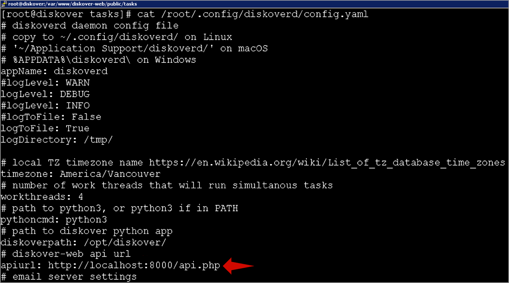

### Install Task Worker for Linux

#### Set diskoverd Configuration File

The configuration file for each worker must be configured to point to the Diskover-Web API. 

🔴 &nbsp;Change the **apiurl** to the Diskover-Web location.
```
vi /root/.config/diskoverd/config.yaml
```



#### Configure diskoverd Task Worker to Run as a Service

Setting up **diskoverd** task worker daemon as a service in CentOS 7.

🔴 &nbsp;First, we need to enable logging to a file in **diskoverd** config file(s) by setting the **logToFile** setting to **True** for every worker node that is running tasks.

🔴 &nbsp;Second, we need to set up the **diskoverd** service by creating the below service file for every worker node that is running tasks:
```
sudo vi /etc/systemd/system/diskoverd.service
```

```
[Unit]
Description=diskoverd task worker daemon
After=network.target

[Service]
Type=simple
User=root
WorkingDirectory=/opt/diskover/
ExecStart=/usr/bin/python3 /opt/diskover/diskoverd.py -n worker-${HOSTNAME}
Restart=always

[Install]
WantedBy=multi-user.target
```

🔴 &nbsp;Set permissions, enable and start the **diskoverd** service:
```
sudo chmod 644 /etc/systemd/system/diskoverd.service
sudo systemctl daemon-reload
sudo systemctl enable diskoverd.service
sudo systemctl start diskoverd.service
sudo systemctl status diskoverd.service
```

🔴 &nbsp;Now you should have a **diskoverd** task service running and ready to work on tasks.

🔴 &nbsp;Starting, stopping, and seeing the status of **diskoverd** service:
```
sudo systemctl stop diskoverd.service
sudo systemctl start diskoverd.service
sudo systemctl restart diskoverd.service
sudo systemctl status diskoverd.service
```

🔴 &nbsp;Accessing logs for **diskoverd** service:
```
journalctl -u diskoverd
```

Additional log files for **diskoverd** can be found in the directory set in **diskoverd** config files **logDirectory** setting.
