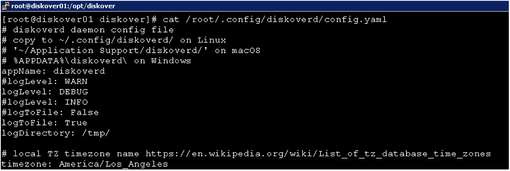
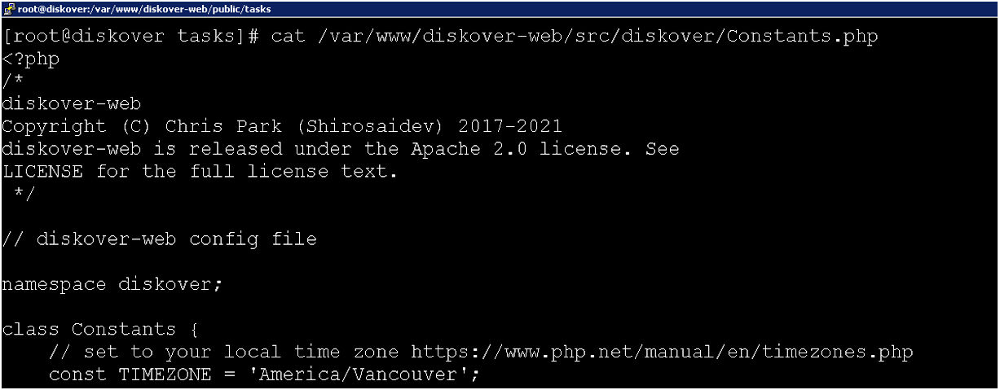
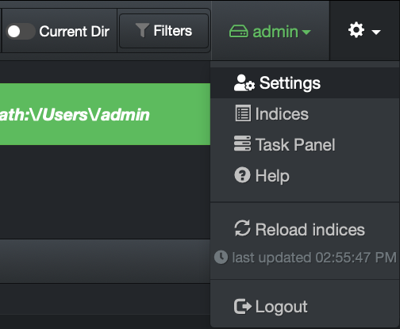
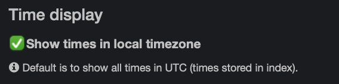

___
## Setting Time Zones
___

Diskover can be configured for local time zones, since Diskover is a distributed, scale out architecture, the time zone will need to be configured for each distributed component.

Use the official **TZ database name** options for Diskover that can be found here:

<a href=“https://en.wikipedia.org/wiki/List_of_tz_database_time_zones”>https://en.wikipedia.org/wiki/List_of_tz_database_time_zones</a>

### Time Zone Setting for diskoverd Task Daemon(s)

🔴 &nbsp;For each distributed task worker, edit the time zone value here:
```
/root/.config/diskoverd/config.yaml
```



### Default Time Zone Setting for Diskover-Web

🔴 &nbsp;The Diskover-Web default time zone value is configured here:
```
vi /var/www/diskover-web//src/diskover/Constants.php
```



### User Preference Time Zone Setting Within Diskover-Web

Individual users can set their time zone preference to their local time zone with the Diskover-Web HTML 5 user interface. 

🔴 &nbsp;In the top right corner setting gear icon, select **Settings** from the drop-down list:




🔴 &nbsp;Check the box **Show times in local timezone** and simply exit out of the settings dialog box.




