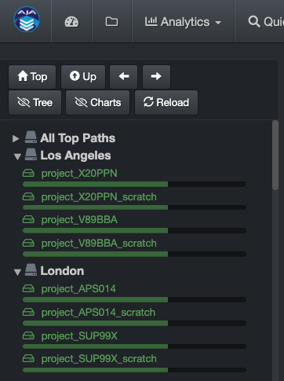
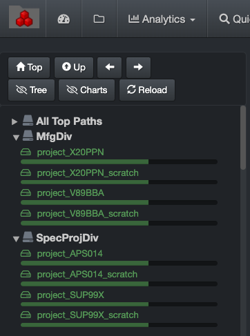

___
## Top Paths

&nbsp;&nbsp;&nbsp;

___

By default, users will see a list of all volumes indexed by Diskover in the left pane of the user interface. You can however create **Top Paths** to organize your volumes (by location, project, etc.).

Here are two examples. Note that the first collapsible option will always be **All Top Paths** and will list all your repositories. The collapsible choices/labels after that are customizable.

&nbsp;

🔴 &nbsp;Open the **TOPPATH_TREE** constants.php file:

```
/var/www/diskover-web/src/diskover/Constants.php
```

🔴 &nbsp;Edit the file and change for your storage locations, the example below using **tokyo_stor** and **van_stor***:

```
// top path collapsible tree/menu
// top path tree displayed in search file tree and top path drop down menu in nav bar
// default is have all top paths under All tree
// set to [] to use defaults
// uses php's preg_match for reg exp of top paths
// Example to set /mnt/tokyo_stor* to be nested under Tokyo and /mnt/van_stor* to be nested under Vancouver:
// const TOPPATH_TREE = [ 'Tokyo' => ['/\/mnt\/tokyo_stor*/'], 'Vancouver' => ['/\/mnt\/van_stor*/'] ];
const TOPPATH_TREE = [ 'Stor' => ['/\/mnt\/tokyo_stor*/', '/\/mnt\/van_stor*/']];
```

🔴 &nbsp;To organize and edit the top path **labels**:

```
// alternate top path labels to display in search file tree and top path drop down menu in nav bar
    // default is to display the basename of top path directory
    // set to [] to use defaults
    // Example to set /mnt/stor1 to vol1 label and /mnt/stor2 to vol2 label:
    // const TOPPATH_LABELS = ['/mnt/stor1' => 'vol1', '/mnt/stor2' => 'vol2'];
    const TOPPATH_LABELS = [];
```
