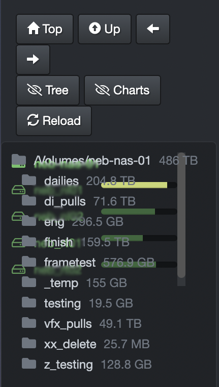

___
## Diskover-Web
___

### Diskover-Web for Linux

🔴 &nbsp;To view log files associated with Diskover-Web errors:
```
tail -f /var/log/nginx/error.log
```

___
### Diskover-Web for Windows

🔴 &nbsp;To view log files associated with Diskover-Web errors:
```
C:\Program Files\Nginx\nginx-1.19.6\logs\error.log
```

___
### Diskover-Web Task Management

🔴 &nbsp;To get started with the task panel, check that you have the json files in diskover-web `public/tasks/` directory.
```
cd /var/www/diskover-web/public/tasks
ls *.json
tasklog.json	tasks.json	templates.json	workers.json
```

You should see the above `.json` files which are used by the Task Panel for storing task and worker related data. 

🔴 &nbsp;If you only see `.json.sample` files, copy the sample/default files:
```
for f in *.json.sample; do cp $f "${f%.*}"; done
chmod 660 *.json
chown nginx:nginx *.json
```

- You will need to start at least one Diskover worker daemon `diskoverd` to work on tasks. 
- `diskoverd` can run on the diskover host or on any host. 
- `diskoverd` requires access to the Diskover-Web REST API which is located at `http://<diskover-web-host>:<port>/api.php`

#### Diskover-Web Tasks Not Running or Failing

If tasks are not running when scheduled or are showing last status as failed, follow the below steps to help troubleshoot.

🔴 &nbsp; Check `Workers` tab in `Task Panel` has at least one worker online.

🔴 &nbsp; For index tasks, check the mount being scanned is still mounted. You can use for example `mount` or `df` commands to check.

🔴 &nbsp; Check diskoverd worker log files for any errors or warnings. You can find the log file location by checking the diskoverd config `logDirectory` setting. diskoverd config file is at `~/.config/diskoverd/config.yaml`.

___
### Unable to Access Diskover-Web from Browser

🔴 &nbsp;Ensure the web-server components are running:
```
systemctl status nginx
systemctl status php-fpm
```

🔴 &nbsp;Check the nginx web-server error logs:
```
tail -f /var/log/nginx/error.log
```

🔴 &nbsp;Trace access from Web session by reviewing NGINX access logs. Open Web browser and attempt to access diskover-web, the access attempt should be evident in the access log:
```
tail -f /var/log/nginx/access.log
```
___
### Hard Reload After a Software Update

Sometimes when the web user interface gets updated, it requires a forced/hard reload of the browser, in order to reload the new Javascript, etc. cached files.

[Click here for more information](https://fabricdigital.co.nz/blog/how-to-hard-refresh-your-browser-and-clear-cache).

For example, this overlay display of the volumes and directories might happen after a software update and a hard reload might be necessary:



___
### Missing Indicies

By default Diskover-web does not load all indices in Elasticsearch. This is for performance reasons in case there are thousands of indices in Elasticsearch.

First check that there are not any missing indices in Elasticsearch.

To see all diskover indices in Elasticsearch:

```
curl -X GET "htt://<eshost>:9200/_cat/indices/diskover-*?v=true&s=index&pretty"
```

on AWS ES/OpenSearch:

```
curl -X GET -u user:pass "http://<aws es endpoint>/_cat/indices/diskover-*?v=true&s=index&pretty"
```

On the indices page, there is a **max indices to load** input setting which controls the number of indices to load. Indices are loaded by order of creation date. If you are missing indices in the list, try increasing this number. This is a per user setting that gets stored in a cookie in each user's browser.

This number can also be set for all users in web config's `MAX_INDEX` setting. If the user's browser `maxindex` cookie is lower than this number, their cookie will be set to this number.


___
### Nginx Reverse Proxy/ Nginx too big header error/ Bad gateway 502 error

If you are running nginx reverse proxy and see in your nginx error log "upstream sent too big header while reading response header from upstream" and you are seeing bad gateway 502 errors, you will need to adjust your nginx buffer sizes:

On Nginx reverse proxy host in nginx config file:
```
http {
  proxy_buffer_size   128k;
  proxy_buffers   4 256k;
  proxy_busy_buffers_size   256k;
}
```

After making changes, you will need to restart/reload nginx service.

More info in the [nginx documentation](http://nginx.org/en/docs/http/ngx_http_proxy_module.html)
