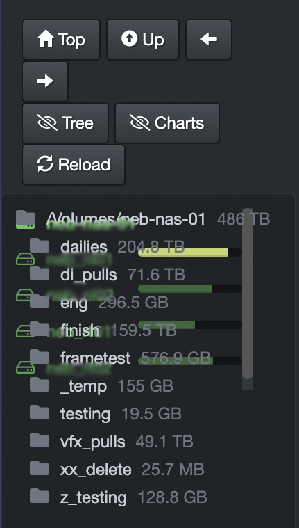

___
## Web Interface
___

### Hard Reload After a Software Update

Sometimes when the Web user interface gets updated, it requires a forced/hard reload of the browser, in order to reload the new Javascript, etc. cached files.

[Click here for more information](https://fabricdigital.co.nz/blog/how-to-hard-refresh-your-browser-and-clear-cache).

For example, this overlay display of the volumes and directories might happen after a software update and a hard reload might be necessary:

